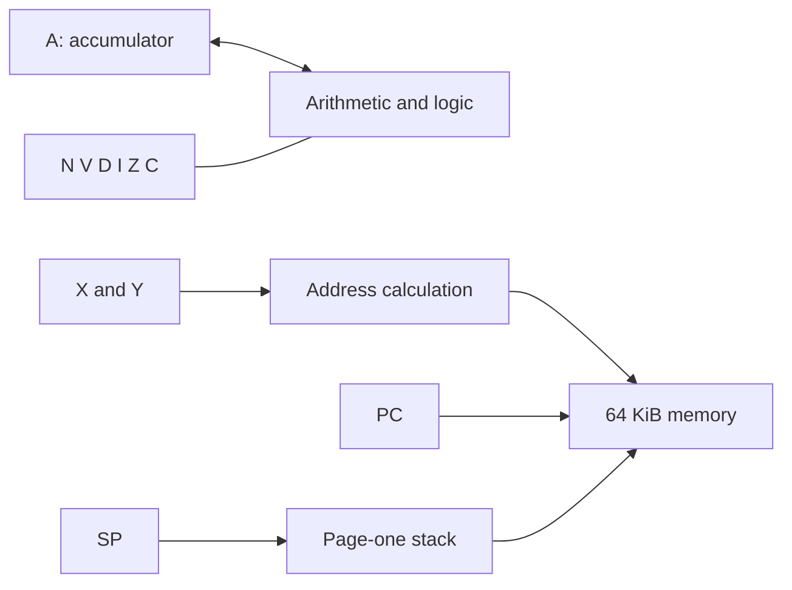

# MOS 6502

This chapter owns the complete stored-state schema, byte-addressing sources,
all 151 documented instruction forms, their encodings, and the packed status view
for Dromaios's instruction-level NMOS 6502. Its `cpu` fences generate production
definitions; the preceding paragraphs supply their instruction explanations.
Execution boundaries and external interrupt entry still live in TypeScript.
The [coverage report](../../../../docs/cpus/coverage.md#6502) tracks that migration.

The model records instruction-level effects in order. It does not describe
cycles or dummy reads. If a memory access fails, execution stops at that access:
earlier effects remain and later effects do not occur. See the
[CPU model](../../../../docs/cpus/6502/model.md) for the complete execution
contract and the [language guide](../../../../docs/cpus/literate-specifications.md)
for this prototype's syntax and boundaries.

[History](#historical-background) ·
[Programmer's machine](#the-programmers-machine) ·
[State](#stored-state) ·
[Addressing](#addressing-a-byte) ·
[Arithmetic](#arithmetic-in-binary-and-decimal) ·
[Byte updates](#shifts-rotates-and-byte-adjustments) ·
[Status](#status-as-a-byte) ·
[Stack](#the-page-one-stack) ·
[Control flow](#branches-and-jumps) ·
[Worked execution](#following-a-program) ·
[Checks](#checks-and-remaining-boundaries)

## Historical background

MOS Technology introduced the 6502 in 1975 at a price of $25. Chuck Peddle led
a team that included former Motorola employees; the low price made it practical
to consider a processor in products with modest budgets. The
[Computer History Museum's 1975 timeline][history] places the introduction in
that context. The following year's [KIM-1][kim] gave engineers a small computer
for experimenting with the processor, and also attracted hobbyists.

The [Synertek/MOS programming manual][manual] introduces a byte accumulator,
two byte index registers, and a sixteen-bit program counter. Addressing modes
make those few registers useful across a full 64 KiB address space. This
chapter follows the original NMOS model; later CMOS instruction additions and
behavior changes are not implied by the name 6502.

## The programmer's machine

Addresses and data below use `$` for hexadecimal. A byte holds `$00`–`$FF`;
a sixteen-bit address holds `$0000`–`$FFFF`. Assembly `#` marks an immediate
value: `LDA #$80` loads the number `$80`, while `LDA $80` loads the byte from
memory address `$0080`.

| State | Role |
| --- | --- |
| A | Accumulator for arithmetic, logical operations, and many transfers |
| X, Y | Index registers, also useful as counters and byte storage |
| PC | Address of the next instruction byte |
| SP | Eight-bit stack offset into page one, `$0100`–`$01FF` |
| N, Z | Sign bit and zero result from instructions that update them |
| C | Arithmetic carry; comparison and subtraction use set C for no borrow |
| V | Signed arithmetic overflow, or memory bit 6 copied by BIT |
| D | Select decimal arithmetic for ADC/SBC |
| I | Mask ordinary interrupt requests |

X and Y are separate byte indices; they do not combine into a word register.
The stack uses its own page and wraps its byte offset there. Zero page,
`$0000`–`$00FF`, has compact address operands and can also hold word pointers.
A sixteen-bit word is stored low byte first: `$34 $12` denotes `$1234`.



This is a functional map of the model. It helps distinguish an index, an
address, and the byte at that address; it does not describe physical wiring
or timing. Memory-mapped devices use the surrounding machine's address space;
there are no separate IN/OUT instructions in the documented 6502 inventory.

## Stored state

The declarations below generate the schema used by construction, snapshots,
machine parsing, and every instruction definition. They retain the public
lowercase fields and their declaration order. Initial values are supplied by
the caller; declaring storage does not choose power-on or reset values.

Only six arithmetic/control flags are stored. The packed status byte's fixed
bit 5 and stacked B marker are not extra state fields. The chapter owns their
[packing and restoration](#status-as-a-byte); reset and interrupt recognition
still belong to the [model contract](../../../../docs/cpus/6502/model.md). Changing a register does
not implicitly recalculate flags: LDA sets N/Z explicitly, while TXS leaves
all six flags unchanged.

```cpu
cpu "6502"
state {
  register A: 8
  register X: 8
  register Y: 8
  register SP: 8
  register PC: 16
  flag N
  flag V
  flag D
  flag I
  flag Z
  flag C
}
```

## Addressing a byte

An address source returns a sixteen-bit address without reading the final data
byte. This distinction lets LDA read that byte and STA write it. Each source has
its own capture scope. `fetch` consumes the next instruction byte; `register`
reads live state at that point. An expression uses already captured values.

Zero-page addressing extends an eight-bit offset to sixteen bits. For indexed
zero-page addressing, addition happens **before** extension: `$FF + $01` wraps
to `$00`. The Y variant serves LDX/STX; LDA and STA use the X variant.

```cpu
source zeroPage "zero page": 16 {
  offset = fetch
  return extend(offset, 16)
}
source zeroPageX "zero page indexed by X": 16 {
  offset = fetch
  index = register X
  return extend(add(offset, index), 16)
}
source zeroPageY "zero page indexed by Y": 16 {
  offset = fetch
  index = register Y
  return extend(add(offset, index), 16)
}
```

Absolute addresses arrive low byte first. `concat(high, low)` joins the two
bytes into a word. For indexed absolute addressing, the index is extended before
addition, so a carry crosses a page boundary and `$FFFF + $01` wraps to `$0000`.

```cpu
source absolute "absolute address, low byte first": 16 {
  low = fetch
  high = fetch
  return concat(high, low)
}
source absoluteX "absolute indexed by X": 16 {
  low = fetch
  high = fetch
  index = register X
  return add(concat(high, low), extend(index, 16))
}
source absoluteY "absolute indexed by Y": 16 {
  low = fetch
  high = fetch
  index = register Y
  return add(concat(high, low), extend(index, 16))
}
```

The two indirect modes read a low-first pointer from zero page. In both modes,
the pointer's high-byte address wraps within zero page: a pointer at `$FF` reads
its high byte from `$00`, not `$0100`. `u8($01)` makes the width of that addition
explicit. Indexed indirect adds X before reading the pointer; indirect indexed
reads the complete pointer before reading Y and adding it to the address.

```cpu
source indexedIndirect "indexed indirect (zero page,X)": 16 {
  offset = fetch
  index = register X
  pointer = add(offset, index)
  low = memory(extend(pointer, 16))
  high = memory(extend(add(pointer, u8($01)), 16))
  base = concat(high, low)
  return base
}
source indirectIndexed "indirect indexed (zero page),Y": 16 {
  offset = fetch
  pointer = offset
  low = memory(extend(pointer, 16))
  high = memory(extend(add(pointer, u8($01)), 16))
  base = concat(high, low)
  index = register Y
  return add(base, extend(index, 16))
}
```

An immediate operand is the next instruction byte itself. It has no destination
address, so it is available to loads but cannot be selected by a store.

```cpu
source immediateByte "immediate byte": 8 {
  byte = fetch
  return byte
}
```

## Encoding the addressing mode

The accumulator families share `aaa bbb 01`. The operation bits `aaa` select
ORA/AND/EOR/ADC/STA/LDA/CMP/SBC in binary order. The three `b`
bits select the following modes in binary order. A `memory` entry provides
both its address and the byte read there; a
`value` entry provides only a value. Selecting `.address` therefore omits the
immediate encoding, rather than inventing an immediate STA instruction.

```cpu
operands accumulator {
  000 "(zero page,X)" = memory indexedIndirect
  001 "zero page" = memory zeroPage
  010 "#byte" = value immediateByte
  011 "absolute" = memory absolute
  100 "(zero page),Y" = memory indirectIndexed
  101 "zero page,X" = memory zeroPageX
  110 "absolute,Y" = memory absoluteY
  111 "absolute,X" = memory absoluteX
}
```

## Loading A

Only N and Z change on a load. A policy updates its listed flags together and
preserves every unlisted flag. Its parameter is a captured byte, so flags do not
depend on a subsequent read of live A. This policy also serves other 6502
instructions whose result sets N and Z.

```cpu
policy NZ "6502 result N/Z" (result: 8) {
  N = negative(result)
  Z = zero(result)
}
```

Finish the source reads before writing the destination, then set N/Z from the captured byte.
Preserve V, D, I, and C. A failed source read leaves the destination and every flag unchanged.

```cpu
family LDA "101 bbb 01" for b in accumulator.read {
  result = source b
  A <- result
  apply NZ(result)
}
```

## Storing A

Resolve the address once, including any pointer reads, before capturing the source register.
Write that byte once, even if unchanged, without reading the destination. Preserve every flag.
A failed access prevents later effects; completed fetches and pointer reads remain.

```cpu
family STA "100 bbb 01" for b in accumulator.address {
  address = source b
  byte = register A
  memory(address) <- byte
}
```

## Index-register loads and stores

The complete patterns are `101 bbb r0` for loads and `100 bbb r0` for stores:
`r=0` selects Y, `r=1` selects X. Their `bbb` field differs from the accumulator
catalogue. Loads use `000` for immediate, `001/011` for zero page/absolute,
and `101/111` for the corresponding indexed forms. Stores have only `001`,
`011`, and `101`; no immediate or absolute-indexed store exists.

Indexing uses the *other* register: LDX/STX use Y, while LDY/STY use X.
The one-bit catalogues below expose the shared choice between zero page and
absolute addressing. An encoding's `b` occupies bit 3; its surrounding fixed
bits determine whether the address is indexed. The explicit encodings avoid
filling undefined slots with invented addressing modes.

```cpu
operands direct {
  0 "zero page" = memory zeroPage
  1 "absolute" = memory absolute
}
operands indexedX {
  0 "zero page,X" = memory zeroPageX
  1 "absolute,X" = memory absoluteX
}
operands indexedY {
  0 "zero page,Y" = memory zeroPageY
  1 "absolute,Y" = memory absoluteY
}
```

Fetch or read the complete operand, then replace X and set N/Z from the captured
byte. Indexed forms use Y without changing it. Preserve V/D/I/C; a failed
operand read prevents register and flag writes.

```cpu
family LDX {
  encoding "101 000 10" with b = immediateByte named "LDX #byte"
  encoding "101 0b1 10" for b in direct.read named "LDX {b}"
  encoding "101 1b1 10" for b in indexedY.read named "LDX {b}"
  result = source b
  X <- result
  apply NZ(result)
}
```

Fetch or read the complete operand, then replace Y and set N/Z from the captured
byte. Indexed forms use X without changing it. Preserve V/D/I/C; a failed
operand read prevents register and flag writes.

```cpu
family LDY {
  encoding "101 000 00" with b = immediateByte named "LDY #byte"
  encoding "101 0b1 00" for b in direct.read named "LDY {b}"
  encoding "101 1b1 00" for b in indexedX.read named "LDY {b}"
  result = source b
  Y <- result
  apply NZ(result)
}
```

Resolve the complete destination address before capturing X, then write once
without reading destination memory. The zero-page indexed form uses Y with
byte wrapping. Preserve all flags; a failed address fetch prevents later effects.

```cpu
family STX {
  encoding "100 0b1 10" for b in direct.address named "STX {b}"
  encoding "100 101 10" with b = zeroPageY named "STX zero page,Y"
  address = source b
  byte = register X
  memory(address) <- byte
}
```

Resolve the complete destination address before capturing Y, then write once
without reading destination memory. The zero-page indexed form uses X with
byte wrapping. Preserve all flags; a failed address fetch prevents later effects.

```cpu
family STY {
  encoding "100 0b1 00" for b in direct.address named "STY {b}"
  encoding "100 101 00" with b = zeroPageX named "STY zero page,X"
  address = source b
  byte = register Y
  memory(address) <- byte
}
```

## Register transfers

Transfers copy bytes without using data memory. TAY/TAX use `101 010 r0`,
with the same Y/X selector as the index loads. Other directions have fixed
encodings. In particular, TXS changes the stack offset while preserving flags;
TSX copies that offset into X and sets N/Z. Neither pushes or pops RAM.

```cpu
operands indexRegisters {
  0 "Y" = register Y
  1 "X" = register X
}
```

Capture A, write the selected index register, then apply N/Z from that byte.
Preserve V/D/I/C and A; no data-memory access occurs.

```cpu
family transferFromA "101 010 r0" for r in indexRegisters named "TA{r}" {
  result = register A
  operand r <- result
  apply NZ(result)
}
```

Capture X, replace A, then apply N/Z from the captured byte. Preserve X and
V/D/I/C; no data-memory access occurs.

```cpu
family TXA "100 010 10" {
  result = register X
  A <- result
  apply NZ(result)
}
```

Capture Y, replace A, then apply N/Z from the captured byte. Preserve Y and
V/D/I/C; no data-memory access occurs.

```cpu
family TYA "100 110 00" {
  result = register Y
  A <- result
  apply NZ(result)
}
```

Capture X and replace SP, preserving every flag and other register. Changing
the stack offset does not read or write any stack memory.

```cpu
family TXS "100 110 10" {
  result = register X
  SP <- result
}
```

Capture SP, replace X, then apply N/Z from the captured byte. Preserve SP and
V/D/I/C; no stack memory is accessed.

```cpu
family TSX "101 110 10" {
  result = register SP
  X <- result
  apply NZ(result)
}
```

## Logical operations

ORA, AND, and EOR use `aaa=000`, `001`, and `010` in `aaa bbb 01`.
They select bits to set, retain, or invert, respectively. For example, with
A=`$A5` and operand `$0F`, the results are `$AF`, `$05`, and `$AA`.
All three set N/Z from the resulting byte and preserve C/V/D/I, even when
decimal mode is set. The [buffer example](../../../../docs/cpus/6502/examples/buffer.md)
combines them while traversing memory through indirect addressing.

Read the operand before capturing A. OR the bytes, write A, then set N/Z
from the result. Preserve V/D/I/C; a failed read prevents every later effect.

```cpu
family ORA "000 bbb 01" for b in accumulator.read {
  right = source b
  left = register A
  result = or(left, right)
  A <- result
  apply NZ(result)
}
```

Read the operand before capturing A. AND the bytes, write A, then set N/Z
from the result. Preserve V/D/I/C; a failed read prevents every later effect.

```cpu
family AND "001 bbb 01" for b in accumulator.read {
  right = source b
  left = register A
  result = and(left, right)
  A <- result
  apply NZ(result)
}
```

Read the operand before capturing A. XOR the bytes, write A, then set N/Z
from the result. Preserve V/D/I/C; a failed read prevents every later effect.

```cpu
family EOR "010 bbb 01" for b in accumulator.read {
  right = source b
  left = register A
  result = xor(left, right)
  A <- result
  apply NZ(result)
}
```

## Comparisons

CMP, CPX, and CPY subtract an operand to set flags without changing a register.
They use binary subtraction even with D set. Z reports equality; C reports
that the unsigned register value is greater than or equal to the operand.
For example, `$00 - $01` gives temporary result `$FF`: N=1, Z=0, C=0.
Equality gives N=0, Z=1, C=1. V is preserved, so N alone cannot establish
signed ordering when subtraction would overflow.

```cpu
policy COMPARE "6502 comparison N/Z/C" (left: 8, right: 8, result: 8) {
  N = negative(result)
  Z = zero(result)
  C = not(borrow(left, right))
}
```

CMP uses `110 bbb 01` and all eight accumulator addressing modes. Read the
operand before A, calculate a wrapped difference, then apply N/Z/no-borrow C.
Preserve every register and V/D/I; a failed read prevents flag changes.

```cpu
family CMP "110 bbb 01" for b in accumulator.read {
  right = source b
  left = register A
  result = subtract(left, right)
  apply COMPARE(left, right, result)
}
```

CPY/CPX use `11r bbb 00`, with `r=0/1` selecting Y/X. Only `bbb=000`,
`001`, and `011` exist: immediate, zero page, and absolute. Read the operand
before the selected register, then apply N/Z/no-borrow C to their difference.
Preserve every register and V/D/I; incoming C and D do not affect comparison.

```cpu
family compareIndex {
  encoding "11r 000 00" for r in indexRegisters with b = immediateByte named "CP{r} #byte"
  encoding "11r 0b1 00" for r in indexRegisters, b in direct.read named "CP{r} {b}"
  right = source b
  left = operand r
  result = subtract(left, right)
  apply COMPARE(left, right, result)
}
```

## Testing memory bits

BIT has two forms: `001 0b1 00`, where `b=0/1` selects zero page/absolute.
Its three affected flags answer two different questions. N and V copy memory
bits 7 and 6, regardless of A. Z reports whether A and memory share any set
bits. With A=`$0F` and memory=`$C0`, N/V/Z all become set; A remains `$0F`.
The AND result is zero, but the tested memory byte is not.

```cpu
policy BITFLAGS "6502 BIT N/V/Z" (accumulator: 8, operand: 8) {
  N = negative(operand)
  V = not(zero(and(operand, u8($40))))
  Z = zero(and(accumulator, operand))
}
```

Read memory before capturing A. Copy N/V from memory bits 7/6 and set Z from
A AND memory, preserving A and C/D/I. Decimal mode has no effect; a failed
read leaves every flag unchanged.

```cpu
family BIT "001 0b1 00" for b in direct.read {
  right = source b
  left = register A
  apply BITFLAGS(left, right)
}
```

## Arithmetic in binary and decimal

ADC and SBC complete `aaa bbb 01`: `aaa=011` selects addition, `aaa=111`
subtraction, with all eight accumulator addressing modes. ADC adds A, the
operand, and C. SBC subtracts the operand and **the inverse of C**: setting C
before the first subtraction means no incoming borrow. Both preserve D/I.

In binary mode, N/Z describe the wrapped result, C describes unsigned carry
or no borrow, and V describes signed overflow. Thus `$7F + $01` yields `$80`
with V=1 and C=0, while `$FF + $01` yields `$00` with V=0 and C=1. The
`addOverflow` and `overflow` predicates test the signed sum or difference of
captured operands, including the incoming bit; they do not inspect live flags.

```cpu
policy ADCCV "ADC binary C/V" (left: 8, right: 8, carry: flag) {
  C = carry(left, right, carry)
  V = addOverflow(left, right, carry)
}
policy SBCCV "SBC binary C/V" (left: 8, right: 8, carry: flag) {
  C = not(borrow(left, right, not(carry)))
  V = overflow(left, right, not(carry))
}
```

With D set, valid packed-decimal bytes contain two digits from zero through
nine. Six corrects a digit because hexadecimal has sixteen digit values and
decimal has ten. Word-width intermediates keep the digit carry or borrow until
the final byte is selected. The model also specifies invalid digits `$A`–`$F`;
its rules match [Bruce Clark's NMOS decimal predictions][decimal].

NMOS decimal flags come from different stages:

| Flag | Decimal ADC | Decimal SBC |
| --- | --- | --- |
| N | Bit 7 after low-digit correction, before high-digit correction | Binary result bit 7 |
| Z | Uncorrected binary result is zero | Binary result is zero |
| V | Signed overflow at ADC's low-corrected intermediate | Binary subtraction overflow |
| C | Intermediate reaches `$A0`, requiring high-digit correction | Binary subtraction needs no borrow |

Consequently, corrected A=`$00` need not mean Z=1. Decimal `$99 + $01` with
C=0 gives A=`$00`, C=1, N=1, Z=0. Decimal `$79 + $00` with C=1 reaches
intermediate `$80`, setting N/V even though its binary result is `$7A`.
These intermediate flags are NMOS behavior, not portable decimal arithmetic
advice for later members of the 6502 family. The original [manual][manual]
describes decimal arithmetic without promising useful decimal N/V/Z values.

### Adding with carry

The ADC low digit is corrected when its word sum reaches ten; inverse borrow
expresses that unsigned threshold. Masking the corrected digit and adding
exactly one `$10` carry also defines the behavior for invalid BCD inputs.
The high nibbles then join that corrected low result. The decimal flag policy
uses this intermediate before the final `$60` correction. V requires operands
with the same sign and an intermediate byte with the opposite sign.

```cpu
policy ADCDECIMAL "ADC NMOS decimal flags" (left: 8, right: 8, binary: 8, intermediate: 16) {
  Z = zero(binary)
  N = negative(lowByte(intermediate))
  V = and(negative(xor(left, lowByte(intermediate))), not(negative(xor(left, right))))
  C = not(borrow(intermediate, u16($A0)))
}
```

Finish operand reads before capturing A and C. Binary ADC writes A before
N/Z/C/V. Decimal ADC calculates low-digit correction, sets Z from the binary
result and N/V/C from the intermediate, then writes corrected A. Preserve D/I;
a failed operand read prevents all arithmetic effects.

```cpu
family ADC "011 bbb 01" for b in accumulator.read {
  right = source b
  left = register A
  carry = flag C
  binary = add(left, right, carry)
  decimal = flag D
  when not(decimal) {
    A <- binary
    apply NZ(binary)
    apply ADCCV(left, right, carry)
  }
  when decimal {
    low = add(extend(and(left, u8($0F)), 16), extend(and(right, u8($0F)), 16), carry)
    lowCorrection = or(and(add(low, u16($06)), u16($0F)), u16($10))
    correctedLow = select(not(borrow(low, u16($0A))), lowCorrection, low)
    high = add(extend(and(left, u8($F0)), 16), extend(and(right, u8($F0)), 16))
    intermediate = add(high, correctedLow)
    apply ADCDECIMAL(left, right, binary, intermediate)
    correction = select(not(borrow(intermediate, u16($A0))), u16($60), u16($00))
    A <- lowByte(add(intermediate, correction))
  }
}
```

### Subtracting with borrow

SBC first publishes the binary result and its flags. Decimal correction then
changes only A. A negative low-digit difference subtracts six, keeps the low
nibble, and passes exactly one `$10` borrow to the high-digit difference.
A negative combined intermediate needs another `$60` subtraction. For example,
`$00 - $01` with C=1 becomes `$99`, while N/Z/V/C retain the binary subtraction's
values. The word intermediates wrap, so their top bit detects these bounded
negative differences before narrowing to a byte.

Finish operand reads before capturing A and C. Subtract with inverted incoming
C, write the binary result, and set N/Z/C/V. If D is set, correct the decimal
digits and replace A alone. Preserve D/I; invalid digits pass at most one borrow
between digits. A failed operand read prevents all arithmetic effects.

```cpu
family SBC "111 bbb 01" for b in accumulator.read {
  right = source b
  left = register A
  carry = flag C
  binary = subtract(left, right, not(carry))
  A <- binary
  apply NZ(binary)
  apply SBCCV(left, right, carry)
  decimal = flag D
  when decimal {
    low = subtract(extend(and(left, u8($0F)), 16), extend(and(right, u8($0F)), 16), not(carry))
    lowCorrection = subtract(and(subtract(low, u16($06)), u16($0F)), u16($10))
    correctedLow = select(negative(low), lowCorrection, low)
    high = subtract(extend(and(left, u8($F0)), 16), extend(and(right, u8($F0)), 16))
    intermediate = add(high, correctedLow)
    corrected = select(negative(intermediate), subtract(intermediate, u16($60)), intermediate)
    A <- lowByte(corrected)
  }
}
```

The [decimal example](../../../../docs/cpus/6502/examples/decimal.md) gives a
complete program, initial state, and trace for chained packed-decimal arithmetic.

## Shifts, rotates, and byte adjustments

These operations use a different addressing field. In `0ss bbb 10`, `ss`
selects ASL/ROL/LSR/ROR in binary order. `bbb=010` selects A; memory forms use
`bbb=mm1`, with `mm` selecting zero page, absolute, zero page,X, absolute,X.
INC/DEC use the same four memory modes in `11i mm1 10`, where `i=0/1`
selects decrement/increment. No immediate, Y-indexed, or indirect form exists.

```cpu
operands modified {
  00 "zero page" = memory zeroPage
  01 "absolute" = memory absolute
  10 "zero page,X" = memory zeroPageX
  11 "absolute,X" = memory absoluteX
}
policy CARRY "6502 shifted-out bit" (outgoing: flag) {
  C = outgoing
}
```

ASL and LSR insert zero; ROL and ROR insert the captured incoming C. Each
exports the outgoing bit to C and sets N/Z from its result, preserving V/D/I.
For example, ROR of `$01` with C=1 gives `$80` and leaves C=1. The model uses
the established NMOS ROR behavior; the early silicon ROR defect is outside its
scope. See [manual][manual], sections 10.1–10.5.

Memory forms have two writes to the **same captured address**: first the
original byte, then the changed byte. The first write occurs before a rotate
reads C. C changes before the final write, whereas N/Z change only after it
succeeds. A failure leaves exactly the earlier effects in place. The register
forms have no memory accesses. These are observable instruction-level effects;
no cycle timing or dummy reads are added. The original-value write follows
[manual][manual], section 10.6.

### ASL

Capture A and shift in zero. Set C from the outgoing bit, write A, then set N/Z.
Preserve V/D/I; no data memory is accessed.

```cpu
family ASLaccumulator "000 010 10" named "ASL A" {
  original = register A
  result = shiftLeft(original, 0)
  apply CARRY(negative(original))
  A <- result
  apply NZ(result)
}
```

Resolve the address once, read the original byte, and write it back unchanged.
Then shift in zero and update C from the outgoing bit.
Write the result before N/Z; preserve V/D/I. A failed result write retains
the carry update and leaves N/Z unchanged.

```cpu
family ASLmemory "000 mm1 10" for m in modified.address named "ASL {m}" {
  address = source m
  original = memory(address)
  memory(address) <- original
  result = shiftLeft(original, 0)
  apply CARRY(negative(original))
  memory(address) <- result
  apply NZ(result)
}
```

### ROL

Capture A, then incoming C. Shift through that captured C, set C from the outgoing
bit, write A, then set N/Z. Preserve V/D/I; no data memory is accessed.

```cpu
family ROLaccumulator "001 010 10" named "ROL A" {
  original = register A
  carry = flag C
  result = shiftLeft(original, carry)
  apply CARRY(negative(original))
  A <- result
  apply NZ(result)
}
```

Resolve the address once, read the original byte, and write it back unchanged.
Then read incoming C, shift, and update C from the outgoing bit.
Write the result before N/Z; preserve V/D/I. A failed result write retains
the carry update and leaves N/Z unchanged.

```cpu
family ROLmemory "001 mm1 10" for m in modified.address named "ROL {m}" {
  address = source m
  original = memory(address)
  memory(address) <- original
  carry = flag C
  result = shiftLeft(original, carry)
  apply CARRY(negative(original))
  memory(address) <- result
  apply NZ(result)
}
```

### LSR

Capture A and shift in zero. Set C from the outgoing bit, write A, then set N/Z.
Preserve V/D/I; no data memory is accessed.

```cpu
family LSRaccumulator "010 010 10" named "LSR A" {
  original = register A
  result = shiftRight(original, 0)
  apply CARRY(lowBit(original))
  A <- result
  apply NZ(result)
}
```

Resolve the address once, read the original byte, and write it back unchanged.
Then shift in zero and update C from the outgoing bit.
Write the result before N/Z; preserve V/D/I. A failed result write retains
the carry update and leaves N/Z unchanged.

```cpu
family LSRmemory "010 mm1 10" for m in modified.address named "LSR {m}" {
  address = source m
  original = memory(address)
  memory(address) <- original
  result = shiftRight(original, 0)
  apply CARRY(lowBit(original))
  memory(address) <- result
  apply NZ(result)
}
```

### ROR

Capture A, then incoming C. Shift through that captured C, set C from the outgoing
bit, write A, then set N/Z. Preserve V/D/I; no data memory is accessed.

```cpu
family RORaccumulator "011 010 10" named "ROR A" {
  original = register A
  carry = flag C
  result = shiftRight(original, carry)
  apply CARRY(lowBit(original))
  A <- result
  apply NZ(result)
}
```

Resolve the address once, read the original byte, and write it back unchanged.
Then read incoming C, shift, and update C from the outgoing bit.
Write the result before N/Z; preserve V/D/I. A failed result write retains
the carry update and leaves N/Z unchanged.

```cpu
family RORmemory "011 mm1 10" for m in modified.address named "ROR {m}" {
  address = source m
  original = memory(address)
  memory(address) <- original
  carry = flag C
  result = shiftRight(original, carry)
  apply CARRY(lowBit(original))
  memory(address) <- result
  apply NZ(result)
}
```

### Incrementing and decrementing

INC/DEC and INX/INY/DEX/DEY wrap a byte, updating only N/Z. C is preserved,
so these instructions can advance pointers or counters between arithmetic
operations without breaking a carry chain. Memory retains the same original-
and result-byte writes as the shifts, but has no intermediate carry update.

Resolve the address once, read its byte, and write that original back unchanged.
DEC wraps by one, then writes the result before N/Z. Preserve V/D/I/C;
a failed write prevents later effects and no flag changes precede either write.

```cpu
family DEC "110 mm1 10" for m in modified.address {
  address = source m
  original = memory(address)
  memory(address) <- original
  result = subtract(original, u8($01))
  memory(address) <- result
  apply NZ(result)
}
```

Resolve the address once, read its byte, and write that original back unchanged.
INC wraps by one, then writes the result before N/Z. Preserve V/D/I/C;
a failed write prevents later effects and no flag changes precede either write.

```cpu
family INC "111 mm1 10" for m in modified.address {
  address = source m
  original = memory(address)
  memory(address) <- original
  result = add(original, u8($01))
  memory(address) <- result
  apply NZ(result)
}
```

Register adjustments use `11r 010 00` for INY/INX (`r=0/1` selects Y/X).
DEY occupies `100 010 00`; DEX occupies `110 010 10`. Giving those irregular
encodings explicitly avoids introducing an undefined register form.

Capture the selected index register, increment with byte wrapping, then write
it before N/Z. Preserve V/D/I/C; no data memory is accessed.

```cpu
family incrementIndex "11r 010 00" for r in indexRegisters named "IN{r}" {
  original = operand r
  result = add(original, u8($01))
  operand r <- result
  apply NZ(result)
}
```

Capture Y, decrement with byte wrapping, then write Y before N/Z. Preserve
V/D/I/C; no data memory is accessed.

```cpu
family DEY "100 010 00" {
  original = register Y
  result = subtract(original, u8($01))
  Y <- result
  apply NZ(result)
}
```

Capture X, decrement with byte wrapping, then write X before N/Z. Preserve
V/D/I/C; no data memory is accessed.

```cpu
family DEX "110 010 10" {
  original = register X
  result = subtract(original, u8($01))
  X <- result
  apply NZ(result)
}
```

## Status as a byte

P is a packed view of the six stored flags, not another stored register.
Its bits are `NV1BDIZC`, from bit 7 down to bit 0. Bit 5 is always set in a
stacked status byte. Bit 4, B, identifies a software-created frame: PHP and
BRK set it; IRQ and NMI clear it. Pulling status ignores both bits.

The view below supplies B clear. Each flag is captured once, in N/V/D/I/Z/C
order, before the byte is assembled. Software pushes explicitly OR in `$10`.
The same view supplies external interrupt entry while that entry sequence
remains TypeScript-authored.

```cpu
view STATUS "packed processor status, B clear": 8 {
  n = flag N
  v = flag V
  d = flag D
  i = flag I
  z = flag Z
  c = flag C
  high = or(select(n, u8($80), u8($00)), select(v, u8($40), u8($00)))
  control = or(select(d, u8($08), u8($00)), select(i, u8($04), u8($00)))
  arithmetic = or(select(z, u8($02), u8($00)), select(c, u8($01), u8($00)))
  return or(u8($20), or(high, or(control, arithmetic)))
}
policy STATUSFLAGS "restore packed status" (status: 8) {
  N = not(zero(and(status, u8($80))))
  V = not(zero(and(status, u8($40))))
  D = not(zero(and(status, u8($08))))
  I = not(zero(and(status, u8($04))))
  Z = not(zero(and(status, u8($02))))
  C = not(zero(and(status, u8($01))))
}
```

`replace STATUSFLAGS(status)` restores all six flags as one new flag object.
The policy uses the captured byte, so the restoration cannot depend on an
assignment made earlier in the same update. RAM retains the original byte;
there is no stored B flag to restore.

### Changing individual flags

The flag instructions occupy `00v 110 00` for C, `01v 110 00` for I, and
`11v 110 00` for D, where `v` is the new value. CLV instead uses `101 110 00`.
Their zero/one policy arguments expose the value directly. They never read
flags or data memory, and preserve the current flag object. In this model,
changes to I affect the next explicit IRQ offer immediately; cycle-level
interrupt polling delays are not modeled.

```cpu
policy SETC "write carry" (value: flag) {
  C = value
}
policy SETI "write interrupt mask" (value: flag) {
  I = value
}
policy SETD "write decimal mode" (value: flag) {
  D = value
}
policy CLEARV "clear overflow" () {
  V = 0
}
```

Clear C; preserve every other flag and register. No data-memory access occurs.

```cpu
family CLC "000 110 00" {
  apply SETC(0)
}
```

Set C; preserve every other flag and register. No data-memory access occurs.

```cpu
family SEC "001 110 00" {
  apply SETC(1)
}
```

Clear I; preserve every other flag and register. No data-memory access occurs.

```cpu
family CLI "010 110 00" {
  apply SETI(0)
}
```

Set I; preserve every other flag and register. No data-memory access occurs.

```cpu
family SEI "011 110 00" {
  apply SETI(1)
}
```

Clear D; preserve every other flag and register. No data-memory access occurs.

```cpu
family CLD "110 110 00" {
  apply SETD(0)
}
```

Set D; preserve every other flag and register. No data-memory access occurs.

```cpu
family SED "111 110 00" {
  apply SETD(1)
}
```

Clear V; preserve every other flag and register. No data-memory access occurs.

```cpu
family CLV "101 110 00" {
  apply CLEARV()
}
```

## The page-one stack

SP identifies the next free byte in `$0100`–`$01FF`. A push writes there
before decrementing SP; a pull increments SP before reading there. Both
adjustments wrap at eight bits, never crossing out of page one. There is no
stack-depth check and a pull does not erase memory. See the [manual][manual],
chapter 8, for the programmer's stack convention.

The model reads the live pointer at each declared stage. On a failed push,
that write's decrement has not happened. On a failed pull, that read's
increment has already happened. Pushing is written inline so the capture of
each value and its two pointer reads stay visible. Pulling returns a byte,
so a reusable source naturally expresses the shared sequence:

```cpu
source popByte "pop byte through SP": 8 {
  pointer = register SP
  SP <- add(pointer, u8($01))
  address = register SP
  byte = memory(or(u16($0100), extend(address, 16)))
  return byte
}
source popWord "pop low byte then high byte": 16 {
  low = source popByte
  high = source popByte
  return concat(high, low)
}
```

PHA/PLA use `01p 010 00`, with `p=0/1` selecting push/pull. PHP/PLP use
`00p 010 00`. A pull completes before its destination changes. PLA sets N/Z
from the pulled byte; PLP replaces all six flags using the status policy.

Capture A, read SP, and write the captured byte to page one. Only after a
successful write, read live SP again and decrement it with byte wrapping.
Preserve every flag and A/X/Y/PC; a failed write prevents the decrement.

```cpu
family PHA "010 010 00" {
  original = register A
  address = register SP
  memory(or(u16($0100), extend(address, 16))) <- original
  pointer = register SP
  SP <- subtract(pointer, u8($01))
}
```

Increment SP before reading the stack byte. After a successful read, replace A
and then set N/Z. Preserve V/D/I/C and X/Y/PC. A failed read retains the SP
increment but leaves A and flags unchanged.

```cpu
family PLA "011 010 00" {
  result = source popByte
  A <- result
  apply NZ(result)
}
```

Capture status before any stack access and set its stacked B marker. Write
that byte at page one, then decrement live SP after the successful write.
Preserve registers other than SP and every flag; do not store B as CPU state.

```cpu
family PHP "000 010 00" {
  status = source STATUS
  original = or(status, u8($10))
  address = register SP
  memory(or(u16($0100), extend(address, 16))) <- original
  pointer = register SP
  SP <- subtract(pointer, u8($01))
}
```

Increment SP before the stack read. Only after it succeeds, restore all six
flags from that byte, ignoring bits 5/4. Preserve other registers; a failed
read retains the pointer increment and the old flag object.

```cpu
family PLP "001 010 00" {
  status = source popByte
  replace STATUSFLAGS(status)
}
```

## Branches and jumps

Branches use `ffv 100 00`: `ff=00/01/10/11` selects N/V/C/Z, while `v`
specifies the required flag value. The three-bit catalogue lists those eight
combinations in encoding order. The next instruction byte is a signed offset
from the PC **after** that byte has been fetched. `$00` branches to the following
instruction; `$FE` branches back two bytes. `signExtend(offset, 16)` preserves
the displacement's signed value before sixteen-bit wrapped addition.

```cpu
conditions branches {
  000 "BPL" = flag N = 0
  001 "BMI" = flag N = 1
  010 "BVC" = flag V = 0
  011 "BVS" = flag V = 1
  100 "BCC" = flag C = 0
  101 "BCS" = flag C = 1
  110 "BNE" = flag Z = 0
  111 "BEQ" = flag Z = 1
}
```

Fetch the displacement before testing the selected live flag. Only a taken
branch reads post-fetch PC, adds the signed displacement with word wrapping,
and writes PC. Preserve flags and other registers. An untaken path neither
reads nor writes PC after the operand fetch; a failed fetch prevents the test.

```cpu
family branch "ccc 100 00" for c in branches named "{c}" {
  offset = source immediateByte
  when test c {
    pc = register PC
    PC <- add(pc, signExtend(offset, 16))
  }
}
```

Absolute JMP (`010 011 00`) uses the low-first word already described by
`absolute`. Indirect JMP (`011 011 00`) fetches that word as a pointer, then
reads the target low/high bytes. The NMOS pointer increment changes only its
low byte: `$30FF` is followed by `$3000`, not `$3100`. Unlike a zero-page
pointer, this pointer may occupy any page. The source makes that wrap explicit.

```cpu
source indirectJump "NMOS page-wrapped pointer": 16 {
  pointer = source absolute
  low = memory(pointer)
  next = or(and(pointer, u16($FF00)), extend(add(lowByte(pointer), u8($01)), 16))
  high = memory(next)
  return concat(high, low)
}
```

Fetch both target bytes before replacing PC. Preserve every flag and other
register; a failed fetch prevents the PC write. Do not read destination memory.

```cpu
family jumpAbsolute "010 011 00" named "JMP absolute" {
  target = source absolute
  PC <- target
}
```

Fetch the pointer, then read its low/high target bytes using the NMOS page wrap.
Only after both reads succeed, replace PC. Preserve flags and other registers;
a failed read retains earlier accesses without installing a partial target.

```cpu
family jumpIndirect "011 011 00" named "JMP indirect" {
  target = source indirectJump
  PC <- target
}
```

## Subroutines and returns

JSR (`001 000 00`) stacks the address of its final operand byte. RTS
(`011 000 00`) pulls that address and adds one. The saved word is pushed high
byte first and pulled low byte first; the stack pointer wraps within page one.

JSR's ordering matters when stack memory overlaps the instruction. It fetches
target low, pushes PC high, pushes live PC low, and **then** fetches target high.
Thus a stack write can replace the final operand. Capturing the whole target
before either write would silently change the model. The
[subroutine example](../../../../docs/cpus/6502/examples/subroutines.md)
provides complete call/return traces.

Fetch target low, then push current PC high and live PC low, decrementing live
SP after each successful write. Fetch target high only after both pushes and
then replace PC. Preserve flags and A/X/Y. Failed accesses retain completed
pushes and pointer changes; no destination-memory read occurs.

```cpu
family JSR "001 000 00" {
  targetLow = fetch
  highPC = register PC
  highAddress = register SP
  memory(or(u16($0100), extend(highAddress, 16))) <- highByte(highPC)
  highPointer = register SP
  SP <- subtract(highPointer, u8($01))
  lowPC = register PC
  lowAddress = register SP
  memory(or(u16($0100), extend(lowAddress, 16))) <- lowByte(lowPC)
  lowPointer = register SP
  SP <- subtract(lowPointer, u8($01))
  targetHigh = fetch
  PC <- concat(targetHigh, targetLow)
}
```

Pull the complete saved PC low byte then high byte, incrementing SP before
each read. After both succeed, add one with word wrapping and replace PC.
Preserve every flag and A/X/Y. A failed read retains earlier pointer changes
and reads without replacing PC; neither return byte is erased.

```cpu
family RTS "011 000 00" {
  returnPC = source popWord
  PC <- add(returnPC, u16($0001))
}
```

## Software interrupt and interrupt return

BRK (`000 000 00`) consumes its padding byte before entering the interrupt
handler, so its saved PC points two bytes beyond the opcode. It enters even
when I is set. Its frame contains PC high, PC low, and `NV11DIZC`. The old I
is saved; only after all three writes does I become set. The IRQ/BRK vector
at `$FFFE`/`$FFFF` supplies the new PC. D is preserved on this NMOS model.

The [manual][manual], section 9.11 and Appendix B, describes the software
entry; Appendix B shows I becoming set. The explicit sequence below also
retains partial effects on failures and live-state reads between transfers.
It models instruction-level access order without cycle timing or automatic
interrupt polling.

Fetch padding, push PC high, then live PC low, then status with B set.
Decrement live SP after each successful write. Set I only after the frame is
complete, then read the low/high vector before replacing PC. Preserve A/X/Y
and N/V/D/Z/C. Failed accesses prevent later effects and retain completed ones.

```cpu
family BRK "000 000 00" {
  padding = fetch
  highPC = register PC
  highAddress = register SP
  memory(or(u16($0100), extend(highAddress, 16))) <- highByte(highPC)
  highPointer = register SP
  SP <- subtract(highPointer, u8($01))
  lowPC = register PC
  lowAddress = register SP
  memory(or(u16($0100), extend(lowAddress, 16))) <- lowByte(lowPC)
  lowPointer = register SP
  SP <- subtract(lowPointer, u8($01))
  packed = source STATUS
  status = or(packed, u8($10))
  statusAddress = register SP
  memory(or(u16($0100), extend(statusAddress, 16))) <- status
  statusPointer = register SP
  SP <- subtract(statusPointer, u8($01))
  apply SETI(1)
  vectorLow = memory(u16($FFFE))
  vectorHigh = memory(u16($FFFF))
  PC <- concat(vectorHigh, vectorLow)
}
```

RTI (`010 000 00`) pulls status before the two PC bytes. It ignores the saved
B marker and fixed bit 5, replaces the six flags, and restores PC without
RTS's extra increment. A failure during a later PC read retains the restored
flags. IRQ and NMI create compatible frames with B clear; their acceptance
policy and entry orchestration remain outside the chapter for now.

Pull and replace the complete flags first. Then pull PC low/high and replace
PC only after both reads succeed, without adding one. Increment SP before
each read. Preserve A/X/Y; failed reads retain completed pulls and any flag
restoration, and do not erase stack memory or read destination memory.

```cpu
family RTI "010 000 00" {
  status = source popByte
  replace STATUSFLAGS(status)
  target = source popWord
  PC <- target
}
```

### NOP

The sole documented no-operation encoding is `111 010 10`. It performs no
instruction-body effects; the core has already fetched the opcode and advanced
PC. Undocumented encodings remain unsupported rather than becoming extra NOPs.

Preserve all state after opcode fetching; perform no operand or data accesses.

```cpu
family NOP "111 010 10" {
}
```

## Following a program

The [addressing example](../../../../docs/cpus/6502/examples/addressing.md)
and [comparison/flag example](../../../../docs/cpus/6502/examples/flags.md)
own complete program images, initial states, and acceptance traces. Their
selected steps show why addressing and flag effects stay explicit in the chapter.

At `$0200` in the addressing example, `LDA $FF` fetches `$A5 $FF`, then
reads `$A5` from `$00FF`. PC reaches `$0202`, A becomes `$A5`, and N/Z
become 1/0. D remains set: a load does not perform decimal correction. The
following `STA $00` fetches `$85 $00` and writes A to `$0000`, preserving
flags. Its instruction byte and address byte are distinct from the data write.
The caller stops at `$0204`; the CPU does not acquire a halted state there.

The comparison/flag example begins with CLD, then loads X with `$80`. TXS
copies that value to SP without changing N/Z. After PHA writes A=`$01` at
`$0180` and decrements SP, TSX reads the resulting `$7F` into X and sets
N/Z to 0/0. CPX #$7F compares equal, setting Z/C while preserving X.

Later, BIT at `$0213` tests memory `$0080`, which holds `$C0`, against
A=`$01`. N/V become 1/1 from the memory byte; Z becomes 1 because none of
its set bits overlap A. The following BEQ takes its branch. CLV then clears
V without changing that memory byte, illustrating that flags retain the most
recent instruction's updates rather than continuously describing memory.

These are instruction-level observations. Fetching, result writes, and flag
updates remain ordered effects; the chapter does not infer flags by inspecting
the final register snapshot. The linked example specifications retain the
complete traces and stopping criteria.

## Checks and remaining boundaries

[Chapter tests](../../../../tests/components/cpus/semantics/literate.test.ts)
check the exact production opcode inventory, state schema, formal edits,
operand ordering, and diagnostics. [Arithmetic chapter tests](../../../../tests/components/cpus/semantics/literate-6502-arithmetic.test.ts)
check edited decimal corrections, overflow predicates at three widths, and
rotation writes that change live carry. [Control/stack chapter tests](../../../../tests/components/cpus/semantics/literate-6502-control.test.ts)
check signed branches, JSR overlap, pointer wrapping, and partial RTI failures.
[Integration tests](../../../../tests/scripts/chapter-model-integration.test.ts)
verify that edits to status packing and I updates reach PHP/BRK and IRQ/NMI.
The existing [CPU tests](../../../../tests/components/cpus/6502.test.ts) and machine tests
retain their independently specified results, wrapping, preservation rules,
access order, and failure behavior.

Every documented instruction now comes from this chapter. External IRQ/NMI
entry still uses a TypeScript-authored sequence, consuming the chapter's status
view and interrupt-mask policy. The core still owns
opcode fetching, vector-based reset, and IRQ/NMI recognition; the
[model document](../../../../docs/cpus/6502/model.md) remains their contract.
The chapter's state schema is generated into a small module, re-exported by
the existing thin state adapter. No handwritten packed-status layout remains.
Generated TypeScript is disposable build output.

[history]: https://www.computerhistory.org/timeline/1975/
[kim]: https://www.computerhistory.org/revolution/personal-computers/17/296/1134
[manual]: https://syncopate.us/books/Synertek6502ProgrammingManual.html
[decimal]: https://github.com/Klaus2m5/6502_65C02_functional_tests/blob/master/6502_decimal_test.a65
