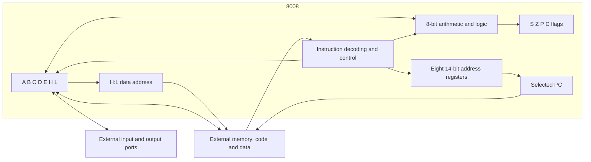

# Intel 8008

The Intel 8008 brought an eight-bit processor onto one chip at the beginning
of the microcomputer era. This chapter follows it from its origins to its
programming model, physical operation, and instruction encodings. The formal
definitions also generate Dromaios's complete instruction-level implementation.
Hardware history, explanations, model contracts, and executable definitions
therefore share one maintained source.

[History](#historical-background) ·
[Architecture](#the-programmers-machine) ·
[Physical operation](#from-chip-to-computer) ·
[Worked execution](#following-a-program) ·
[Formal model](#stored-state) ·
[Hardware references](#references) ·
[Checks and limits](#checks-and-limits) ·
[Coverage](../../../../docs/cpus/coverage.md#8008) ·
[Example programs](#example-programs)

The opening sections can be read without knowing the specification language.
The later `cpu` blocks define state, instruction behavior, reset, and execution
policies; the surrounding prose explains their meaning and choices. See the
[language guide](../../../../docs/cpus/literate-specifications.md) for syntax.
Descriptions of electrical operation provide context for the hardware; the
[model boundary](#the-chip-and-this-model) identifies what execution simulates.

## Historical background

Intel introduced the 8008 in April 1972, five months after the four-bit 4004.
The two projects developed separately. The 8008 grew from work for Computer
Terminal Corporation (CTC, later Datapoint), which wanted a processor for its
Datapoint 2200 programmable terminal. Intel initially called the chip the 1201.
Its customer origin matters: the instruction set began with the needs of a
particular terminal rather than a plan for a future desktop computer.
[Intel's historical account][intel-history] traces the contract discussions
to December 1969.

CTC supplied the starting instruction set. Ted Hoff and Stan Mazor worked on
Intel's specification; Hal Feeney developed the chip under Federico Faggin's
supervision. Intel made changes, including adding increment and decrement
instructions. CTC ultimately used a processor built from TTL logic chips in
the Datapoint 2200 rather than adopting the 8008. The participants describe
these decisions in the [8008 oral history][8008-oral-history], pages 2–9.
Intel subsequently sold the processor as a general product.

The result was small enough to make a processor a component that other
designers could build around. Intel lists roughly 3,500 transistors and a
10-micrometre process for the 8008 in its [processor reference][intel-family].
The chip still needed memory, clocks, and interface circuitry: putting the
CPU on one chip did not put the whole computer there.

### Machines and programming tools

The 8008 reached industrial systems, development equipment, and early personal
computers. These examples show several ways people used the same processor:

| System | Period | Role |
| --- | --- | --- |
| Micral | 1973 | A French commercial computer sold assembled, using the 8008; see the [Computer History Museum account][micral-history] |
| Intel Intellec 8 | 1973 | A development system with RAM, a console, a teletype interface, and PROM-programming support; see Intel's [June 1973 announcement][intel-1973], reproduced before the manual's contents |
| SCELBI-8H | 1974 | An early small computer offered to individual builders; Nat Wadsworth's [lab notes][scelbi-notes] record a commercial unit in January and advertisements beginning in March |
| Mark-8 | July 1974 | Jonathan Titus's construction project in *Radio-Electronics*, using an 8008 and separate logic and memory boards; described in the contemporary [Amateur Computer Society newsletter][mark8-newsletter] |

Programs could be developed away from the target machine. Intel's
[assembly-language manual][intel-assembly], section 1.0, describes an Intellec
editor, assembler, and monitor, plus cross assemblers hosted on larger computers
with a suitable FORTRAN compiler. A small target could run code prepared on
a much larger machine. Dromaios continues that separation: a host prepares a
memory image, then the simulated CPU fetches the resulting bytes.

### What carried forward

Intel's 8080 followed in April 1974, according to its
[introduction timeline][intel-years]. The familiar A/B/C/D/E/H/L registers,
accumulator arithmetic, and little-endian addresses make the family resemblance
visible. The 8008 is nevertheless its own instruction set. For example, `$06`
loads A with an immediate byte here; on our [8080 model](8080.md)
it loads B. Likewise, `$FF` halts the 8008 but performs RST 7 on the 8080.
An 8008 binary cannot simply be handed to an 8080.

The address stack is another substantial difference: the 8008 retains return
addresses inside the chip, whereas the 8080 uses a stack in external memory.
These distinctions explain why this specification starts from the 8008's
native encodings and state, even when shared emulator machinery can serve both.

## The programmer's machine

Eight-bit describes the data the processor moves and calculates with at once.
Each byte represents an unsigned value from 0 to 255, or another interpretation
chosen by a program: a character, eight independent bits, or part of a larger
number. Addresses have a different width. Fourteen address bits select 16,384
byte locations, `$0000` through `$3FFF`. Code and data occupy the same address
space; the operation being performed determines how a fetched byte is used.

The following is a functional map of the state and operations defined below.
It is an architectural view, not a transistor layout or wiring schematic.



### The accumulator, registers, and flags

A is the accumulator: arithmetic and logical instructions combine A with a
source byte and normally put the result back in A. B/C/D/E/H/L hold other bytes.
Transfers move values between registers without doing arithmetic. H and L have
an additional role: concatenating them supplies the address for a memory
operand. `M` in an instruction name means the byte at that address; there is
no eighth data register named M.

| Flag | Meaning after a byte-result arithmetic operation | Example |
| --- | --- | --- |
| S | The result's high bit | `$80` has S = 1 |
| Z | The result is zero | `$00` has Z = 1 |
| P | The result contains an even number of one bits | `$05` has P = 1; `$01` has P = 0 |
| C | Carry out of addition, or borrow from subtraction | `$FF + $01` produces `$00` and C = 1 |

S makes a two's-complement interpretation possible, but the chip has no signed
overflow flag. For example, `$7F + $01` sets S and clears C: the unsigned
addition fits in a byte even though signed 127 plus 1 does not. Comparison
performs subtraction for its flags while leaving A unchanged. Loads preserve
flags, and increment/decrement preserve C, so a program can adjust pointers
and counts without losing a pending carry between bytes. The formal policies
below distinguish these cases from rotations, which change C alone.

### Two ways to hold an address

The PC selects the next instruction byte. Physically, it is the selected member
of eight address registers, leaving seven others for saved return addresses.
CAL or RST changes which register is selected; RET selects the preceding one.
These operations do not push bytes into RAM. There is no general PUSH/POP
facility for saving A, flags, or local variables. Software must arrange that
storage itself, and must account for the seven saved-return-address limit.

H:L independently addresses data. Only its low fourteen bits reach memory,
although both registers retain all eight bits. Thus H:L = `$E677` reads or
writes location `$2677`, while H still contains `$E6` when used in arithmetic.
To load an arbitrary data address, load H and L separately; there is no direct
load/store instruction carrying a full data address in its own operand bytes.

Increasing L past `$FF` wraps it to `$00` without changing H. Crossing a
256-byte boundary therefore needs an explicit adjustment of H. The same
principle applies to larger arithmetic: software combines byte operations
using carry or borrow. These are consequences of the instruction set, not
extra work introduced by the emulator.

### Reading the instruction encodings

The first byte of an instruction is its opcode. Some instructions then fetch
one immediate data byte or two target-address bytes, low byte first. All bit
patterns below run from bit 7 on the left to bit 0 on the right. Repeated
letters identify a selector field; `x` means a documented ignored bit.
Values with `$` and the byte listings are hexadecimal; a historical suffix
such as `80H` also means hexadecimal. Step counts are decimal.

| Leading bits | Main families | What the other bits select |
| --- | --- | --- |
| `00` | Adjustments, rotates, conditional returns, immediate ALU, RST, immediate loads, RET, and two HLT forms | Register, operation, condition, or restart vector, depending on the low bits |
| `01` | Jumps, calls, and ports | A condition or ignored alias field for control flow; a five-bit selector for ports |
| `10` | Register/memory accumulator ALU | `ooo` chooses an operation; `sss` chooses its source |
| `11` | Register/memory transfers | `ddd` chooses a destination and `sss` a source; `11 111 111` is HLT |

For example, LMA is `11 111 000`: transfer (`11`), destination M (`111`),
source A (`000`). Its opcode is `$F8`. LAI is `00 000 110`, or `$06`, followed
by a data byte. An unconditional JMP can be `$44`, `$4C`, and six other
aliases because its middle selector bits are ignored. The detailed families
below give the complete patterns and exclusions.

Intel advertised **48 instructions**; this project counts **250 documented
opcode forms**, including register selections, conditions, ports, and aliases.
These count different things. The remaining six byte values are undefined in
this specification. See the [counting rules](../../../../docs/cpus/coverage.md#how-the-percentages-are-counted)
and Intel's [manual introduction][intel-1973], printed page 3.

## From chip to computer

The hardware contained more than the state a program could name: its internal
bus, instruction decoder, temporary registers, and control logic moved values
through the ALU and register storage. The data registers and address stack used
dynamic memories, refreshed internally, including while waiting or stopped.
[Intel's block description][intel-1973], printed pages 6–7, describes that
implementation. The formal model retains the resulting stored values and
ordered effects without recreating those internal circuits.

### Package and signals

The package had 18 pins. Feeney recalls that Intel's established memory-chip
packages constrained the design: an early 16-pin plan became practical as an
18-pin part when that package entered Intel's production. Mazor also connects
the fourteen-bit address limit to the shortage of pins in the
[oral history][8008-oral-history], pages 5–6.

| Pins | Role |
| --- | --- |
| D0–D7 | Eight bidirectional lines shared by addresses, control information, and data |
| S0–S2 and SYNC | Identify processor state and timing |
| READY | Allows external memory to delay a transfer |
| INTERRUPT | Requests an externally supplied instruction |
| φ1 and φ2 | External clock phases |
| VCC and VDD | Power supplies |

The [November 1972 manual][intel-1972-nov], pin configuration and *Processor
Timing*, describes this interface. External latches retain the address while
the same pins carry data. A computer also needs memory selection and read/write
control, port decoding, clocks, and power.

### A memory cycle

Multiplexing means using the same wires for successive parts of a transfer:

| State | Bus activity |
| --- | --- |
| T1 | Send the low eight address bits |
| T2 | Send the high six address bits and two cycle-control bits |
| WAIT, if needed | Wait for READY |
| T3 | Read an instruction/data byte or write a data byte |
| T4/T5, when needed | Perform internal execution work |

The cycle-control bits distinguish opcode fetch, further reads, writes, and I/O.
An instruction can require several cycles; T1I replaces T1 for interrupt
acknowledgement. See [Intel's timing description][intel-1972-nov], printed pages
2–3. The emulator's ordered access records describe completed byte transfers,
not each state or clock edge.

### Speed, clocks, and power

Intel specifies a 500 kHz clock for the 8008 and 800 kHz for the selected
8008-1, with a five-state instruction taking 20 or 12.5 microseconds respectively.
Those are ten clock periods, not one; extra cycles or waits take longer.
Its electrical tables specify VCC = +5 V and VDD = −9 V relative to the system's
TTL ground. See the [November 1973 manual][intel-1973], printed pages 3 and 22.
These physical requirements are distinct from the host computer's speed and
from Dromaios's instruction-step budget, which expresses no simulated duration.

### Starting, stopping, and communicating

HLT stops instruction execution, while READY waiting pauses a transfer.
Neither means that the hardware has been powered off. Startup and interrupts
are closely related because there is no reset pin that simply redirects PC
to a fixed boot address. External circuitry must arrange an instruction to
release the stopped CPU, as described in [reset](#reset) and
[interrupt delivery](#external-interrupt-delivery).

A supplied RST is especially useful: it selects one of eight restart addresses
without needing operand bytes from the interrupt source. A supplied CAL allows
an arbitrary address but requires two more supplied bytes. Those instructions
save the interrupted PC through the internal stack. A supplied LAA instead
leaves A unchanged and continues at that same PC. Interrupt acceptance itself
does not save registers or flags, so an interrupt routine needs its own
preservation convention.

Ports form a separate interface from memory. INP selects one of eight input
ports; OUT selects one of twenty-four output ports. The opcode contains the
port number and A carries the byte. What a port controls—a keyboard, display,
paper-tape interface, or another device—is a property of the surrounding
machine. The CPU definition specifies the transfer, while the machine supplies
the device and any interrupt-request logic.

### The chip and this model

This chapter specifies every documented instruction and the externally visible
state at instruction boundaries. Its physical descriptions also explain the
parts deliberately outside that model:

| Subject | Dromaios contract |
| --- | --- |
| Memory system | One flat 16 KiB RAM connection; real systems could populate the address space with different memory devices |
| Timing and electrical signals | Ordered byte accesses, without pin transitions, READY delays, internal refresh, or cycle counts |
| Power-on | `reset()` models the settled stopped state; slot zero and preserved unspecified flags are explicit model choices |
| Interrupt request | A host call supplies bytes; external qualification, electrical timing, and device scheduling belong to the caller |
| Undefined opcodes | Ordinary execution reports `unsupported` and retains state; this is a diagnostic policy, not a promise about undefined silicon behavior |

The executable state and policies below are therefore sufficient to reproduce
program behavior within these boundaries. Reconstructing the chip's electrical
waveforms would require an additional timing model.

## Following a program

The existing [arithmetic example](../../../../docs/cpus/8008/examples/arithmetic.md)
loads 2, adds 3, stores 5 at `$0080`, and halts. Its specification owns the
complete image, initial state, and acceptance trace. Here the interesting part
is how three of its instructions use different paths through the same CPU.

At `$0004`, LAI reads opcode `$06` and operand `$02`. The active address register
advances twice, reaching `$0006`; A becomes `$02` and flags stay unchanged.
The instruction's data comes from the byte stream, so H:L is irrelevant.

At `$0006`, ADI reads `$04` and `$03`. PC reaches `$0008`, and the ALU adds
`$02 + $03` to produce `$05`. S and Z are clear; C is clear because the total
fits in a byte; P is set because `$05` has two one bits. This is the point
where a stored byte becomes a calculation and new condition flags.

At `$0008`, LMA reads `$F8`, advancing PC to `$0009`. H:L already holds `$0080`.
The instruction then writes A's `$05` to that location, without reading the old
byte or changing flags. The record distinguishes the opcode read at `$0008`
from the data write at `$0080`. Finally HLT advances PC to `$000A` and stops.
An externally supplied RST could subsequently save that `$000A` and enter a
routine; another ordinary step alone leaves the stopped state unchanged.

These observations connect directly to the definitions: the fetch policy owns
PC advancement, the load family writes its selected destination, the ALU policy
sets flags, and the memory operand uses H:L. The next sections make each rule
explicit enough to generate the emulator.

## Stored state

The seven byte registers, four flags, eight address registers, address-register
selector, and stopped latch below are the complete stored state of this model.
These declarations generate the schema used by construction, snapshots, machine
parsing, and instruction validation, together with its TypeScript stored-state
type. They declare storage and constraints, not initial or reset values.

Register and flag fields use lowercase names in TypeScript. Architectural flags
live in a separate `flags` group, so register C and flag C are distinct.
Machine definitions use uppercase register and flag names. The explicit mappings
retain `addressStack`, `stackIndex`, and `halted` for the internal control state.
There is no RAM stack pointer, stack-depth counter, interrupt-enable latch,
auxiliary carry, or overflow flag.

```cpu
cpu "8008"
state {
  register A: 8
  register B: 8
  register C: 8
  register D: 8
  register E: 8
  register H: 8
  register L: 8
  flag S
  flag Z
  flag P
  flag C
  array ADDRESS: 14[8] = addressStack
  register SELECTOR: 3 = stackIndex
  latch STOPPED = halted
}
```

## Register views

The selected address register is the PC. Read its selector, then that physical
slot; inspecting PC never advances it. H:L is the raw sixteen-bit concatenation
of the H and L byte registers, including H's upper two bits. Memory addressing
still masks that pair to fourteen bits at the point of a memory access.
Neither view has separate storage, and both observe the current stored values.

```cpu
view PC "selected program counter": 14 {
  slot = register SELECTOR
  address = array ADDRESS[slot]
  return address
}
view HL "raw H:L pair": 16 {
  high = register H
  low = register L
  return concat(high, low)
}
```

The ordinary fetcher supplies a sixteen-bit next address. Truncate it to fourteen
bits, read the current selector, and replace only the selected address register.
This includes wrapping from $3FFF to $0000; the other seven slots stay intact.
Instruction bodies retain their explicit target and selector writes, while
interrupt-supplied bytes do not call this action.

```cpu
action setPC "set the selected program counter" (address: 16) {
  target = truncate(address, 14)
  slot = register SELECTOR
  ADDRESS[slot] <- target
}
```

## Reset

The 8008 has no dedicated reset input. Its documented power-on sequence clears
its internal memories and leaves it stopped; an interrupt starts execution.
`reset()` models that settled clearing-and-stop result at an instruction boundary.
Selecting slot zero and preserving unspecified flags are deterministic model
policies. No power transition, clock sequence, forced instruction, or interrupt
is simulated, and this operation is distinct from the RST instruction.

Reset models settled power-on state. Clear the seven byte registers and all
eight address registers, select slot zero, and enter STOPPED. The startup
reference does not specify flag values; this model preserves them by omitting
flag reads and writes. `ADDRESS[]` writes the same value to every physical slot
without reading its previous contents. Repeating reset produces the same state.
RAM and ports are untouched. The shared runtime guards the execution boundary
and records detached before/after snapshots around this action.

```cpu
action reset "settled power-on reset" {
  A <- u8($00)
  B <- u8($00)
  C <- u8($00)
  D <- u8($00)
  E <- u8($00)
  H <- u8($00)
  L <- u8($00)
  ADDRESS[] <- u14($0000)
  SELECTOR <- u3(0)
  STOPPED <- 1
}
```

The reset record contains independent `before` and `after` snapshots and an
empty, memory-only access list, with no instruction or step outcome. After reset,
`interrupt()` can start the CPU with an externally supplied instruction.
Example factories instead initialize `halted = false`; creating a new example
restores its initial state and fresh RAM. Construction never implies power-on.

## Execution and interrupt acceptance

An interrupt is an unconditional offer of an instruction. After validating the
host's acknowledgement callback, release STOPPED before requesting its first
byte. No flags or address registers change during acceptance. A later invalid
byte, undefined opcode, or device failure retains this release.

```cpu
action resume "accept an external instruction" {
  STOPPED <- 0
}
```

Ordinary execution uses a flat fourteen-bit RAM address space and the selected
PC. A stopped step makes no access. Read one opcode byte; advance PC only when
that byte selects a documented instruction. Each later operand fetch reads the
live PC, then advances it after a successful read. Counter arithmetic supplies
a sixteen-bit next address to `setPC`, whose narrowing gives the native wrap.
Word operands are low byte first. There is no additional retirement action.

Interrupt execution obtains every instruction byte from acknowledgement,
including immediate and address operands, and preserves PC during those
fetches. Data-memory and port accesses still use their ordinary connections.
The same opcode families execute both ways; supplied HLT can stop the CPU again.
An undefined supplied byte retains acceptance effects and fetches no more bytes.
Thrown failures propagate, keeping completed effects and returning no record.

```cpu
execution {
  memory 14
  counter PC write setPC
  stopped STOPPED
  word little
  opcode advance on dispatch
  operand advance after read
  failure retain
  reset action reset
  retire none
  interrupt {
    accept always with resume
    bytes acknowledge
    counter preserve
    unknown retain
  }
}
```

The shared runtime records completed accesses in order and returns detached
before/after snapshots. Unsupported instructions report the fetched byte;
already stopped steps report no instruction. A common guard rejects nested
step, reset, and interrupt calls, while allowing snapshots in callbacks, and
releases after success or failure. These services execute the declared policies.

### Instruction steps

`step()` returns a `Cpu8008StepRecord` with independent `before` and `after`
snapshots, the instruction address and fetched bytes, ordered byte `accesses`,
and an `outcome` of `executed`, `halted`, or `unsupported`. Only unsupported
records have `reason: "opcode"`. An already halted step has `instruction: null`,
no accesses, and unchanged state.

Data reads are separate from instruction bytes and do not advance PC. Stores
never read the destination; writes are recorded even if the value is unchanged.
Recorded instruction bytes survive stores over their original RAM locations;
subsequent instructions read current RAM. All records own their snapshots and
access entries, so later CPU or device activity cannot change earlier records.

The six undefined bytes (`22`, `2A`, `32`, `38`, `39`, `3A`) read only the
opcode and preserve all state and RAM. Repeating the attempt repeats that read.
Leaving PC unchanged despite fetching the byte is an explicit model policy.
All three HLT encodings (`00`, `01`, `FF`) advance PC once before stopping
ordinary execution; an external interrupt can release STOPPED.

### External interrupt delivery

`interrupt(acknowledge: () => number)` offers an instruction at the current
boundary. The 8008 has no interrupt mask, enable delay, automatic flag save,
or automatic call. The caller owns request qualification and scheduling; no
request queue or device connection is added to snapshot state. A new offer
can be accepted at the very next boundary.

The callback supplies the opcode and each immediate or address byte exactly
once; every result must be an integer in `00`–`FF`. None advances PC. Data
accesses still use RAM through H:L or the connected ports, and target addresses
remain low-byte first with the high two bits ignored. The instruction bodies
below therefore have these effects when supplied externally:

| Supplied instruction | Effect on control flow |
| --- | --- |
| RST / taken CAL | Leave the interrupted PC in its slot, select the next slot, and load the target |
| JMP / taken conditional jump | Replace the selected PC |
| RET / taken conditional return | Select the preceding slot without incrementing the outgoing one |
| Untaken conditional transfer | Preserve every slot; jump/call still consume both supplied address bytes |
| LAA or another non-branch instruction | Resume ordinary RAM execution at the unchanged PC |
| HLT | Reenter STOPPED with no PC increment |

An ordinary HLT has already advanced PC, so a supplied RST/CAL preserves the
address after that HLT. Calls retain their eight-slot wrap and overwrite
behavior. Flags and registers change only as specified by the instruction.

`Cpu8008InterruptRecord` contains detached `before`/`after` snapshots,
`instruction: { source: "interrupt", bytes }`, and ordered accesses. It has
no RAM instruction address. Acknowledgements use `{ kind: "acknowledge", value }`;
data-memory and port transfers retain their ordinary shapes. Outcomes are
`executed`, `halted`, or `unsupported` with `reason: "opcode"`; there is no masked
or ignored outcome. An undefined byte is acknowledged and rejected after
releasing STOPPED, with no further effect. Ordinary `step()` instead preserves
all state when rejecting an opcode.

The [November 1973 manual][intel-1973], printed pages 18–20 and Figure 5,
describes PC suppression and supplied RST/CALL saving the interrupted PC.
Its startup examples include LAA at address zero, executed first during the
interrupt and then again by ordinary execution. The
[Intellec 8 Reference Manual][intellec-1974], printed pages 18–19, distinguishes
CPU acceptance from the peripheral logic supplying a multi-byte instruction.
The callback models that external source, without electrical synchronization
or multiplexed bus states.

### Failure boundaries

A missing or non-callable interrupt callback throws `TypeError` before
acceptance. An invalid supplied byte throws `RangeError`; callback, RAM, and
device errors propagate. Failures return no record and retain completed
effects, including STOPPED release, without rollback or implicit retry.
Callbacks may inspect snapshots, but nested `step()`, `reset()`, or `interrupt()`
calls throw before changing CPU state. The execution guard clears after every
failure, allowing a later boundary call.

## Public interface

The model is exposed as `Cpu8008`. Construction takes RAM, initial stored state,
and an optional byte-port connection. It checks RAM before reading initial
state, then validates and copies every stored field, including the address
registers and flags. Caller-owned arrays may be readonly; internal storage is
mutable. The generated `Cpu8008State` and `Cpu8008StoredState` types express
that distinction, with `Cpu8008AddressStack` and `Cpu8008Flags` aliases derived
from the corresponding stored fields.

`new Cpu8008(ram, initialState, ports?)` requires exactly 16 KiB RAM. Numeric
state violations throw `RangeError`; malformed address arrays and non-Boolean
flags or latches throw `TypeError`. Sparse address arrays fail numeric
validation. Each declared input field and array slot is read once, including
non-enumerable properties. Extra metadata and derived views are ignored.
Construction neither resets nor executes, and makes no RAM or port accesses.

Snapshots contain a detached copy of all stored state plus the two views below.
Their fields, nested flags, and address registers are readonly to callers.
`pc` exposes the selected address register; `hl` exposes the complete H:L pair,
including its upper two bits. Reading a snapshot never accesses RAM or ports.

```cpu
interface Cpu8008 "Instruction-level Intel 8008 with native port selectors and 14-bit addresses." {
  snapshot pc = PC
  snapshot hl = HL
}
```

The generated class supplies `snapshot()`, `reset()`, `step()`, and
`interrupt(acknowledge)`, together with their concrete state and result types.
Their behavior follows the execution contract above. The public module, state
types, instruction catalogue, and execution bindings are all generated; this
chapter is the sole processor-specific implementation source.

A snapshot can initialize a fresh CPU. Its recursively readonly public type
does not freeze the underlying JavaScript objects; bypassing that typing still
cannot change the CPU or another snapshot. The CPU retains no record history.
Reconstruction reconnects any external devices separately, as described under
[port input and output](#port-input-and-output).

The build discovers this chapter and registers the model from `cpu "8008"`.
Machine parsing uses its generated schema and caller-state types. `memory 14`
sets the required RAM size to $4000 bytes; the fourteen-bit public PC view sets
completion addresses to $0000–$3FFF. The same generated entry point serves flat
and composed machines. No separate model registration or RAM-size rule is
maintained in TypeScript.

## Seven registers and one memory operand

A, B, C, D, E, H, and L each hold a complete byte. Transfers do not read or write
the flags, the selected address-stack slot, its selector, or the halted latch.

The eighth operand, M, means the memory byte addressed by H:L. Concatenating H
and L produces sixteen bits, but the 8008 has fourteen address bits. Masking
with `$3FFF` makes the upper two H bits irrelevant to addressing while retaining
them in the register itself. Thus `$3FFF`, `$7FFF`, `$BFFF`, and `$FFFF` all
address the same byte; a transfer *from H* still reads all eight bits of H.

```cpu
source throughHL "memory address through low 14 bits of HL": 16 {
  high = register H
  low = register L
  return and(concat(high, low), u16($3FFF))
}
```

Each three-bit selector uses the order A/B/C/D/E/H/L/M. A register entry can be
read or written directly. A memory entry resolves its address at the time of
the operand read or write; selecting M does not eagerly read H or L.

```cpu
operands bytes {
  000 "A" = register A
  001 "B" = register B
  010 "C" = register C
  011 "D" = register D
  100 "E" = register E
  101 "H" = register H
  110 "L" = register L
  111 "M" = memory throughHL
}
```

## Register and memory transfers

The [November 1973 manual][intel-1973], printed pages 8–11, gives the selectors,
load forms, and flag rules. The transfer matrix contains 49 register copies,
seven memory reads, and seven memory writes; immediate loads add eight forms.
Loading H or L from memory reads through the original H:L before replacing
the destination. A register self-transfer reads only its opcode from RAM.

The encoding is `11 ddd sss`: `ddd` selects the destination and `sss` the source.
Intel names a transfer `Lds`, placing the destination before the source: LBA
loads B from A, LAM loads A from memory, and LMA stores A to memory. The name
template below uses those selected operand labels.

The `11 111 111` slot belongs to HLT, so it is explicitly excluded.

Capture the selected source byte before writing the destination, including
self-transfers and unchanged writes. For M, read H then L at the access point
and mask only the address to $3FFF. Stores resolve it after capturing the source,
even when storing H or L, and never read the destination. Do not access flags
or control state. A failed source read prevents writeback.

```cpu
family transfer "11 ddd sss" for d in bytes, s in bytes named "L{d}{s}" except "11 111 111" {
  result = operand s
  operand d <- result
}
```

## Immediate loads

The encoding `00 ddd 110` selects the destination in the same way, followed by
one immediate byte. All eight destinations exist, including M. Fetching advances
the selected address register in ordinary execution, while interrupt-supplied
bytes follow the CPU's existing supplied-stream contract.

Fetch the immediate byte before touching the destination. For M, then read H
and L and mask only the address to $3FFF. Never read destination memory; write
once, even if unchanged. Preserve flags. A failed fetch prevents destination effects.

```cpu
family immediate "00 ddd 110" for d in bytes named "L{d}I n" {
  result = fetch
  operand d <- result
}
```

## Arithmetic operands and flags

The [November 1973 manual][intel-1973], printed pages 11–12, defines the
accumulator operations and flags. H and L contribute all eight bits as operands.
A memory operand makes a separate data read even when it aliases the opcode;
it neither writes RAM nor increments PC. Other data registers and inactive
address slots remain unchanged.

The accumulator A supplies the left operand. The right operand is a selected
register, M through the same masked H:L address, or the next instruction byte.
Read that source completely before reading incoming carry or A. Even an
instruction using A as its source reads A twice, at these separate points.
Immediate fetching retains the ordinary/supplied-stream rule described above.

```cpu
source immediateByte "immediate byte": 8 {
  byte = fetch
  return byte
}
```

Register C and carry flag C are distinct storage locations. `register C` and
`flag C` distinguish their reads; flag writes belong to explicit policies.
S reports bit 7 of a byte result, Z reports zero, and P reports even parity,
including zero. Adjustments preserve carry without reading it; accumulator
arithmetic also replaces carry. Each policy's listed flags change in one stage.

```cpu
policy SZP "8008 result S/Z/P" (result: 8) {
  S = negative(result)
  Z = zero(result)
  P = evenParity(result)
}
policy ALU "8008 result S/Z/P/C" (result: 8, carry: flag) {
  S = negative(result)
  Z = zero(result)
  P = evenParity(result)
  C = carry
}
```

## Eight accumulator operations

Both encodings select the same operation: `10 ooo sss` uses A/B/C/D/E/H/L/M,
while `00 ooo 100` fetches an immediate byte. Each family below lists both
encodings and supplies their shared body once. The immediate encoding binds
`s` to the instruction-byte source instead of a three-bit operand selector.

| ooo | Register/memory | Immediate | Result |
| --- | --- | --- | --- |
| 000 | ADs | ADI | A plus source |
| 001 | ACs | ACI | A plus source plus C |
| 010 | SUs | SUI | A minus source |
| 011 | SBs | SBI | A minus source minus C |
| 100 | NDs | NDI | A AND source |
| 101 | XRs | XRI | A XOR source |
| 110 | ORs | ORI | A OR source |
| 111 | CPs | CPI | Compare A with source |

Addition and subtraction wrap to eight bits. Carry reports an unsigned total
above FF; borrow reports a subtraction below zero. The 8008 uses C directly
as borrow on subtraction. It has no overflow or half-carry flag. The `carry`
and `borrow` expressions use captured operands, never a later state read.

### AD

Read the source, then A without reading incoming flags. Add with byte wraparound;
set S/Z and even parity P from the result, and C from unsigned carry, before
writing A. A failed source read prevents arithmetic and writeback.

```cpu
family AD {
  encoding "10 000 sss" for s in bytes.read named "AD{s}"
  encoding "00 000 100" with s = immediateByte named "ADI byte"
  right = source s
  left = register A
  result = add(left, right)
  apply ALU(result, carry(left, right))
  A <- result
}
```

### AC

Read the source, capture incoming C, then read A. Add both bytes and that
captured carry with byte wraparound. Apply S/Z/P and unsigned carry before
writing A. A failed source read prevents carry reads and writeback.

```cpu
family AC {
  encoding "10 001 sss" for s in bytes.read named "AC{s}"
  encoding "00 001 100" with s = immediateByte named "ACI byte"
  right = source s
  carry = flag C
  left = register A
  result = add(left, right, carry)
  apply ALU(result, carry(left, right, carry))
  A <- result
}
```

### SU

Read the source, then A without reading incoming flags. Subtract with byte
wraparound; set S/Z/P from the result and C from unsigned borrow before writing
A. A failed source read prevents arithmetic and writeback.

```cpu
family SU {
  encoding "10 010 sss" for s in bytes.read named "SU{s}"
  encoding "00 010 100" with s = immediateByte named "SUI byte"
  right = source s
  left = register A
  result = subtract(left, right)
  apply ALU(result, borrow(left, right))
  A <- result
}
```

### SB

Read the source, capture incoming C, then read A. Subtract the source and that
captured borrow with byte wraparound. Apply S/Z/P and unsigned borrow before
writing A. A failed source read prevents carry reads and writeback.

```cpu
family SB {
  encoding "10 011 sss" for s in bytes.read named "SB{s}"
  encoding "00 011 100" with s = immediateByte named "SBI byte"
  right = source s
  carry = flag C
  left = register A
  result = subtract(left, right, carry)
  apply ALU(result, borrow(left, right, carry))
  A <- result
}
```

### ND

Read the source before A and compute their bitwise AND. Set S/Z/P from the
result and clear C before writing A, without reading incoming flags. A failed
source read prevents calculation and writeback.

```cpu
family ND {
  encoding "10 100 sss" for s in bytes.read named "ND{s}"
  encoding "00 100 100" with s = immediateByte named "NDI byte"
  right = source s
  left = register A
  result = and(left, right)
  apply ALU(result, 0)
  A <- result
}
```

### XR

Read the source before A and compute their bitwise XOR. Set S/Z/P from the
result and clear C before writing A, without reading incoming flags. A failed
source read prevents calculation and writeback.

```cpu
family XR {
  encoding "10 101 sss" for s in bytes.read named "XR{s}"
  encoding "00 101 100" with s = immediateByte named "XRI byte"
  right = source s
  left = register A
  result = xor(left, right)
  apply ALU(result, 0)
  A <- result
}
```

### OR

Read the source before A and compute their bitwise OR. Set S/Z/P from the
result and clear C before writing A, without reading incoming flags. A failed
source read prevents calculation and writeback.

```cpu
family OR {
  encoding "10 110 sss" for s in bytes.read named "OR{s}"
  encoding "00 110 100" with s = immediateByte named "ORI byte"
  right = source s
  left = register A
  result = or(left, right)
  apply ALU(result, 0)
  A <- result
}
```

### CP

Read the source before A, without reading incoming flags. Compute the wrapped
byte subtraction only to set S/Z/P and unsigned borrow C. Leave A unchanged
without writing it. A failed source read prevents every flag update.

```cpu
family CP {
  encoding "10 111 sss" for s in bytes.read named "CP{s}"
  encoding "00 111 100" with s = immediateByte named "CPI byte"
  right = source s
  left = register A
  result = subtract(left, right)
  apply ALU(result, borrow(left, right))
}
```

## Increment and decrement

The encoding `00 rrr 00d` adjusts B/C/D/E/H/L, with d=0 for increment and d=1
for decrement. A has no adjustment: its two slots are HLT. M has no adjustment
either, and its two slots remain undefined. The exclusions make both exceptions
visible beside each pattern.

H remains a full byte, and adjusting L never carries into H. Adjustments and
rotations follow the [November 1973 manual][intel-1973], printed pages 11 and 13.

Read the selected register once, add one with byte wraparound, and apply S/Z/P
before writing the register. Preserve C without reading it. No instruction
operand, data memory, or control state is accessed.

```cpu
family IN "00 rrr 000" for r in bytes named "IN{r}" except "00 000 000", "00 111 000" {
  original = operand r
  result = add(original, u8($01))
  apply SZP(result)
  operand r <- result
}
```

Read the selected register once, subtract one with byte wraparound, and apply
S/Z/P before writing the register. Preserve C without reading it. No instruction
operand, data memory, or control state is accessed.

```cpu
family DC "00 rrr 001" for r in bytes named "DC{r}" except "00 000 001", "00 111 001" {
  original = operand r
  result = subtract(original, u8($01))
  apply SZP(result)
  operand r <- result
}
```

## Accumulator rotations

The four encodings are `00 0td 010`: t=0 rotates the outgoing bit back into A,
while t=1 inserts incoming C; d=0 shifts left and d=1 shifts right. The outgoing
bit always replaces C, after writing A. S/Z/P retain their previous values even
if the new accumulator is zero or has a different sign or parity.

```cpu
policy rotateCarry "8008 rotate carry" (carry: flag) {
  C = carry
}
```

Capture A and rotate left, inserting its original bit 7 into bit 0. Write A
before replacing C with that outgoing bit. Preserve S/Z/P without reading them;
make no operand fetch or data-memory access.

```cpu
family RLC "00 000 010" {
  original = register A
  result = shiftLeft(original, negative(original))
  A <- result
  apply rotateCarry(negative(original))
}
```

Capture A and rotate right, inserting its original bit 0 into bit 7. Write A
before replacing C with that outgoing bit. Preserve S/Z/P without reading them;
make no operand fetch or data-memory access.

```cpu
family RRC "00 001 010" {
  original = register A
  result = shiftRight(original, lowBit(original))
  A <- result
  apply rotateCarry(lowBit(original))
}
```

Capture A before reading incoming C, then rotate left with the captured carry
entering bit 0. Write A before replacing C with original bit 7. Preserve S/Z/P;
make no operand fetch or data-memory access.

```cpu
family RAL "00 010 010" {
  original = register A
  carry = flag C
  result = shiftLeft(original, carry)
  A <- result
  apply rotateCarry(negative(original))
}
```

Capture A before reading incoming C, then rotate right with the captured carry
entering bit 7. Write A before replacing C with original bit 0. Preserve S/Z/P;
make no operand fetch or data-memory access.

```cpu
family RAR "00 011 010" {
  original = register A
  carry = flag C
  result = shiftRight(original, carry)
  A <- result
  apply rotateCarry(lowBit(original))
}
```

## Eight address registers

The 8008 has eight physical fourteen-bit address registers. A three-bit selector
chooses the current PC; the other seven slots can retain return addresses.
A call advances the selector modulo eight, then writes its target to the newly
selected slot. A return only moves the selector back. Neither operation copies
addresses or accesses a stack in RAM. An eighth nested call overwrites the
oldest return address.

Numbering slots by incrementing for calls and decrementing for returns is a
model convention. Extra returns continue around the ring without a depth check
or fault, and no slot is cleared on return. An ordinary RET advances its outgoing
slot for the opcode fetch before changing the selector; that advanced value
remains in the inactive slot. Intel's [November 1972 revision][intel-1972-nov],
Appendix II, describes these increments before stack selection changes.

The [November 1973 manual][intel-1973], printed pages 13–14, defines the control
encodings and both conditional paths. Every target fetch retains the entire
high byte in its record even though addressing ignores the high two bits.
Conditional jumps and calls fetch all three bytes on either path; an untaken
call preserves all inactive slots. Control instructions preserve data registers,
flags, and RAM, with no destination prefetch.

The chapter calls these locations ADDRESS and SELECTOR. They refer to the
stored fields `addressStack` and `stackIndex` declared above; SELECTOR is an
internal selection register, not an additional software-visible byte register.

Ordinary opcode and operand fetching advances the selected address register
with fourteen-bit wraparound. Interrupt-supplied bytes leave it unchanged.
Those rules remain in the CPU boundary; the bodies below only perform the
instruction's explicit target and selector changes.

Targets arrive low byte first. Fetch both bytes before reading any condition
or selector, concatenate them, and discard the high two bits. A failed second
fetch retains the first fetch's effects and prevents the later state changes.

```cpu
source targetAddress "14-bit target, low byte first": 14 {
  low = fetch
  high = fetch
  return truncate(concat(high, low), 14)
}
```

## Conditional control flow

The three-bit condition field is `vff`: v=0 requires a clear flag and v=1 a set
flag; ff selects C/Z/S/P. Intel's mnemonic suffixes combine F/T with that flag
name: JFC jumps if carry is clear, CTP calls if parity is set, and RFS returns
if sign is clear. Selecting a condition does not read flags. `when test c`
reads exactly that selected flag where the statement appears, then executes
its block only when the required value matches.

```cpu
conditions branches {
  000 "FC" = flag C = 0
  001 "FZ" = flag Z = 0
  010 "FS" = flag S = 0
  011 "FP" = flag P = 0
  100 "TC" = flag C = 1
  101 "TZ" = flag Z = 1
  110 "TS" = flag S = 1
  111 "TP" = flag P = 1
}
```

Conditional jumps use `01 ccc 000`. Fetch and narrow the complete target before
testing the selected flag. Only a taken jump reads SELECTOR and writes the
selected address register. Do not read target memory or change flags, SELECTOR,
or STOPPED; an untaken jump has only its instruction-fetch effects.

```cpu
family conditionalJump "01 ccc 000" for c in branches named "J{c}" {
  target = source targetAddress
  when test c {
    slot = register SELECTOR
    ADDRESS[slot] <- target
  }
}
```

Conditional calls use `01 ccc 010`. Fetch and narrow the complete target before
testing the selected flag. Only a taken call reads SELECTOR, advances it modulo
eight, and writes the target into that new physical slot. Preserve all other
slots, flags, and STOPPED. An untaken call never accesses the selector or array.

```cpu
family conditionalCall "01 ccc 010" for c in branches named "C{c}" {
  target = source targetAddress
  when test c {
    slot = register SELECTOR
    next = truncate(add(extend(slot, 8), u8($01)), 3)
    SELECTOR <- next
    ADDRESS[next] <- target
  }
}
```

Conditional returns use `00 ccc 011`. Test the selected flag before reading
SELECTOR. Only a taken return decrements it modulo eight. Keep every physical
address register unchanged; do not read a return address, fetch an operand,
or access data memory. Preserve flags and STOPPED. Ordinary opcode fetching
advances the current slot; externally supplied bytes leave it unchanged.

```cpu
family conditionalReturn "00 ccc 011" for c in branches named "R{c}" {
  when test c {
    slot = register SELECTOR
    next = truncate(subtract(extend(slot, 8), u8($01)), 3)
    SELECTOR <- next
  }
}
```

## Unconditional jumps, calls, and returns

The unconditional forms ignore their middle three bits: JMP is `01 xxx 100`,
CAL is `01 xxx 110`, and RET is `00 xxx 111`. Each pattern therefore names eight
documented opcode aliases. Unlike conditional forms, these instructions never
read flags.

Fetch both target bytes, low first, and narrow to fourteen bits. Then read
SELECTOR and replace only its selected address register. JMP leaves all other
slots, the selector, flags, and STOPPED unchanged, without reading target memory.

```cpu
family JMP "01 xxx 100" {
  target = source targetAddress
  slot = register SELECTOR
  ADDRESS[slot] <- target
}
```

Fetch and narrow the complete target, then advance SELECTOR modulo eight before
writing that target into the new slot. CAL leaves the caller's slot holding
its post-fetch address, or its unchanged address for supplied bytes. Preserve
other slots, flags, and STOPPED; perform no data-memory access.

```cpu
family CAL "01 xxx 110" {
  target = source targetAddress
  slot = register SELECTOR
  next = truncate(add(extend(slot, 8), u8($01)), 3)
  SELECTOR <- next
  ADDRESS[next] <- target
}
```

Read SELECTOR and decrement it modulo eight. RET leaves all eight physical
address registers, flags, and STOPPED unchanged. It neither reads a return
address nor fetches an operand, and performs no data-memory access.

```cpu
family RET "00 xxx 111" {
  slot = register SELECTOR
  next = truncate(subtract(extend(slot, 8), u8($01)), 3)
  SELECTOR <- next
}
```

## Restarts and halts

The restart pattern is `00 vvv 101`. Its three-bit field selects one of eight
fixed fourteen-bit target addresses. The catalogue distinguishes the encoded
bits from their values and native hexadecimal labels.

```cpu
codes vectors: 14 {
  000 "00" = $00
  001 "08" = $08
  010 "10" = $10
  011 "18" = $18
  100 "20" = $20
  101 "28" = $28
  110 "30" = $30
  111 "38" = $38
}
```

Capture the encoded restart target without fetching an operand. Read SELECTOR,
advance it modulo eight, then write the target into the new slot, just as for
CAL. Preserve all other slots, flags, and STOPPED. Ordinary opcode fetching
has already advanced the caller's slot; supplied opcodes have left it unchanged.

```cpu
family RST "00 vvv 101" for v in vectors {
  target = operand v
  slot = register SELECTOR
  next = truncate(add(extend(slot, 8), u8($01)), 3)
  SELECTOR <- next
  ADDRESS[next] <- target
}
```

STOPPED refers to the model's `halted` control latch. It is distinct from the
architectural flags and is not changed by the preceding control instructions.

HLT occupies `00 000 00x` and `11 111 111`: three documented encodings. Set
STOPPED without reading registers, flags, or the old latch. Opcode fetching
alone determines whether the selected address register has advanced. A stopped
CPU waits for the existing external interrupt boundary to supply an instruction.

```cpu
family HLT {
  encoding "00 000 00x"
  encoding "11 111 111"
  STOPPED <- 1
}
```

## Port input and output

The [November 1973 manual][intel-1973], printed page 14, defines the transfers;
page 62 confirms the assembler's port numbering: input `000`–`007` and output
`010`–`037` in octal. INP opcodes are `41`, `43`, …, `4F`; OUT opcodes are
`51`, `53`, …, `7F`. Output selectors retain their encoded values.

Port instructions use `01 ppppp 1`; the five-bit field is the entire port
selector, with no immediate byte. Ports 0..7 are inputs, and ports 8..31 are
outputs. The catalogue widens the encoded values to the common sixteen-bit
port interface without changing those native selector numbers. Labels retain
the decimal port numbers used by the instruction names.

```cpu
codes ports: 16 {
  00000 "0"
  00001 "1"
  00010 "2"
  00011 "3"
  00100 "4"
  00101 "5"
  00110 "6"
  00111 "7"
  01000 "8"
  01001 "9"
  01010 "10"
  01011 "11"
  01100 "12"
  01101 "13"
  01110 "14"
  01111 "15"
  10000 "16"
  10001 "17"
  10010 "18"
  10011 "19"
  10100 "20"
  10101 "21"
  10110 "22"
  10111 "23"
  11000 "24"
  11001 "25"
  11010 "26"
  11011 "27"
  11100 "28"
  11101 "29"
  11110 "30"
  11111 "31"
}
```

Capture the encoded input selector, read one byte from that port, and replace A
only after the read succeeds. Never read old A or any flag. Preserve all other
registers and control state; fetch no operand and access no data memory.

```cpu
family INP "01 ppppp 1" for p in ports except "01 01xxx 1", "01 1xxxx 1" {
  selector = operand p
  result = port(selector)
  A <- result
}
```

Capture the encoded output selector, then A, and write that byte once to the
port. Do not reread A during the callback or change registers, flags, or control
state. Fetch no operand and access no data memory. A failed callback retains
any effects the device has already performed.

```cpu
family OUT "01 ppppp 1" for p in ports except "01 00xxx 1" {
  selector = operand p
  contents = register A
  port(selector) <- contents
}
```

These families complete the 250 documented opcode forms. The six undefined
encodings (`22`, `2A`, `32`, `38`, `39`, and `3A`) stay absent. The execution
contract selects these same families for ordinary and interrupt-supplied bytes;
shared runtime services enforce guarding and assemble records.

### Device connection and records

The optional third constructor argument is the shared
[`BytePorts`](../port-access.ts) connection: `readPort(port): number` and
`writePort(port, value): void`. Input must return an unsigned byte. The CPU
retains the connection and calls it during execution; the caller owns device
state, which is neither snapshotted nor reset. Reconstructing a CPU requires
reconnecting its device. Construction, inspection, reset, undefined instructions,
and already halted steps make no port calls. RAM-only programs need no connection.

`Cpu8008Access` uses `{ kind: "read" | "write", address, value }` for memory and
`{ kind: "input" | "output", port, value }` for ports. A successful ordinary INP
or OUT records its opcode read followed by the port transfer, including unchanged
inputs and repeated outputs. Port transfers do not become instruction bytes.

A missing connection, invalid input byte, or device error throws a host error
and returns no instruction record. The completed opcode fetch remains: during
ordinary execution PC has advanced, while A, flags, and inactive slots remain
unchanged. Device side effects are not rolled back. The common
[failure boundary](#failure-boundaries) also applies to port callbacks.

## References

For historical background, [Intel's account][intel-history] establishes the
product's origins, and the [2006 oral-history panel][8008-oral-history] records
the designers' recollections. Contemporary manuals establish the technical
contract; dated lab notes and contemporary publications ground the system
examples. Historical context explains design choices without making a later
recollection part of the executable hardware contract.

The hardware reference is Intel's [8008 User's Manual, April 1972][intel-1972]
([searchable copy][intel-1972-searchable]), especially *Basic Functional Blocks*,
*Basic Instruction Set*, *Start-Up of the 8008*, and Appendix I's functional
definitions. The [November 1972 revision][intel-1972-nov], Appendix II, adds the
PC-increment details. Instruction sections above cite printed pages in the
[November 1973 manual][intel-1973]; the [Intellec 8 manual][intellec-1974]
clarifies the external interrupt source. The tutorial's earlier teaching model
uses 8080 encodings; this specification follows Intel's hardware 8008 encodings.

[intel-1972]: https://www.bitsavers.org/components/intel/MCS8/Intel_8008_8-Bit_Parallel_Central_Processing_Unit_Rev1_Apr72.pdf
[intel-1972-searchable]: https://manuals.plus/m/c23aa03524a8348d87dbe05c0a002b2aef66f39578347a483393e89283fb0f96
[intel-1972-nov]: https://manualzz.com/doc/10956006/intel-8008--8008-1-microprocessors-users-manual
[intel-1973]: https://deramp.com/downloads/mfe_archive/050-Component%20Specifications/Intel/Microprocessors%20and%20Support/8008%20Family/i8008UM%20Nov%2073.pdf
[intellec-1974]: https://www.bitsavers.org/components/intel/MCS8/Intel_Intellec_8_Reference_Manual_Rev_1_Jun74.pdf
[intel-history]: https://www.intel.com/content/www/us/en/history/virtual-vault/articles/the-8008.html
[8008-oral-history]: https://archive.computerhistory.org/resources/text/Oral_History/Intel_8008/Intel_8008_1.oral_history.2006.102657982.pdf
[intel-family]: https://www.intel.com/pressroom/kits/quickreffam.htm
[intel-years]: https://www.intel.com/pressroom/kits/quickrefyr.htm
[micral-history]: https://www.computerhistory.org/timeline/1973/
[scelbi-notes]: https://www.scelbi.com/history-lab-notes
[mark8-newsletter]: https://archive.computerhistory.org/resources/access/text/2024/06/102654910-05-0001-acc.pdf
[intel-assembly]: https://www.bitsavers.org/components/intel/MCS8/MCS_8_Assembly_Language_Programming_Manual_Preliminary_Edition_Nov73.pdf

## Checks and limits

[CPU tests](../../../../tests/components/cpus/8008.test.ts) ·
[Interrupt program test](../../../../tests/machines/8008/interrupts.test.ts) ·
[Public type checks](../../../../tests/types/8008.ts)

CPU tests check every byte pair and both incoming carry values for all eight
immediate ALU operations against independent decimal arithmetic, logical truth
tables, and binary-digit counts. Every register/memory and immediate encoding
also checks all operand bytes and incoming flag patterns at accumulator
boundaries, including A as its own source. Memory ALU checks cover H's four
address aliases, boundaries, and code overlaps, with no writes.

Other tests check all load bytes and flag patterns, all H:L combinations, every
PC, and each address-stack selector. They compare complete records and actual
RAM accesses, including unchanged-value writes, self-modified code, unsupported
attempts, all three HLT encodings, reset, and detached records.

Transfer checks cover every matrix encoding, byte value, and incoming flag
pattern, with all eight PC slots and wrapped opcode fetches. Memory cases also
check the four aliases formed by H's top bits, address-space boundaries,
instruction overlap, and loads into H and L. LAM and LMA each cover every H:L
combination. LMI covers every byte and flag pattern, wrapped operand fetches,
and aliased writes over its own opcode or operand. Further checks verify that
memory loads see RAM edits and the pointer left by a preceding load.

Control-flow checks cover all documented aliases, every encoded destination
including ignored high bits, every selector and flag pattern, wrapped fetches,
eight nested calls, overwritten return addresses, and unbalanced returns.
Conditional checks cover all 24 encodings and all 16 flag patterns in every
slot. Jump/call cases include four address aliases, byte-boundary wrapping,
self-targets, and destinations overlapping instruction bytes on both paths.
Return cases check retained outgoing slots, boundary destinations, and equal
PC values in different slots. A repeated conditional jump also checks current
flags, edited address bytes, and detached records.

Adjustment and rotation tests cover all 256 operand values and all 16 incoming
flag patterns, checking full records, preserved registers/flags, and actual
RAM calls. RST tests cover every vector from every PC, all stack selectors and
flag patterns, wrapped fetches, overlapping targets, returns, and eight nested
restarts overwriting the oldest return address. An opcode audit exercises all
250 documented forms and rejects exactly the six undefined bytes. Port tests
check every selector and byte, preserved flags and address slots, wrapped
fetches, live device state, ordered transfers, detached records, callback
reentrancy, and connection failures. A combined INP/CAL/ADI/OUT/RET/HLT program
checks bounded running and snapshot restoration across a wrapped call.

Interrupt tests check every RST vector, stack selector, and flag pattern at
boundary PCs; all jump/call/return aliases; both paths of every condition;
one-, two-, and three-byte supplied instructions; memory and port access order;
STOPPED release and reentry; undefined bytes; and callback validation, failure,
reentrancy, and record ownership. The [combined interrupt program](../../../../tests/machines/8008/interrupts.test.ts)
starts after reset, initializes RAM through a supplied RST, halts, services a
supplied CAL, returns, and resumes arithmetic/output. Reconstructing the CPU
at each boundary with its snapshot and reconnected device preserves the trace.

The generated examples check both factories, whole memory images, complete
traces, bounded running, caller completion, reset, and fresh restart. The
nested-call trace also checks inactive slot contents across returns.
The ALU example checks resumption with a pending borrow and preservation of
comparison flags through the output stores and halt.
The control-flow trace checks both paths of each conditional family, a skipped
failure path, and resumption between an untaken RFZ and a taken RTZ.
The carry trace checks RST/RET, both RFZ paths, pointer page crossing, and
resumption with carry pending between two RAM bytes.
Parser and generator tests cover address lists, ranges, RAM size, diagnostics,
and declaration order. Type checks preserve concrete CPU and runner records.

Memory-mapped devices, cycle timing, ongoing internal refresh, dummy accesses,
and pin activity remain outside this model. This includes READY waits and the
multiplexed presentation of A and flags during input cycles. Opcode completion
does not imply complete processor emulation or cycle accuracy.

## Example programs

The example specifications retain their programs, traces, and acceptance criteria:

- [Arithmetic](../../../../docs/cpus/8008/examples/arithmetic.md): load, add, and store through H:L.
- [ALU](../../../../docs/cpus/8008/examples/alu.md): propagate carry and borrow, combine bits, and preserve comparison flags through stores and halt.
- [Nested calls](../../../../docs/cpus/8008/examples/stack.md): follow the circular address registers and retained outgoing slots.
- [Transfers](../../../../docs/cpus/8008/examples/transfers.md): follow a byte through registers and RAM, then change the pointer by loading H from memory.
- [Control flow](../../../../docs/cpus/8008/examples/control-flow.md): use comparisons and arithmetic flags in a loop with conditional calls and returns.
- [Carry and restart](../../../../docs/cpus/8008/examples/carry.md): preserve carry across pointer and count adjustments between rotations.
