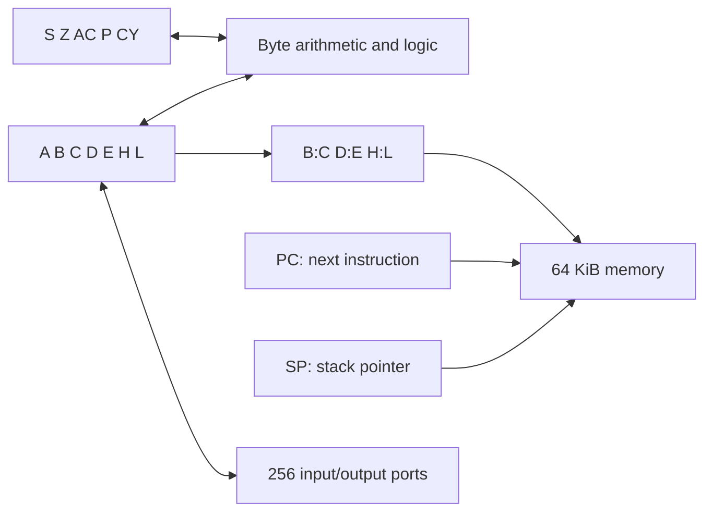

# Intel 8080

This chapter is executable source for the 8080's stored state, derived register
views, reset, instruction boundaries, interrupt acceptance, and byte instruction
families. Word operations, stack/control flow, and packed-status operations still
use [TypeScript definitions](../semantics/definitions/8080.ts). The
[model contract](../../../../docs/cpus/8080/model.md) retains the full public API
and the contracts for those remaining families. The
[coverage report](../../../../docs/cpus/coverage.md#8080) tracks the migration.

## Historical background

Intel introduced the 8080 in 1974. Its design responded to customers who had
found the 8008 too restrictive for larger programs; the 8080 became the CPU of
the MITS Altair 8800. Intel's [fiftieth-anniversary account][history] describes
this move toward a general-purpose microprocessor market.

The [1975 programming manual][manual], chapter 1, presents seven byte registers,
a sixteen-bit program counter, and a separately programmable stack pointer.
Memory holds both programs and data. A RAM stack replaces the 8008's fixed set
of internal return-address registers, and sixteen address bits select 64 KiB.
A, the accumulator, remains the focus of byte arithmetic; B:C, D:E, and H:L
also serve as word pairs. The selector order is now B/C/D/E/H/L/M/A.

## The programmer's machine

A byte has eight bits; a word has sixteen. H:L addresses the byte operand M.
PC selects the next instruction byte, while SP selects a stack location in RAM.
The low byte of an immediate word appears first in the instruction stream.
The named registers and pairs below describe architectural values, not separate
physical copies of a pair's bytes.



This is a functional map. Dromaios models ordered instruction effects; it does
not yet reproduce clock periods, pin transitions, or every electrical bus cycle.
An external host offers an interrupt between instructions. Its device supplies
instruction bytes through acknowledgement, and ordinary data accesses still
use RAM and ports. These are explicit boundaries of this model.

## Stored state

The chapter owns the complete stored schema. Registers and flags use uppercase
architectural names and map to the existing lowercase public fields. PC and SP
are stored words; BC, DE, and HL are derived views. Flags are independent Boolean
values: changing A does not implicitly update them.

ENABLED represents interrupt enable, DEFERRED the instruction-boundary delay
following EI, and STOPPED the halted state. DEFERRED records eligibility to
accept an interrupt; it is a model latch, not an additional programmer-visible
arithmetic flag. Initial values come from the caller and make no claim about
hardware power-on contents.

```cpu
cpu "8080"
state {
  register A: 8
  register B: 8
  register C: 8
  register D: 8
  register E: 8
  register H: 8
  register L: 8
  register PC: 16
  register SP: 16
  flag S
  flag Z
  flag AC
  flag P
  flag CY
  latch ENABLED = interruptEnabled
  latch DEFERRED = interruptDeferred
  latch STOPPED = halted
}
```

## Register views and counter writes

Snapshots expose BC, DE, and HL alongside stored bytes. Each view reads high
then low and concatenates the captured bytes, without memory access. NEXT is
the execution boundary's view of the stored PC; it introduces no extra state.

```cpu
view BC "B:C register pair": 16 {
  high = register B
  low = register C
  return concat(high, low)
}
view DE "D:E register pair": 16 {
  high = register D
  low = register E
  return concat(high, low)
}
view HL "H:L register pair": 16 {
  high = register H
  low = register L
  return concat(high, low)
}
view NEXT "next instruction address": 16 {
  address = register PC
  return address
}
action setPC "write the program counter" (address: 16) {
  PC <- address
}
```

## Reset

Reset sets PC to zero, disables interrupts, clears the EI delay, and releases
HALT. It preserves data registers, SP, arithmetic flags, RAM, and device state.
These are the existing model's reset rules, following the
[Intellec 8/MOD 80 reference manual][reset], section 1.2.1; construction and
lesson restart remain separate operations.

```cpu
action reset "reset PC and interrupt control" {
  PC <- u16($0000)
  ENABLED <- 0
  DEFERRED <- 0
  STOPPED <- 0
}
```

## Instruction boundaries and interrupt acceptance

Successful opcode dispatch advances PC before the body executes. Operand
fetches advance it only after their reads succeed, wrapping at sixteen bits.
An unsupported ordinary opcode leaves PC unchanged. A halted step makes no
accesses. Thrown host errors retain completed effects and skip later effects;
there is no rollback or automatic retry.

Every successfully completed instruction consumes an earlier EI delay. A new
`defer irq` request instead renews that delay at retirement. Merely requesting
it does not immediately write DEFERRED. Halted steps, unsupported opcodes, and
failed instructions do not retire. This also applies to externally supplied
instructions, including EI itself.

At an interrupt offer, clear ENABLED means rejection with reason `disabled`;
otherwise set DEFERRED means rejection with reason `deferred`. Rejection makes
no accesses and leaves all state unchanged. Acceptance clears both latches and
releases HALT before the first acknowledgement. The supplied opcode and every
needed operand come from the callback; these fetches preserve PC. There is no
automatic stack push: a supplied RST or CALL performs its own stack effects.
Intel documents delayed EI acceptance and externally supplied instructions in
its [8080/8085 programming manual][interrupts], pages 3-23 and chapter 7.

```cpu
action accept "accept an external instruction" {
  ENABLED <- 0
  DEFERRED <- 0
  STOPPED <- 0
}
execution {
  memory 16
  counter NEXT write setPC
  stopped STOPPED
  word little
  opcode advance on dispatch
  operand advance after read
  failure retain
  reset action reset
  retire irq into DEFERRED
  interrupt {
    accept when ENABLED unless DEFERRED with accept
    bytes acknowledge
    callback validate on read
    counter preserve
    unknown retain
  }
}
```

The callback policy preserves this API's lazy handling of host arguments:
ignored offers never invoke or validate the callback. An invalid callback on
an accepted offer fails at its first use, after the acceptance effects. Each
returned byte is range-checked before it enters the execution record. Unknown
supplied opcodes retain acceptance effects and their acknowledged byte.
Snapshots and execution records remain detached; callback failures propagate
and always release the host's reentrancy guard.

## Byte operands

The three-bit field `rrr` selects B/C/D/E/H/L/M/A. M addresses memory through
the full H:L word, with no 8008-style address mask. Resolving M reads H then L
at the point of access. Immediate operands use one successful instruction-byte
fetch. Both sources retain the live-state and partial-failure rules above.

```cpu
source throughHL "memory address through H:L": 16 {
  high = register H
  low = register L
  return concat(high, low)
}
source immediateByte "immediate byte": 8 {
  byte = fetch
  return byte
}
operands bytes {
  000 "B" = register B
  001 "C" = register C
  010 "D" = register D
  011 "E" = register E
  100 "H" = register H
  101 "L" = register L
  110 "M" = memory throughHL
  111 "A" = register A
}
```

## Moving bytes

The overall pattern `01 ddd sss` encodes destination `ddd` and source `sss`.
The memory-to-memory slot `01 110 110` belongs to HLT and is excluded from MOV.
Register self-copies still read and write the selected register.

Capture the source before writing the destination. A memory source reads
through the original H:L; a memory destination resolves H:L only after the
source has been captured. Stores never read destination memory. Preserve all
flags and control latches; a failed source read prevents writeback.

```cpu
family MOV "01 ddd sss" for d in bytes, s in bytes named "MOV {d},{s}" except "01 110 110" {
  result = operand s
  operand d <- result
}
```

MVI uses `00 ddd 110`, followed by an immediate byte. Fetch that byte before
touching the destination, then resolve H:L if the destination is M. Write
exactly once without a destination read, preserving all flags. Failed fetching
prevents every destination effect.

```cpu
family MVI "00 ddd 110" for d in bytes named "MVI {d},n" {
  result = fetch
  operand d <- result
}
```

## Arithmetic and logical flags

S reports bit 7, Z reports zero, and P reports even parity of the byte result.
CY reports full-byte carry or borrow. AC reports low-nibble carry on addition
and **inverse low-nibble borrow** on subtraction in this 8080 model. ANA sets
AC from bit 3 of the original A OR its operand; XRA and ORA clear it. These
8080 rules are distinct from those of the 8085 and Z80; see the existing
[arithmetic contract](../../../../docs/cpus/8080/model.md#accumulator-arithmetic-and-logic).
All right-hand sides are evaluated before any listed flag is written.

```cpu
policy ALU "8080 S/Z/P/CY/AC" (result: 8, carry: flag, auxiliary: flag) {
  S = negative(result)
  Z = zero(result)
  P = evenParity(result)
  CY = carry
  AC = auxiliary
}
policy ADJUST "8080 S/Z/P/AC, preserving CY" (result: 8, auxiliary: flag) {
  S = negative(result)
  Z = zero(result)
  P = evenParity(result)
  AC = auxiliary
}
policy CARRY "8080 carry only" (carry: flag) {
  CY = carry
}
```

## Eight accumulator operations

The shared pattern is `10 ooo sss` for a register or M and `11 ooo 110` for
an immediate byte. The operation field `ooo` is the same in both encodings.
Every body captures its right operand completely before reading incoming CY,
if needed, and then A. Selecting A as the source deliberately reads A at both
points. All arithmetic wraps to eight bits. CMP updates flags without writing A.

| ooo | Register or M | Immediate | Operation |
| --- | --- | --- | --- |
| 000 | ADD | ADI | Addition |
| 001 | ADC | ACI | Addition with carry |
| 010 | SUB | SUI | Subtraction |
| 011 | SBB | SBI | Subtraction with borrow |
| 100 | ANA | ANI | Bitwise AND |
| 101 | XRA | XRI | Bitwise XOR |
| 110 | ORA | ORI | Bitwise OR |
| 111 | CMP | CPI | Comparison |

### ADD

Read the source, then A without reading incoming flags. Add with byte
wraparound and derive CY and AC from full-byte and low-nibble carry. Apply
S/Z/P/CY/AC before writing A; failed operand reads prevent flags and writeback.

```cpu
family ADD {
  encoding "10 000 sss" for s in bytes.read named "ADD {s}"
  encoding "11 000 110" with s = immediateByte named "ADI byte"
  right = source s
  left = register A
  result = add(left, right)
  apply ALU(result, carry(left, right), halfCarry(left, right))
  A <- result
}
```

### ADC

Read the source, capture incoming CY, then read A. Add both bytes and the
captured carry with wraparound. Include that carry in both carry calculations.
Apply S/Z/P/CY/AC before writing A; do not reread CY after flag updates.

```cpu
family ADC {
  encoding "10 001 sss" for s in bytes.read named "ADC {s}"
  encoding "11 001 110" with s = immediateByte named "ACI byte"
  right = source s
  carry = flag CY
  left = register A
  result = add(left, right, carry)
  apply ALU(result, carry(left, right, carry), halfCarry(left, right, carry))
  A <- result
}
```

### SUB

Read the source, then A without reading incoming flags. Subtract with byte
wraparound; CY reports borrow and AC reports inverse low-nibble borrow.
Apply S/Z/P/CY/AC before replacing A, retaining completed operand fetches.

```cpu
family SUB {
  encoding "10 010 sss" for s in bytes.read named "SUB {s}"
  encoding "11 010 110" with s = immediateByte named "SUI byte"
  right = source s
  left = register A
  result = subtract(left, right)
  apply ALU(result, borrow(left, right), not(halfBorrow(left, right)))
  A <- result
}
```

### SBB

Read the source, capture incoming CY as borrow, then read A. Subtract both
the source and captured borrow. Include it in CY and inverse half-borrow AC.
Apply flags before A; a failed source read prevents the carry read too.

```cpu
family SBB {
  encoding "10 011 sss" for s in bytes.read named "SBB {s}"
  encoding "11 011 110" with s = immediateByte named "SBI byte"
  right = source s
  carry = flag CY
  left = register A
  result = subtract(left, right, carry)
  apply ALU(result, borrow(left, right, carry), not(halfBorrow(left, right, carry)))
  A <- result
}
```

### ANA

Read the source before A and compute their bitwise AND. Set S/Z/P from the
result, clear CY, and derive AC from bit 3 of the original A OR the source.
Write flags before A, without reading incoming flags.

```cpu
family ANA {
  encoding "10 100 sss" for s in bytes.read named "ANA {s}"
  encoding "11 100 110" with s = immediateByte named "ANI byte"
  right = source s
  left = register A
  result = and(left, right)
  apply ALU(result, 0, not(zero(and(or(left, right), u8($08)))))
  A <- result
}
```

### XRA

Read the source before A and compute their bitwise XOR. Set S/Z/P from the
result and clear CY and AC before writing A. A failed memory or immediate
read prevents all flag updates and accumulator writeback.

```cpu
family XRA {
  encoding "10 101 sss" for s in bytes.read named "XRA {s}"
  encoding "11 101 110" with s = immediateByte named "XRI byte"
  right = source s
  left = register A
  result = xor(left, right)
  apply ALU(result, 0, 0)
  A <- result
}
```

### ORA

Read the source before A and compute their bitwise OR. Set S/Z/P from the
result and clear CY and AC before writing A. Preserve all other registers
and retain the ordinary or supplied operand-fetch policy.

```cpu
family ORA {
  encoding "10 110 sss" for s in bytes.read named "ORA {s}"
  encoding "11 110 110" with s = immediateByte named "ORI byte"
  right = source s
  left = register A
  result = or(left, right)
  apply ALU(result, 0, 0)
  A <- result
}
```

### CMP

Read the source before A and compute the wrapped difference for flags only.
Set S/Z/P, borrow CY, and inverse low-nibble borrow AC, preserving A without
a destination write. Do not read incoming CY.

```cpu
family CMP {
  encoding "10 111 sss" for s in bytes.read named "CMP {s}"
  encoding "11 111 110" with s = immediateByte named "CPI byte"
  right = source s
  left = register A
  result = subtract(left, right)
  apply ALU(result, borrow(left, right), not(halfBorrow(left, right)))
}
```

## Increment and decrement

The full pattern is `00 rrr 10d`: `rrr` selects the byte operand and `d`
selects INR (0) or DCR (1). Both preserve CY without reading it. The memory
forms capture H:L once, before reading the byte, and reuse that address even
if a device callback changes H or L. Flags change before the result is written.

### INR

Add one to the selected register with byte wraparound. Set S/Z/P and
low-nibble carry AC before writing the register; leave CY untouched.

```cpu
family INR "00 rrr 100" for r in bytes named "INR {r}" except "00 110 100" {
  original = operand r
  result = add(original, u8($01))
  apply ADJUST(result, halfCarry(original, u8($01)))
  operand r <- result
}
```

Capture the memory address once, then read its byte and add one. Apply
S/Z/P/AC before the single write. A failed read leaves flags unchanged; a
failed write retains the updated flags. Preserve CY and all register bytes.

```cpu
family INRM "00 110 100" named "INR M" {
  address = source throughHL
  original = memory(address)
  result = add(original, u8($01))
  apply ADJUST(result, halfCarry(original, u8($01)))
  memory(address) <- result
}
```

### DCR

Subtract one from the selected register with byte wraparound. Set S/Z/P and
inverse low-nibble borrow AC before writing the register; leave CY untouched.

```cpu
family DCR "00 rrr 101" for r in bytes named "DCR {r}" except "00 110 101" {
  original = operand r
  result = subtract(original, u8($01))
  apply ADJUST(result, not(halfBorrow(original, u8($01))))
  operand r <- result
}
```

Capture the memory address once, then read its byte and subtract one. Apply
S/Z/P/AC before the single write. A failed read leaves flags unchanged; a
failed write retains the updated flags. Preserve CY and all register bytes.

```cpu
family DCRM "00 110 101" named "DCR M" {
  address = source throughHL
  original = memory(address)
  result = subtract(original, u8($01))
  apply ADJUST(result, not(halfBorrow(original, u8($01))))
  memory(address) <- result
}
```

## Accumulator rotates

The overall pattern `00 ooo 111` gives four rotates when `ooo` is 000–011.
RLC/RRC rotate circularly; RAL/RAR rotate through CY. Each reads A before any
carry input, writes A before CY, and preserves S/Z/P/AC.

### RLC

Capture A and rotate left. Insert the outgoing bit at the
opposite end. Write A, then replace CY with the original sign bit. Do not
access RAM or change any other flag.

```cpu
family RLC "00 000 111" {
  original = register A
  A <- shiftLeft(original, negative(original))
  apply CARRY(negative(original))
}
```

### RRC

Capture A and rotate right. Insert the outgoing bit at the
opposite end. Write A, then replace CY with the original low bit. Do not
access RAM or change any other flag.

```cpu
family RRC "00 001 111" {
  original = register A
  A <- shiftRight(original, lowBit(original))
  apply CARRY(lowBit(original))
}
```

### RAL

Capture A, then incoming CY and rotate left. Insert the captured carry at the
opposite end. Write A, then replace CY with the original sign bit. Do not
access RAM or change any other flag.

```cpu
family RAL "00 010 111" {
  original = register A
  carry = flag CY
  A <- shiftLeft(original, carry)
  apply CARRY(negative(original))
}
```

### RAR

Capture A, then incoming CY and rotate right. Insert the captured carry at the
opposite end. Write A, then replace CY with the original low bit. Do not
access RAM or change any other flag.

```cpu
family RAR "00 011 111" {
  original = register A
  carry = flag CY
  A <- shiftRight(original, carry)
  apply CARRY(lowBit(original))
}
```

## Port transfers

The full pattern `1101 d 011` selects OUT for `d=0` and IN for `d=1`, followed
by the port byte. The model zero-extends that byte to its shared port-interface
width. A port is a separate address space, so these transfers never read or
write the corresponding RAM address.

Fetch the port selector before reading A. Output A exactly once, preserving
registers and flags. A failed selector fetch never contacts the device;
a failed output retains the completed instruction fetches.

```cpu
family OUT "1101 0 011" named "OUT n" {
  selector = fetch
  byte = register A
  port(extend(selector, 16)) <- byte
}
```

Fetch the port selector, then input one byte. Replace A only after a successful
input, preserving all flags. A missing connection or invalid device byte
throws without accumulator writeback or instruction retirement.

```cpu
family IN "1101 1 011" named "IN n" {
  selector = fetch
  byte = port(extend(selector, 16))
  A <- byte
}
```

## Interrupt controls

The complete pattern `1111 e 011` selects DI for `e=0` and EI for `e=1`.
Their ordinary opcode fetch advances PC; supplied instruction bytes do not.
Neither body accesses arithmetic flags, data registers, RAM, or ports.

Clear interrupt enable now. Leave DEFERRED alone in the body: successful
retirement consumes the previous delay, exactly as for other instructions.

```cpu
family DI "1111 0 011" {
  ENABLED <- 0
}
```

Set interrupt enable now and request IRQ deferral at successful retirement.
The request renews an earlier delay, so EI followed by EI still inhibits the
next boundary. The stored delay is not changed by the request itself.

```cpu
family EI "1111 1 011" {
  ENABLED <- 1
  defer irq
}
```

## Checks and remaining work

The independent 8080 instruction and machine tests retain their expected values,
flag rules, access order, wrapping, and partial-failure checks. Chapter tests
also edit formal definitions to demonstrate that state, behavior, and execution
policies come from these fences. The shared runtime must continue to serve the
8008's unconditional acceptance and internal address-stack counter unchanged.

The remaining word, stack, branch, decimal-adjust, and packed-status families
retain their existing definitions and join these families in one generated
opcode table. Their migration, the public-interface declaration, and the
remaining model documentation will complete this chapter. Electrical timing
and complete historical machines remain separate work.

[history]: https://www.intel.com/content/www/us/en/newsroom/news/50-years-ago-the-influential-intel-8080.html
[manual]: https://altairclone.com/downloads/manuals/8080%20Programmers%20Manual.pdf
[reset]: https://bitsavers.org/components/intel/MCS80/Intellec_8_Mod_80/Intel_Intellec_8_Mod_80_Reference_Manual_Feb75.pdf
[interrupts]: https://st.sdf-eu.org/i8080/Intel%208080-8085%20Assembly%20Language%20Programming%201977%20Intel.pdf
