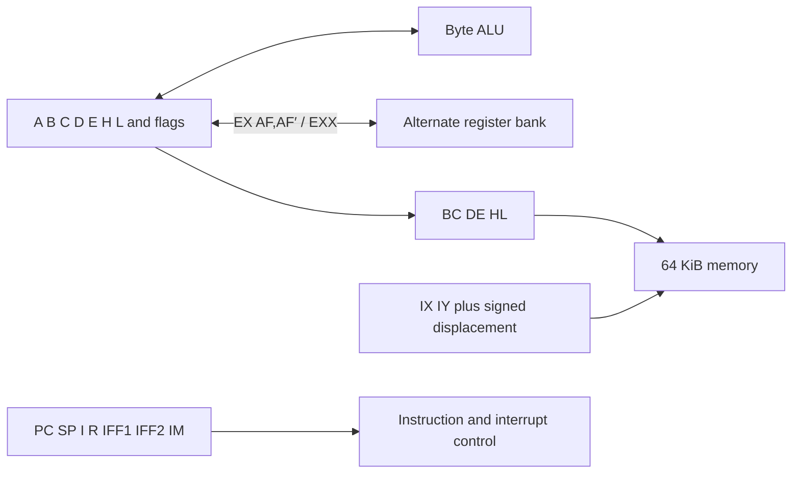

# Zilog Z80

This chapter begins the executable guide to Dromaios's instruction-level Z80.
It owns stored state, pair and status views, and the unprefixed byte loads,
arithmetic, and increment/decrement instructions. The remaining instruction
families and execution boundary still use TypeScript. The
[model contract](../../../../docs/cpus/z80/model.md) describes that boundary;
the [coverage report](../../../../docs/cpus/coverage.md#z80) measures migration.

## Historical background

The Z80 grew out of Zilog, founded by Federico Faggin and Ralph Ungermann after
leaving Intel in 1974. Masatoshi Shima joined the development in 1975. Their
[oral history at the Computer History Museum][history] describes a design that
retained 8080 machine-code compatibility while adding index registers, a second
register set, more word operations, and a richer interrupt system. The
processor reached the market in 1976.

Compatibility made existing software useful, but the Z80 was a distinct
processor. Even familiar byte instructions need their own flag rules. The
formal definitions below expose those differences rather than treating the
Z80 as an 8080 with a few extra opcode handlers.

## The programmer's machine

The model has an eight-bit data path and a sixteen-bit memory address space.
Bytes range from `$00` to `$FF`; addresses range from `$0000` to `$FFFF`.
As in the other chapters, `$` introduces hexadecimal and an opcode pattern
lists bits from most to least significant. Instruction operands and memory
words put the low byte first.



B:C, D:E, and H:L are word views of stored bytes. H=`$12`, L=`$34` means
HL=`$1234`; there is no second value to synchronize. An operand written
`(HL)` means the memory byte at that address. It is not another register.
IX and IY are separately stored words. Their indexed byte operations add a
signed displacement, wrapping the resulting address to sixteen bits.

The alternate bank contains A′, B′, C′, D′, E′, H′, L′, and flags F′.
`EX AF,AF′` exchanges A and its flags; `EXX` exchanges BC, DE, and HL.
Ordinary instructions still name the main bank. These exchanges do not select
a persistent bank number: they swap the stored values. A program must manage
which values belong to which context.

| Register | Role |
| --- | --- |
| A | Accumulator and ordinary byte ALU destination |
| B, C, D, E, H, L | Byte operands or halves of BC, DE, HL |
| IX, IY | Index pointers |
| PC, SP | Next instruction address and RAM stack pointer |
| I | High byte used in interrupt mode 2 vector addressing |
| R | Refresh register; the decoder advances its low seven bits on M1 fetches |
| IFF1, IFF2 | Interrupt enable state |
| IM | Interrupt mode 0, 1, or 2 |

### Flags distinguish parity from overflow

F holds six modeled flags: S (sign), Z (zero), H (half carry), P/V
(parity or overflow), N (subtraction), and C (carry or borrow). P/V describes
signed overflow for arithmetic and even bit parity for logical operations.
Unlike the 8080, subtraction reports half **borrow**, and AND always sets H.
These are instruction effects, not properties continuously recomputed from A:
loading A with zero leaves the old Z unchanged.

| Operation | Result | P/V | C | Why |
| --- | --- | --- | --- | --- |
| `$7F + $01` | `$80` | 1 | 0 | Signed overflow without unsigned carry |
| `$FF + $01` | `$00` | 0 | 1 | Unsigned carry without signed overflow |
| `$80 - $01` | `$7F` | 1 | 0 | Signed overflow without unsigned borrow |
| `$03 XOR $00` | `$03` | 1 | 0 | Two set bits give even parity |

The model omits undocumented F bits 5 and 3. Packing emits zero in those
positions and unpacking ignores them; that is a modeling limit, not a claim
that the silicon holds them at zero.

### Physical operation and the model boundary

Zilog's [CPU manual][manual] describes M1 opcode fetches, refresh, memory and
I/O transfers, and interrupt acknowledgement as distinct bus activities.
The original design uses an eight-bit data bus, sixteen-bit address bus, a
single clock input and a +5 V supply. WAIT and bus-request signals let the
surrounding system delay transfers or take control of the buses.

Dromaios models instruction effects, not clock phases or electrical pins. R
advances on modeled opcode fetches; operand and displacement reads do not all
advance it. Refresh itself performs no recorded RAM access. Neither access
counts nor R alone measure elapsed cycles. The existing model contract remains
authoritative for prefix fetching, interrupt entry, reset, and failed accesses
until those mechanisms move into this chapter.

## Stored state

Each bank owns its own flags object. Architectural names are uppercase; stored
JavaScript fields are lowercase unless explicitly mapped. `ALTERNATE.B` means
B in the named bank, while plain B refers to the main bank. PC and SP are
independent words. The two deferral latches and STOPPED describe instruction
boundary behavior; they are not additional programmer-visible registers.

```cpu
cpu "z80"
state {
  register A: 8
  register B: 8
  register C: 8
  register D: 8
  register E: 8
  register H: 8
  register L: 8
  flag S
  flag Z
  flag H
  flag PV
  flag N
  flag C
  bank ALTERNATE = alternate {
    register A: 8
    register B: 8
    register C: 8
    register D: 8
    register E: 8
    register H: 8
    register L: 8
    flag S
    flag Z
    flag H
    flag PV
    flag N
    flag C
  }
  register IX: 16
  register IY: 16
  register PC: 16
  register SP: 16
  register I: 8
  register R: 8
  latch IFF1
  latch IFF2
  choice IM: 0, 1, 2
  latch IRQDEFERRED = interruptDeferred
  latch NMIDEFERRED = nmiDeferred
  latch STOPPED = halted
}
```

## Pair and status views

Reading a pair captures its high byte and then its low byte. Snapshots derive
both banks' pair values from their detached stored-state copies. The views do
not fetch memory or change registers.

```cpu
view BC "B:C register pair": 16 {
  high = register B
  low = register C
  return concat(high, low)
}
view DE "D:E register pair": 16 {
  high = register D
  low = register E
  return concat(high, low)
}
view HL "H:L register pair": 16 {
  high = register H
  low = register L
  return concat(high, low)
}
view BC_ALT "alternate B:C register pair": 16 {
  high = register ALTERNATE.B
  low = register ALTERNATE.C
  return concat(high, low)
}
view DE_ALT "alternate D:E register pair": 16 {
  high = register ALTERNATE.D
  low = register ALTERNATE.E
  return concat(high, low)
}
view HL_ALT "alternate H:L register pair": 16 {
  high = register ALTERNATE.H
  low = register ALTERNATE.L
  return concat(high, low)
}
```

F packs `S Z 0 H 0 PV N C`, reading the six flags in that order. PUSH AF
captures A before this view; POP AF writes A before replacing the flags object.
The status action below supplies that replacement to the existing stack body.
All six new flag values are computed before the old object is replaced.

```cpu
view F "packed documented flags": 8 {
  sign = flag S
  zero = flag Z
  half = flag H
  parity = flag PV
  subtract = flag N
  carry = flag C
  sz = or(select(sign, u8($80), u8(0)), select(zero, u8($40), u8(0)))
  hp = or(select(half, u8($10), u8(0)), select(parity, u8($04), u8(0)))
  nc = or(select(subtract, u8($02), u8(0)), select(carry, u8($01), u8(0)))
  return or(or(sz, hp), nc)
}
policy FFLAGS "restore all documented flags" (status: 8) {
  S = not(zero(and(status, u8($80))))
  Z = not(zero(and(status, u8($40))))
  H = not(zero(and(status, u8($10))))
  PV = not(zero(and(status, u8($04))))
  N = not(zero(and(status, u8($02))))
  C = not(zero(and(status, u8($01))))
}
action writeF "replace packed F" (status: 8) {
  replace FFLAGS(status)
}
```

## Byte operands and transfers

In `01 ddd sss`, ddd selects the destination and sss the source. Both fields
use the same catalogue: B/C/D/E/H/L/(HL)/A. The `(HL),(HL)` slot is HALT,
not a memory-to-memory load. `00 ddd 110` loads a following immediate byte.
Reading `(HL)` resolves H then L before the memory read. Writing it resolves
H then L after capturing the source, without reading destination memory.

```cpu
source immediateByte "immediate byte": 8 {
  byte = fetch
  return byte
}
operands bytes {
  000 "B" = register B
  001 "C" = register C
  010 "D" = register D
  011 "E" = register E
  100 "H" = register H
  101 "L" = register L
  110 "(HL)" = memory HL
  111 "A" = register A
}
```

Capture the source completely before writing the destination. Register
self-copies still read and write; immediate loads fetch before resolving a
memory destination. Preserve all flags, the alternate bank, and control state.
A failed source read prevents writeback.

```cpu
family LD "01 ddd sss" for d in bytes, s in bytes named "LD {d},{s}" except "01 110 110" {
  result = operand s
  operand d <- result
}
family LDImmediate "00 ddd 110" for d in bytes named "LD {d},n" {
  result = fetch
  operand d <- result
}
```

## Accumulator arithmetic and logic

The shared encodings are `10 ooo sss` for a register or `(HL)` and
`11 ooo 110` for an immediate byte. ooo selects the operation below.
Each body captures the operand, then incoming C if needed, then A. Selecting
A as the source deliberately reads it twice. Results wrap to eight bits.
All six flags update before A; CP performs the subtraction without writing A.
Indexed memory bodies reuse these actions after their native address decoding.

| ooo | Operation | P/V | H | N | C |
| --- | --- | --- | --- | --- | --- |
| 000 | ADD | Signed overflow | Half carry | 0 | Carry |
| 001 | ADC | Signed overflow | Half carry including C | 0 | Carry including C |
| 010 | SUB | Signed overflow | Half borrow | 1 | Borrow |
| 011 | SBC | Signed overflow | Half borrow including C | 1 | Borrow including C |
| 100 | AND | Even parity | 1 | 0 | 0 |
| 101 | XOR | Even parity | 0 | 0 | 0 |
| 110 | OR | Even parity | 0 | 0 | 0 |
| 111 | CP | Signed overflow | Half borrow | 1 | Borrow |

S and Z describe the result. The remaining flag values are explicit policy
arguments so the arithmetic and logical distinctions stay visible at each use.
Policy expressions read only captured values; incoming flags are never reread
after updates begin. Flags update in S/Z/H/PV/N/C order without replacing the
flag object, preserving access and failure behavior of the existing model.

```cpu
policy ALU "Z80 byte result flags" (result: 8, half: flag, parity: flag, subtract: flag, carry: flag) {
  S = negative(result)
  Z = zero(result)
  H = half
  PV = parity
  N = subtract
  C = carry
}
```

### ADD

Capture A without reading incoming flags. Apply the table's flags before
writing the byte result to A. A failed operand read prevents every action effect.

```cpu
action addAccumulator "ADD with a captured byte" (right: 8) {
  left = register A
  result = add(left, right)
  apply ALU(result, halfCarry(left, right), addOverflow(left, right), 0, carry(left, right))
  A <- result
}
family ADD {
  encoding "10 000 sss" for s in bytes.read named "ADD A,{s}"
  encoding "11 000 110" with s = immediateByte named "ADD A,n"
  right = source s
  perform addAccumulator(right)
}
```

### ADC

Capture incoming C, then A. Apply the table's flags before
writing the byte result to A. A failed operand read prevents every action effect.

```cpu
action adcAccumulator "ADC with a captured byte" (right: 8) {
  carry = flag C
  left = register A
  result = add(left, right, carry)
  apply ALU(result, halfCarry(left, right, carry), addOverflow(left, right, carry), 0, carry(left, right, carry))
  A <- result
}
family ADC {
  encoding "10 001 sss" for s in bytes.read named "ADC A,{s}"
  encoding "11 001 110" with s = immediateByte named "ADC A,n"
  right = source s
  perform adcAccumulator(right)
}
```

### SUB

Capture A without reading incoming flags. Apply the table's flags before
writing the byte result to A. A failed operand read prevents every action effect.

```cpu
action subAccumulator "SUB with a captured byte" (right: 8) {
  left = register A
  result = subtract(left, right)
  apply ALU(result, halfBorrow(left, right), overflow(left, right), 1, borrow(left, right))
  A <- result
}
family SUB {
  encoding "10 010 sss" for s in bytes.read named "SUB {s}"
  encoding "11 010 110" with s = immediateByte named "SUB n"
  right = source s
  perform subAccumulator(right)
}
```

### SBC

Capture incoming C, then A. Apply the table's flags before
writing the byte result to A. A failed operand read prevents every action effect.

```cpu
action sbcAccumulator "SBC with a captured byte" (right: 8) {
  carry = flag C
  left = register A
  result = subtract(left, right, carry)
  apply ALU(result, halfBorrow(left, right, carry), overflow(left, right, carry), 1, borrow(left, right, carry))
  A <- result
}
family SBC {
  encoding "10 011 sss" for s in bytes.read named "SBC A,{s}"
  encoding "11 011 110" with s = immediateByte named "SBC A,n"
  right = source s
  perform sbcAccumulator(right)
}
```

### AND

Capture A without reading incoming flags. Apply the table's flags before
writing the byte result to A. A failed operand read prevents every action effect.

```cpu
action andAccumulator "AND with a captured byte" (right: 8) {
  left = register A
  result = and(left, right)
  apply ALU(result, 1, evenParity(result), 0, 0)
  A <- result
}
family AND {
  encoding "10 100 sss" for s in bytes.read named "AND {s}"
  encoding "11 100 110" with s = immediateByte named "AND n"
  right = source s
  perform andAccumulator(right)
}
```

### XOR

Capture A without reading incoming flags. Apply the table's flags before
writing the byte result to A. A failed operand read prevents every action effect.

```cpu
action xorAccumulator "XOR with a captured byte" (right: 8) {
  left = register A
  result = xor(left, right)
  apply ALU(result, 0, evenParity(result), 0, 0)
  A <- result
}
family XOR {
  encoding "10 101 sss" for s in bytes.read named "XOR {s}"
  encoding "11 101 110" with s = immediateByte named "XOR n"
  right = source s
  perform xorAccumulator(right)
}
```

### OR

Capture A without reading incoming flags. Apply the table's flags before
writing the byte result to A. A failed operand read prevents every action effect.

```cpu
action orAccumulator "OR with a captured byte" (right: 8) {
  left = register A
  result = or(left, right)
  apply ALU(result, 0, evenParity(result), 0, 0)
  A <- result
}
family OR {
  encoding "10 110 sss" for s in bytes.read named "OR {s}"
  encoding "11 110 110" with s = immediateByte named "OR n"
  right = source s
  perform orAccumulator(right)
}
```

### CP

Capture A without reading incoming flags. Apply the table's flags before
retaining A without a write. A failed operand read prevents every action effect.

```cpu
action cpAccumulator "CP with a captured byte" (right: 8) {
  left = register A
  result = subtract(left, right)
  apply ALU(result, halfBorrow(left, right), overflow(left, right), 1, borrow(left, right))
}
family CP {
  encoding "10 111 sss" for s in bytes.read named "CP {s}"
  encoding "11 111 110" with s = immediateByte named "CP n"
  right = source s
  perform cpAccumulator(right)
}
```

## Increment and decrement

The encoding is `00 rrr 10d`: rrr selects the same byte catalogue and d selects
INC (0) or DEC (1). Both preserve C without reading it. That lets a program
adjust a loop counter without destroying the carry in a multi-byte calculation.
INC sets P/V only when `$7F` becomes `$80`; DEC sets it only when `$80` becomes
`$7F`. The memory case resolves its address once and retains it through
read/modify/write, even if a host callback changes H or L.

INC reads the original byte, computes the wrapped result, and updates
S/Z/H/PV/N before writeback. A failed read leaves flags unchanged; a failed
write retains the calculated flags. Preserve the alternate bank and controls.
The resolved-memory action also serves the indexed instruction bodies.

```cpu
policy INCFLAGS "Z80 INC, preserving C" (original: 8, result: 8) {
  S = negative(result)
  Z = zero(result)
  H = halfCarry(original, u8(1))
  PV = addOverflow(original, u8(1))
  N = 0
}
action incMemory "INC at a resolved address" (address: 16) using memory {
  original = memory(address)
  result = add(original, u8(1))
  apply INCFLAGS(original, result)
  memory(address) <- result
}
family INC "00 rrr 100" for r in bytes named "INC {r}" except "00 110 100" {
  original = operand r
  result = add(original, u8(1))
  apply INCFLAGS(original, result)
  operand r <- result
}
family INCMemory "00 110 100" named "INC (HL)" {
  address = source HL
  perform incMemory(address)
}
```

DEC reads the original byte, computes the wrapped result, and updates
S/Z/H/PV/N before writeback. A failed read leaves flags unchanged; a failed
write retains the calculated flags. Preserve the alternate bank and controls.
The resolved-memory action also serves the indexed instruction bodies.

```cpu
policy DECFLAGS "Z80 DEC, preserving C" (original: 8, result: 8) {
  S = negative(result)
  Z = zero(result)
  H = halfBorrow(original, u8(1))
  PV = overflow(original, u8(1))
  N = 1
}
action decMemory "DEC at a resolved address" (address: 16) using memory {
  original = memory(address)
  result = subtract(original, u8(1))
  apply DECFLAGS(original, result)
  memory(address) <- result
}
family DEC "00 rrr 101" for r in bytes named "DEC {r}" except "00 110 101" {
  original = operand r
  result = subtract(original, u8(1))
  apply DECFLAGS(original, result)
  operand r <- result
}
family DECMemory "00 110 101" named "DEC (HL)" {
  address = source HL
  perform decMemory(address)
}
```

## Checks and remaining work

Component tests independently exercise the literal load matrix, arithmetic
boundaries, flag combinations, and memory failures. Shared semantics tests
observe the order of register and flag accesses, including callbacks that
change live state. Chapter tests verify production ownership and that editing
the chapter changes generated behavior. The existing
[arithmetic](../../../../docs/cpus/z80/examples/arithmetic.md),
[transfer](../../../../docs/cpus/z80/examples/transfers.md), and
[indexed-buffer](../../../../docs/cpus/z80/examples/indexed-buffer.md) examples
continue through the public CPU.

Word operations, control flow, exchanges, rotates, prefixed families, I/O, and
execution lifecycle remain to migrate. Reusing an action for indexed arithmetic
does not yet make its complete indexed form chapter-owned: prefix and displacement
decoding are still handwritten. The coverage report counts complete forms only.

## References

- [Zilog Z80 CPU User Manual, UM008011-0816][manual]: registers, instruction
  encodings, flags, and bus/interrupt operation. This later manual also covers
  variants; the declared Dromaios model targets the original Z80's documented
  instruction forms, not every later extension.
- [Zilog oral history panel, Computer History Museum, 2007][history]: Faggin,
  Shima, and Ungermann discuss the company's founding and the Z80's development.
- [8080 chapter](8080.md): a comparison of the shared register organization
  and encoding patterns, with the 8080's distinct arithmetic flag rules.

[manual]: https://www.zilog.com/docs/z80/um0080.pdf
[history]: https://archive.computerhistory.org/resources/text/Oral_History/Zilog_Z80/102658073.05.01.pdf
