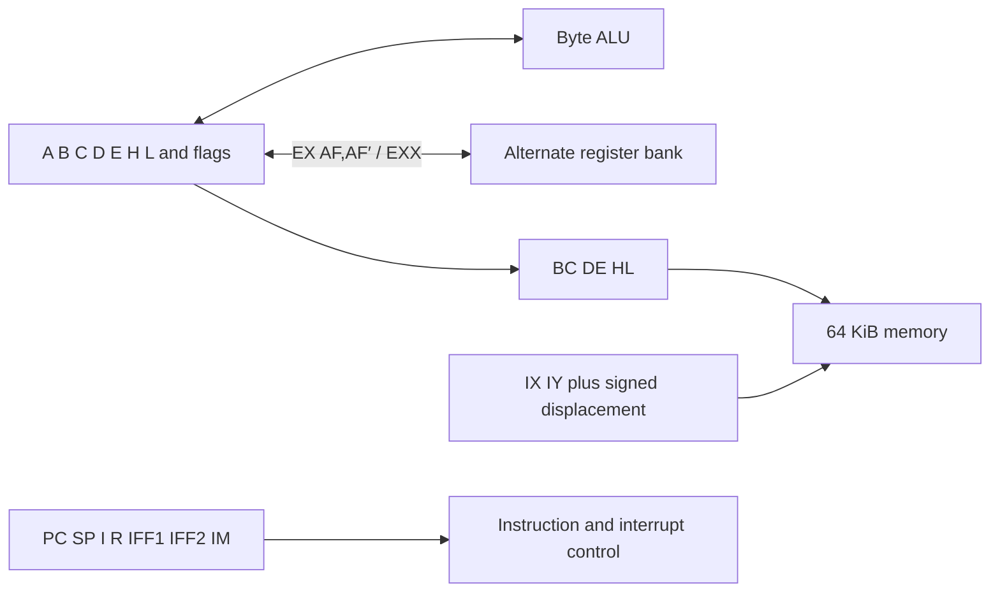

# Zilog Z80

This chapter begins the executable guide to Dromaios's instruction-level Z80.
It owns stored state, pair and status views and writes, every unprefixed
instruction, and the ordinary CB and ED pages. Indexed instruction forms
and the execution boundary still use TypeScript. The
[model contract](../../../../docs/cpus/z80/model.md) describes that boundary;
the [coverage report](../../../../docs/cpus/coverage.md#z80) measures migration.

## Historical background

The Z80 grew out of Zilog, founded by Federico Faggin and Ralph Ungermann after
leaving Intel in 1974. Masatoshi Shima joined the development in 1975. Their
[oral history at the Computer History Museum][history] describes a design that
retained 8080 machine-code compatibility while adding index registers, a second
register set, more word operations, and a richer interrupt system. The
processor reached the market in 1976.

Compatibility made existing software useful, but the Z80 was a distinct
processor. Even familiar byte instructions need their own flag rules. The
formal definitions below expose those differences rather than treating the
Z80 as an 8080 with a few extra opcode handlers.

## The programmer's machine

The model has an eight-bit data path and a sixteen-bit memory address space.
Bytes range from `$00` to `$FF`; addresses range from `$0000` to `$FFFF`.
As in the other chapters, `$` introduces hexadecimal and an opcode pattern
lists bits from most to least significant. Instruction operands and memory
words put the low byte first.



B:C, D:E, and H:L are word views of stored bytes. H=`$12`, L=`$34` means
HL=`$1234`; there is no second value to synchronize. An operand written
`(HL)` means the memory byte at that address. It is not another register.
IX and IY are separately stored words. Their indexed byte operations add a
signed displacement, wrapping the resulting address to sixteen bits.

The alternate bank contains A′, B′, C′, D′, E′, H′, L′, and flags F′.
`EX AF,AF′` exchanges A and its flags; `EXX` exchanges BC, DE, and HL.
Ordinary instructions still name the main bank. These exchanges do not select
a persistent bank number: they swap the stored values. A program must manage
which values belong to which context.

| Register | Role |
| --- | --- |
| A | Accumulator and ordinary byte ALU destination |
| B, C, D, E, H, L | Byte operands or halves of BC, DE, HL |
| IX, IY | Index pointers |
| PC, SP | Next instruction address and RAM stack pointer |
| I | High byte used in interrupt mode 2 vector addressing |
| R | Refresh register; the decoder advances its low seven bits on M1 fetches |
| IFF1, IFF2 | Interrupt enable state |
| IM | Interrupt mode 0, 1, or 2 |

### Flags distinguish parity from overflow

F holds six modeled flags: S (sign), Z (zero), H (half carry), P/V
(parity or overflow), N (subtraction), and C (carry or borrow). P/V describes
signed overflow for arithmetic and even bit parity for logical operations.
Unlike the 8080, subtraction reports half **borrow**, and AND always sets H.
These are instruction effects, not properties continuously recomputed from A:
loading A with zero leaves the old Z unchanged.

| Operation | Result | P/V | C | Why |
| --- | --- | --- | --- | --- |
| `$7F + $01` | `$80` | 1 | 0 | Signed overflow without unsigned carry |
| `$FF + $01` | `$00` | 0 | 1 | Unsigned carry without signed overflow |
| `$80 - $01` | `$7F` | 1 | 0 | Signed overflow without unsigned borrow |
| `$03 XOR $00` | `$03` | 1 | 0 | Two set bits give even parity |

The model omits undocumented F bits 5 and 3. Packing emits zero in those
positions and unpacking ignores them; that is a modeling limit, not a claim
that the silicon holds them at zero.

### Physical operation and the model boundary

Zilog's [CPU manual][manual] describes M1 opcode fetches, refresh, memory and
I/O transfers, and interrupt acknowledgement as distinct bus activities.
The original design uses an eight-bit data bus, sixteen-bit address bus, a
single clock input and a +5 V supply. WAIT and bus-request signals let the
surrounding system delay transfers or take control of the buses.

Dromaios models instruction effects, not clock phases or electrical pins. R
advances on modeled opcode fetches; operand and displacement reads do not all
advance it. Refresh itself performs no recorded RAM access. Neither access
counts nor R alone measure elapsed cycles. The existing model contract remains
authoritative for prefix fetching, interrupt entry, reset, and failed accesses
until those mechanisms move into this chapter.

## Stored state

Each bank owns its own flags object. Architectural names are uppercase; stored
JavaScript fields are lowercase unless explicitly mapped. `ALTERNATE.B` means
B in the named bank, while plain B refers to the main bank. PC and SP are
independent words. The two deferral latches and STOPPED describe instruction
boundary behavior; they are not additional programmer-visible registers.

```cpu
cpu "z80"
state {
  register A: 8
  register B: 8
  register C: 8
  register D: 8
  register E: 8
  register H: 8
  register L: 8
  flag S
  flag Z
  flag H
  flag PV
  flag N
  flag C
  bank ALTERNATE = alternate {
    register A: 8
    register B: 8
    register C: 8
    register D: 8
    register E: 8
    register H: 8
    register L: 8
    flag S
    flag Z
    flag H
    flag PV
    flag N
    flag C
  }
  register IX: 16
  register IY: 16
  register PC: 16
  register SP: 16
  register I: 8
  register R: 8
  latch IFF1
  latch IFF2
  choice IM: 0, 1, 2
  latch IRQDEFERRED = interruptDeferred
  latch NMIDEFERRED = nmiDeferred
  latch STOPPED = halted
}
```

## Pair and status views

Reading a pair captures its high byte and then its low byte. Snapshots derive
both banks' pair values from their detached stored-state copies. The views do
not fetch memory or change registers.

```cpu
view BC "B:C register pair": 16 {
  high = register B
  low = register C
  return concat(high, low)
}
view DE "D:E register pair": 16 {
  high = register D
  low = register E
  return concat(high, low)
}
view HL "H:L register pair": 16 {
  high = register H
  low = register L
  return concat(high, low)
}
view BC_ALT "alternate B:C register pair": 16 {
  high = register ALTERNATE.B
  low = register ALTERNATE.C
  return concat(high, low)
}
view DE_ALT "alternate D:E register pair": 16 {
  high = register ALTERNATE.D
  low = register ALTERNATE.E
  return concat(high, low)
}
view HL_ALT "alternate H:L register pair": 16 {
  high = register ALTERNATE.H
  low = register ALTERNATE.L
  return concat(high, low)
}
```

F packs `S Z 0 H 0 PV N C`, reading the six flags in that order. PUSH AF
captures A before this view; POP AF writes A before replacing the flags object.
The status action below supplies that replacement to the existing stack body.
All six new flag values are computed before the old object is replaced.

```cpu
view F "packed documented flags": 8 {
  sign = flag S
  zero = flag Z
  half = flag H
  parity = flag PV
  subtract = flag N
  carry = flag C
  sz = or(select(sign, u8($80), u8(0)), select(zero, u8($40), u8(0)))
  hp = or(select(half, u8($10), u8(0)), select(parity, u8($04), u8(0)))
  nc = or(select(subtract, u8($02), u8(0)), select(carry, u8($01), u8(0)))
  return or(or(sz, hp), nc)
}
policy FFLAGS "restore all documented flags" (status: 8) {
  S = not(zero(and(status, u8($80))))
  Z = not(zero(and(status, u8($40))))
  H = not(zero(and(status, u8($10))))
  PV = not(zero(and(status, u8($04))))
  N = not(zero(and(status, u8($02))))
  C = not(zero(and(status, u8($01))))
}
action writeF "replace packed F" (status: 8) {
  replace FFLAGS(status)
}
```

## Writing register pairs

A pair write replaces its high byte before its low byte. These actions also
serve the remaining prefixed word definitions. Reading a pair always captures
both bytes before any split write, even when source and destination alias.

```cpu
action writeBC "write B:C" (word: 16) {
  B <- highByte(word)
  C <- lowByte(word)
}
action writeDE "write D:E" (word: 16) {
  D <- highByte(word)
  E <- lowByte(word)
}
action writeHL "write H:L" (word: 16) {
  H <- highByte(word)
  L <- lowByte(word)
}
```

## Byte operands and transfers

In `01 ddd sss`, ddd selects the destination and sss the source. Both fields
use the same catalogue: B/C/D/E/H/L/(HL)/A. The `(HL),(HL)` slot is HALT,
not a memory-to-memory load. `00 ddd 110` loads a following immediate byte.
Reading `(HL)` resolves H then L before the memory read. Writing it resolves
H then L after capturing the source, without reading destination memory.

```cpu
source immediateByte "immediate byte": 8 {
  byte = fetch
  return byte
}
operands bytes {
  000 "B" = register B
  001 "C" = register C
  010 "D" = register D
  011 "E" = register E
  100 "H" = register H
  101 "L" = register L
  110 "(HL)" = memory HL
  111 "A" = register A
}
```

Capture the source completely before writing the destination. Register
self-copies still read and write; immediate loads fetch before resolving a
memory destination. Preserve all flags, the alternate bank, and control state.
A failed source read prevents writeback.

```cpu
family LD "01 ddd sss" for d in bytes, s in bytes named "LD {d},{s}" except "01 110 110" {
  result = operand s
  operand d <- result
}
family LDImmediate "00 ddd 110" for d in bytes named "LD {d},n" {
  result = fetch
  operand d <- result
}
```

## Accumulator arithmetic and logic

The shared encodings are `10 ooo sss` for a register or `(HL)` and
`11 ooo 110` for an immediate byte. ooo selects the operation below.
Each body captures the operand, then incoming C if needed, then A. Selecting
A as the source deliberately reads it twice. Results wrap to eight bits.
All six flags update before A; CP performs the subtraction without writing A.
Indexed memory bodies reuse these actions after their native address decoding.

| ooo | Operation | P/V | H | N | C |
| --- | --- | --- | --- | --- | --- |
| 000 | ADD | Signed overflow | Half carry | 0 | Carry |
| 001 | ADC | Signed overflow | Half carry including C | 0 | Carry including C |
| 010 | SUB | Signed overflow | Half borrow | 1 | Borrow |
| 011 | SBC | Signed overflow | Half borrow including C | 1 | Borrow including C |
| 100 | AND | Even parity | 1 | 0 | 0 |
| 101 | XOR | Even parity | 0 | 0 | 0 |
| 110 | OR | Even parity | 0 | 0 | 0 |
| 111 | CP | Signed overflow | Half borrow | 1 | Borrow |

S and Z describe the result. The remaining flag values are explicit policy
arguments so the arithmetic and logical distinctions stay visible at each use.
Policy expressions read only captured values; incoming flags are never reread
after updates begin. Flags update in S/Z/H/PV/N/C order without replacing the
flag object, preserving access and failure behavior of the existing model.

```cpu
policy ALU "Z80 byte result flags" (result: 8, half: flag, parity: flag, subtract: flag, carry: flag) {
  S = negative(result)
  Z = zero(result)
  H = half
  PV = parity
  N = subtract
  C = carry
}
```

### ADD

Capture A without reading incoming flags. Apply the table's flags before
writing the byte result to A. A failed operand read prevents every action effect.

```cpu
action addAccumulator "ADD with a captured byte" (right: 8) {
  left = register A
  result = add(left, right)
  apply ALU(result, halfCarry(left, right), addOverflow(left, right), 0, carry(left, right))
  A <- result
}
family ADD {
  encoding "10 000 sss" for s in bytes.read named "ADD A,{s}"
  encoding "11 000 110" with s = immediateByte named "ADD A,n"
  right = source s
  perform addAccumulator(right)
}
```

### ADC

Capture incoming C, then A. Apply the table's flags before
writing the byte result to A. A failed operand read prevents every action effect.

```cpu
action adcAccumulator "ADC with a captured byte" (right: 8) {
  carry = flag C
  left = register A
  result = add(left, right, carry)
  apply ALU(result, halfCarry(left, right, carry), addOverflow(left, right, carry), 0, carry(left, right, carry))
  A <- result
}
family ADC {
  encoding "10 001 sss" for s in bytes.read named "ADC A,{s}"
  encoding "11 001 110" with s = immediateByte named "ADC A,n"
  right = source s
  perform adcAccumulator(right)
}
```

### SUB

Capture A without reading incoming flags. Apply the table's flags before
writing the byte result to A. A failed operand read prevents every action effect.

```cpu
action subAccumulator "SUB with a captured byte" (right: 8) {
  left = register A
  result = subtract(left, right)
  apply ALU(result, halfBorrow(left, right), overflow(left, right), 1, borrow(left, right))
  A <- result
}
family SUB {
  encoding "10 010 sss" for s in bytes.read named "SUB {s}"
  encoding "11 010 110" with s = immediateByte named "SUB n"
  right = source s
  perform subAccumulator(right)
}
```

### SBC

Capture incoming C, then A. Apply the table's flags before
writing the byte result to A. A failed operand read prevents every action effect.

```cpu
action sbcAccumulator "SBC with a captured byte" (right: 8) {
  carry = flag C
  left = register A
  result = subtract(left, right, carry)
  apply ALU(result, halfBorrow(left, right, carry), overflow(left, right, carry), 1, borrow(left, right, carry))
  A <- result
}
family SBC {
  encoding "10 011 sss" for s in bytes.read named "SBC A,{s}"
  encoding "11 011 110" with s = immediateByte named "SBC A,n"
  right = source s
  perform sbcAccumulator(right)
}
```

### AND

Capture A without reading incoming flags. Apply the table's flags before
writing the byte result to A. A failed operand read prevents every action effect.

```cpu
action andAccumulator "AND with a captured byte" (right: 8) {
  left = register A
  result = and(left, right)
  apply ALU(result, 1, evenParity(result), 0, 0)
  A <- result
}
family AND {
  encoding "10 100 sss" for s in bytes.read named "AND {s}"
  encoding "11 100 110" with s = immediateByte named "AND n"
  right = source s
  perform andAccumulator(right)
}
```

### XOR

Capture A without reading incoming flags. Apply the table's flags before
writing the byte result to A. A failed operand read prevents every action effect.

```cpu
action xorAccumulator "XOR with a captured byte" (right: 8) {
  left = register A
  result = xor(left, right)
  apply ALU(result, 0, evenParity(result), 0, 0)
  A <- result
}
family XOR {
  encoding "10 101 sss" for s in bytes.read named "XOR {s}"
  encoding "11 101 110" with s = immediateByte named "XOR n"
  right = source s
  perform xorAccumulator(right)
}
```

### OR

Capture A without reading incoming flags. Apply the table's flags before
writing the byte result to A. A failed operand read prevents every action effect.

```cpu
action orAccumulator "OR with a captured byte" (right: 8) {
  left = register A
  result = or(left, right)
  apply ALU(result, 0, evenParity(result), 0, 0)
  A <- result
}
family OR {
  encoding "10 110 sss" for s in bytes.read named "OR {s}"
  encoding "11 110 110" with s = immediateByte named "OR n"
  right = source s
  perform orAccumulator(right)
}
```

### CP

Capture A without reading incoming flags. Apply the table's flags before
retaining A without a write. A failed operand read prevents every action effect.

```cpu
action cpAccumulator "CP with a captured byte" (right: 8) {
  left = register A
  result = subtract(left, right)
  apply ALU(result, halfBorrow(left, right), overflow(left, right), 1, borrow(left, right))
}
family CP {
  encoding "10 111 sss" for s in bytes.read named "CP {s}"
  encoding "11 111 110" with s = immediateByte named "CP n"
  right = source s
  perform cpAccumulator(right)
}
```

## Increment and decrement

The encoding is `00 rrr 10d`: rrr selects the same byte catalogue and d selects
INC (0) or DEC (1). Both preserve C without reading it. That lets a program
adjust a loop counter without destroying the carry in a multi-byte calculation.
INC sets P/V only when `$7F` becomes `$80`; DEC sets it only when `$80` becomes
`$7F`. The memory case resolves its address once and retains it through
read/modify/write, even if a host callback changes H or L.

INC reads the original byte, computes the wrapped result, and updates
S/Z/H/PV/N before writeback. A failed read leaves flags unchanged; a failed
write retains the calculated flags. Preserve the alternate bank and controls.
The resolved-memory action also serves the indexed instruction bodies.

```cpu
policy INCFLAGS "Z80 INC, preserving C" (original: 8, result: 8) {
  S = negative(result)
  Z = zero(result)
  H = halfCarry(original, u8(1))
  PV = addOverflow(original, u8(1))
  N = 0
}
action incMemory "INC at a resolved address" (address: 16) using memory {
  original = memory(address)
  result = add(original, u8(1))
  apply INCFLAGS(original, result)
  memory(address) <- result
}
family INC "00 rrr 100" for r in bytes named "INC {r}" except "00 110 100" {
  original = operand r
  result = add(original, u8(1))
  apply INCFLAGS(original, result)
  operand r <- result
}
family INCMemory "00 110 100" named "INC (HL)" {
  address = source HL
  perform incMemory(address)
}
```

DEC reads the original byte, computes the wrapped result, and updates
S/Z/H/PV/N before writeback. A failed read leaves flags unchanged; a failed
write retains the calculated flags. Preserve the alternate bank and controls.
The resolved-memory action also serves the indexed instruction bodies.

```cpu
policy DECFLAGS "Z80 DEC, preserving C" (original: 8, result: 8) {
  S = negative(result)
  Z = zero(result)
  H = halfBorrow(original, u8(1))
  PV = overflow(original, u8(1))
  N = 1
}
action decMemory "DEC at a resolved address" (address: 16) using memory {
  original = memory(address)
  result = subtract(original, u8(1))
  apply DECFLAGS(original, result)
  memory(address) <- result
}
family DEC "00 rrr 101" for r in bytes named "DEC {r}" except "00 110 101" {
  original = operand r
  result = subtract(original, u8(1))
  apply DECFLAGS(original, result)
  operand r <- result
}
family DECMemory "00 110 101" named "DEC (HL)" {
  address = source HL
  perform decMemory(address)
}
```

## Word operands and transfers

In `00 pp 0001`, pp selects BC, DE, HL, or SP. Fetch the low byte and then
the high byte before writing the selected word. Pair writes use the actions
above; SP is stored directly. No word transfer reads or updates flags.

```cpu
source immediateWord "immediate word, low byte first": 16 {
  low = fetch
  high = fetch
  return concat(high, low)
}
operands words {
  00 "BC" = view BC write writeBC
  01 "DE" = view DE write writeDE
  10 "HL" = view HL write writeHL
  11 "SP" = register SP
}
family LDWord "00 pp 0001" for p in words named "LD {p},nn" {
  result = source immediateWord
  operand p <- result
}
family LDSP "1111 1001" named "LD SP,HL" {
  result = source HL
  SP <- result
}
```

Absolute word transfers first fetch the complete address. Store then captures
HL and writes low followed by high; load reads both memory bytes before changing
H or L. The second address wraps after `$FFFF`. A failed second write retains
the first; a failed load leaves the destination untouched.

```cpu
family storeHL "0010 0010" named "LD (nn),HL" {
  address = source immediateWord
  result = source HL
  memory(address) <- lowByte(result)
  memory(add(address, u16(1))) <- highByte(result)
}
family loadHL "0010 1010" named "LD HL,(nn)" {
  address = source immediateWord
  low = memory(address)
  high = memory(add(address, u16(1)))
  perform writeHL(concat(high, low))
}
```

A also transfers through BC or DE (`00 0p d 010`), or through a following
absolute address (`00 11 d 010`). d is zero for a store and one for a load.
Resolve the complete address before reading A for a store or memory for a
load. A failed load does not write A. Stores never read destination memory;
all six forms preserve both banks' flags and the other registers.

```cpu
operands indirectPairs {
  0 "BC" = value BC
  1 "DE" = value DE
}
family storeA {
  encoding "00 0p 0 010" for p in indirectPairs.read named "LD ({p}),A"
  encoding "00 11 0 010" with p = immediateWord named "LD (nn),A"
  address = source p
  result = register A
  memory(address) <- result
}
family loadA {
  encoding "00 0p 1 010" for p in indirectPairs.read named "LD A,({p})"
  encoding "00 11 1 010" with p = immediateWord named "LD A,(nn)"
  address = source p
  result = memory(address)
  A <- result
}
```

## Word arithmetic

`00 pp q 011` increments (q=0) or decrements (q=1) BC/DE/HL/SP. Both capture
the complete word before replacing it, wrap at sixteen bits, and preserve every
flag without reading it. Word INC/DEC differ from their byte counterparts.

```cpu
family INCWord "00 pp 0 011" for p in words named "INC {p}" {
  original = operand p
  operand p <- add(original, u16(1))
}
family DECWord "00 pp 1 011" for p in words named "DEC {p}" {
  original = operand p
  operand p <- subtract(original, u16(1))
}
```

ADD HL,ss uses `00 pp 1001`, with the same pair selector. Read ss before HL,
including two complete reads for ADD HL,HL. Write H then L before updating
H/C/N in that order. S/Z/PV remain unchanged. The half-carry boundary is bit 11:
bit 12 of `left XOR right XOR result` identifies the carry into bit 12.
This policy also supplies the remaining native IX/IY word additions.

```cpu
policy WORDADD "Z80 ADD word flags (H at bit 11)" (left: 16, right: 16, result: 16) {
  H = not(zero(and(xor(xor(left, right), result), u16($1000))))
  C = carry(left, right)
  N = 0
}
family ADDWord "00 pp 1001" for p in words named "ADD HL,{p}" {
  right = operand p
  left = source HL
  result = add(left, right)
  perform writeHL(result)
  apply WORDADD(left, right, result)
}
```

## The descending RAM stack

SP names the top occupied byte. Pushing decrements SP before each write;
popping increments it after each successful read. Every adjustment reads the
live pointer independently. Thus a callback can affect a later adjustment,
while a failed write retains its preceding decrement. A word push writes its
high byte first, then its low byte. At the final SP, memory is little-endian.

The push action captures its argument before touching SP. Each pop source
captures a complete byte or word before yielding it to its caller. None of
these operations reads or writes flags or erases popped memory.

```cpu
action pushByte "push a captured byte" (byte: 8) using memory {
  pointer = register SP
  SP <- subtract(pointer, u16(1))
  address = register SP
  memory(address) <- byte
}
action pushWord "push a captured word" (word: 16) using memory {
  perform pushByte(highByte(word))
  perform pushByte(lowByte(word))
}
source popByte "pop byte through SP": 8 {
  address = register SP
  byte = memory(address)
  pointer = register SP
  SP <- add(pointer, u16(1))
  return byte
}
source popWord "pop little-endian word": 16 {
  low = source popByte
  high = source popByte
  return concat(high, low)
}
view AF "A:F": 16 {
  accumulator = register A
  status = source F
  return concat(accumulator, status)
}
action writeAF "write A and replace F" (word: 16) {
  A <- highByte(word)
  perform writeF(lowByte(word))
}
operands stackWords {
  00 "BC" = view BC write writeBC
  01 "DE" = view DE write writeDE
  10 "HL" = view HL write writeHL
  11 "AF" = view AF write writeAF
}
```

PUSH/POP encode `11 pp q 101/001`, with q=0 and pp selecting BC/DE/HL/AF.
PUSH captures the entire register before the first stack access. POP commits
its destination only after both reads succeed. AF reads A before packing F;
a pop writes A before replacing the whole flag object, ignoring bits 5 and 3.

```cpu
family PUSH "11 pp 0 101" for p in stackWords named "PUSH {p}" {
  original = operand p
  perform pushWord(original)
}
family POP "11 pp 0 001" for p in stackWords named "POP {p}" {
  result = source popWord
  operand p <- result
}
```

## Exchanges and alternate registers

EX DE,HL exchanges H with D before L with E. Each byte exchange captures both
old values, reads H/L before D/E, then writes D/E before H/L. It preserves
flags, SP, and the alternate bank without inspecting them.

```cpu
family EXDEHL "1110 1011" named "EX DE,HL" {
  highH = register H
  highD = register D
  D <- highH
  H <- highD
  lowL = register L
  lowE = register E
  E <- lowL
  L <- lowE
}
```

EX (SP),HL captures HL and SP before any memory access. Read stack low then
high, write the original H then L back to those captured addresses, and replace
HL only after both writes succeed. Preserve SP and flags. A failure retains
completed writes but prevents register replacement; the second address wraps.

```cpu
family EXStack "1110 0011" named "EX (SP),HL" {
  original = source HL
  address = register SP
  low = memory(address)
  high = memory(add(address, u16(1)))
  memory(add(address, u16(1))) <- highByte(original)
  memory(address) <- lowByte(original)
  perform writeHL(concat(high, low))
}
```

EX AF,AF′ (`00 001 000`) reads alternate A before main A, then writes main
before alternate. It next exchanges the entire flag objects in the same order,
without reading or reconstructing individual bits. The explicit flag-group
exchange preserves that identity and partial-failure contract.

```cpu
family EXAF "00 001 000" named "EX AF,AF′" {
  other = register ALTERNATE.A
  main = register A
  A <- other
  ALTERNATE.A <- main
  exchange FLAGS, ALTERNATE.FLAGS
}
```

EXX (`11 011 001`) exchanges B/C/D/E/H/L individually in that order, reading
alternate then main and writing main then alternate for each byte. It preserves
both A registers and both flag objects, with no memory or control-state access.

```cpu
family EXX "11 011 001" {
  otherB = register ALTERNATE.B
  mainB = register B
  B <- otherB
  ALTERNATE.B <- mainB
  otherC = register ALTERNATE.C
  mainC = register C
  C <- otherC
  ALTERNATE.C <- mainC
  otherD = register ALTERNATE.D
  mainD = register D
  D <- otherD
  ALTERNATE.D <- mainD
  otherE = register ALTERNATE.E
  mainE = register E
  E <- otherE
  ALTERNATE.E <- mainE
  otherH = register ALTERNATE.H
  mainH = register H
  H <- otherH
  ALTERNATE.H <- mainH
  otherL = register ALTERNATE.L
  mainL = register L
  L <- otherL
  ALTERNATE.L <- mainL
}
```

## Jumps and relative branches

For absolute jumps, calls, and returns, `ccc` means Z/C/PV/S selected by its
high two bits, with its low bit selecting clear or set. PO/PE test P/V, which
may represent parity or signed overflow depending on the preceding instruction.
JP cc,nn fetches both target bytes before reading its condition. An untaken
path never reads or writes PC; a taken path does not read target memory.

```cpu
conditions tests {
  000 "NZ" = flag Z = 0
  001 "Z" = flag Z = 1
  010 "NC" = flag C = 0
  011 "C" = flag C = 1
  100 "PO" = flag PV = 0
  101 "PE" = flag PV = 1
  110 "P" = flag S = 0
  111 "M" = flag S = 1
}
family conditionalJump "11 ccc 010" for c in tests named "JP {c},nn" {
  target = source immediateWord
  when test c {
    PC <- target
  }
}
family jump {
  encoding "1100 0011" with t = immediateWord named "JP nn"
  encoding "1110 1001" with t = HL named "JP (HL)"
  target = source t
  PC <- target
}
```

JR has only the four NZ/Z/NC/C conditions, encoded `00 1cc 000`. Its signed
byte displacement is fetched before the condition. On a taken path, read the
post-fetch PC, add the sign-extended displacement, wrap to a word, and write
PC. JR without a condition uses `00 011 000`. Preserve all flags.

```cpu
conditions relativeTests {
  00 "NZ" = flag Z = 0
  01 "Z" = flag Z = 1
  10 "NC" = flag C = 0
  11 "C" = flag C = 1
}
action branch "add a signed displacement to live PC" (offset: 8) {
  pc = register PC
  PC <- add(pc, signExtend(offset, 16))
}
family JR "00 011 000" named "JR e" {
  offset = fetch
  perform branch(offset)
}
family conditionalJR "00 1cc 000" for c in relativeTests named "JR {c},e" {
  offset = fetch
  when test c {
    perform branch(offset)
  }
}
```

DJNZ (`00 010 000`) fetches its displacement, decrements B, then reads B
again to test it. A nonzero result takes the relative branch. It preserves
every flag; failed fetching prevents the decrement. The reread retains live
stored-state behavior at each declared effect.

```cpu
family DJNZ "00 010 000" named "DJNZ e" {
  offset = fetch
  counter = register B
  B <- subtract(counter, u8(1))
  remaining = register B
  when not(zero(remaining)) {
    perform branch(offset)
  }
}
```

## Calls, returns, and restarts

CALL captures its complete target before the condition. On a taken path it
captures the return PC, pushes both bytes, then changes PC. RST uses
`11 ttt 111` to call one of eight fixed addresses in the first 64 bytes.
The shared action ensures both retain completed stack effects on failure,
with PC replaced only after both writes succeed.

```cpu
action call "push return PC then jump" (target: 16) using memory {
  returnPC = register PC
  perform pushWord(returnPC)
  PC <- target
}
codes vectors: 16 {
  000 "00H" = $00
  001 "08H" = $08
  010 "10H" = $10
  011 "18H" = $18
  100 "20H" = $20
  101 "28H" = $28
  110 "30H" = $30
  111 "38H" = $38
}
family callOrRestart {
  encoding "1100 1101" with t = immediateWord named "CALL nn"
  encoding "11 ttt 111" for t in vectors.read named "RST {t}"
  target = source t
  perform call(target)
}
family conditionalCall "11 ccc 100" for c in tests named "CALL {c},nn" {
  target = source immediateWord
  when test c {
    perform call(target)
  }
}
```

RET (`11 001 001`) pops the complete return address before writing PC.
Conditional returns use `11 ccc 000` and test the flag before any stack read.
Untaken returns never read SP or touch RAM. All forms preserve flags.

```cpu
family RET "11 001 001" {
  returnPC = source popWord
  PC <- returnPC
}
family conditionalReturn "11 ccc 000" for c in tests named "RET {c}" {
  when test c {
    returnPC = source popWord
    PC <- returnPC
  }
}
```

## Accumulator rotates and carry controls

The pattern `00 ooo 111` selects RLCA/RRCA/RLA/RRA/DAA/CPL/SCF/CCF.
Accumulator rotates preserve S/Z/PV, unlike their CB-page counterparts.
Capture A before incoming C for through-carry forms; circular forms insert
the outgoing bit. Write A, update C, then clear N/H in that order. No memory
access occurs and no unlisted flags are read.

```cpu
policy CARRY "replace C only" (carry: flag) {
  C = carry
}
policy ROTATE "clear N then H" () {
  N = 0
  H = 0
}
family RLCA "00 000 111" {
  original = register A
  A <- shiftLeft(original, negative(original))
  apply CARRY(negative(original))
  apply ROTATE()
}
family RRCA "00 001 111" {
  original = register A
  A <- shiftRight(original, lowBit(original))
  apply CARRY(lowBit(original))
  apply ROTATE()
}
family RLA "00 010 111" {
  original = register A
  carry = flag C
  A <- shiftLeft(original, carry)
  apply CARRY(negative(original))
  apply ROTATE()
}
family RRA "00 011 111" {
  original = register A
  carry = flag C
  A <- shiftRight(original, carry)
  apply CARRY(lowBit(original))
  apply ROTATE()
}
```

CPL complements A before setting N then H. SCF sets C, then clears N/H.
CCF captures C, copies it to H, complements C, and clears N, in that order.
All three preserve S/Z/PV and the alternate bank without inspecting them.

```cpu
policy COMPLEMENT "CPL flags" () {
  N = 1
  H = 1
}
policy SETCARRY "SCF flags" () {
  C = 1
  N = 0
  H = 0
}
policy COMPLEMENTCARRY "CCF flags" (carry: flag) {
  H = carry
  C = not(carry)
  N = 0
}
family CPL "00 101 111" {
  original = register A
  A <- xor(original, u8($FF))
  apply COMPLEMENT()
}
family SCF "00 110 111" {
  apply SETCARRY()
}
family CCF "00 111 111" {
  carry = flag C
  apply COMPLEMENTCARRY(carry)
}
```

## Decimal adjustment

DAA (`00 100 111`) corrects a packed-BCD result. Read original A, H, C, then N.
The low correction is `$06` when the low digit exceeds nine or incoming H is
set; the high correction is `$60` when A exceeds `$99` or incoming C is set.
Incoming N selects subtraction or addition of that correction. These rules
also define the model's result for inputs that are not valid packed BCD.

Replace the complete flags object with S/Z/H/PV/N/C, temporarily clearing N;
write A, then restore the captured N. H is bit 4 of original A XOR result.
P/V reports even parity. This explicit ordering preserves the established
model contract, including observers that fail during state writes.

```cpu
policy DECIMAL "replace DAA result flags" (original: 8, result: 8, carry: flag) {
  S = negative(result)
  Z = zero(result)
  H = not(zero(and(xor(original, result), u8($10))))
  PV = evenParity(result)
  N = 0
  C = or(not(borrow(original, u8($9A))), carry)
}
policy SUBTRACTION "restore N" (subtract: flag) {
  N = subtract
}
family DAA "00 100 111" {
  original = register A
  half = flag H
  carry = flag C
  subtract = flag N
  low = select(or(not(borrow(and(original, u8($0F)), u8($0A))), half), u8($06), u8(0))
  high = select(or(not(borrow(original, u8($9A))), carry), u8($60), u8(0))
  correction = or(low, high)
  result = select(subtract, subtract(original, correction), add(original, correction))
  replace DECIMAL(original, result, carry)
  A <- result
  apply SUBTRACTION(subtract)
}
```

## Port and execution controls

OUT (n),A and IN A,(n) use `11 01 d 011`: d selects output (0) or input (1).
Both capture old A for address bits 15..8 before fetching the low address byte.
OUT then rereads live A for the transferred value; IN writes A only after a
successful device read. Neither instruction accesses flags. Addressing devices
and retaining device state remain the machine's responsibility.

```cpu
source immediatePort "old A and immediate port byte": 16 {
  high = register A
  low = fetch
  return concat(high, low)
}
family OUT "11 01 0 011" named "OUT (n),A" {
  port = source immediatePort
  byte = register A
  port(port) <- byte
}
family IN "11 01 1 011" named "IN A,(n)" {
  port = source immediatePort
  byte = port(port)
  A <- byte
}
```

NOP changes nothing after opcode fetching. HALT sets STOPPED and retires
normally; further steps stop until reset or an accepted interrupt releases it.
DI and EI write IFF2 before IFF1. EI requests IRQ inhibition through the
following instruction. The native execution boundary still commits that
request at successful retirement and implements refresh and interrupt entry.

```cpu
family NOP "00 000 000" {
}
family HALT "01 110 110" {
  STOPPED <- 1
}
family DI "11 11 0 011" {
  IFF2 <- 0
  IFF1 <- 0
}
family EI "11 11 1 011" {
  IFF2 <- 1
  IFF1 <- 1
  defer irq
}
```

## CB rotations, shifts, and individual bits

A CB prefix gives the following byte the layout `xx yyy rrr`. The byte
catalogue still selects B/C/D/E/H/L/(HL)/A with rrr. For xx=00, yyy selects a
rotation or shift; for xx=01/10/11 it selects the bit tested, cleared, or set.
The undocumented SLL selector is deliberately absent.

| xx | yyy | Operation | Bit inserted into result | New C |
| --- | --- | --- | --- | --- |
| 00 | 000 | RLC | old bit 7 | old bit 7 |
| 00 | 001 | RRC | old bit 0 | old bit 0 |
| 00 | 010 | RL | C | old bit 7 |
| 00 | 011 | RR | C | old bit 0 |
| 00 | 100 | SLA | zero | old bit 7 |
| 00 | 101 | SRA | old bit 7 | old bit 0 |
| 00 | 111 | SRL | zero | old bit 0 |
| 01 | bbb | BIT | no writeback; test bit bbb | unchanged |
| 10 | bbb | RES | bit bbb becomes zero | unchanged |
| 11 | bbb | SET | bit bbb becomes one | unchanged |

The page declaration owns ordinary CB dispatch. The core still fetches and
validates both opcode bytes before committing PC and refresh changes. An
unsupported SLL form records both bytes but leaves PC and R unchanged during
an ordinary step. Interrupt-supplied instructions retain their separate
acknowledgement and refresh rules from the model contract.

```cpu
page CB = $CB
policy SHIFT "Z80 CB rotation and shift flags" (result: 8, carry: flag) {
  S = negative(result)
  Z = zero(result)
  H = 0
  PV = evenParity(result)
  N = 0
  C = carry
}
```

Each rotation or shift captures the operand before reading C, when needed.
It updates S/Z/H/PV/N/C before writeback, unlike the accumulator-only rotates.
For memory, capture HL once and reuse that address for both accesses. A failed
read prevents flag updates and writeback; a failed write retains the new flags.
The resolved-memory actions also serve indexed CB instructions, whose prefix
and displacement decoding remain in the core. Alternate registers and control
state are preserved.

### RLC

Rotate left by one bit, returning old bit 7 to bit 0 and to C.

```cpu
action rlcMemory "RLC memory" (address: 16) using memory {
  original = memory(address)
  result = shiftLeft(original, negative(original))
  apply SHIFT(result, negative(original))
  memory(address) <- result
}
family RLC "00 000 rrr" on CB for r in bytes named "RLC {r}" except "00 000 110" {
  original = operand r
  result = shiftLeft(original, negative(original))
  apply SHIFT(result, negative(original))
  operand r <- result
}
family RLCMemory "00 000 110" on CB named "RLC (HL)" {
  address = source HL
  perform rlcMemory(address)
}
```

### RRC

Rotate right by one bit, returning old bit 0 to bit 7 and to C.

```cpu
action rrcMemory "RRC memory" (address: 16) using memory {
  original = memory(address)
  result = shiftRight(original, lowBit(original))
  apply SHIFT(result, lowBit(original))
  memory(address) <- result
}
family RRC "00 001 rrr" on CB for r in bytes named "RRC {r}" except "00 001 110" {
  original = operand r
  result = shiftRight(original, lowBit(original))
  apply SHIFT(result, lowBit(original))
  operand r <- result
}
family RRCMemory "00 001 110" on CB named "RRC (HL)" {
  address = source HL
  perform rrcMemory(address)
}
```

### RL

Rotate left through C. Capture the byte before reading C; old bit 7 becomes
the new carry and the captured carry enters bit 0.

```cpu
action rlMemory "RL memory" (address: 16) using memory {
  original = memory(address)
  carry = flag C
  result = shiftLeft(original, carry)
  apply SHIFT(result, negative(original))
  memory(address) <- result
}
family RL "00 010 rrr" on CB for r in bytes named "RL {r}" except "00 010 110" {
  original = operand r
  carry = flag C
  result = shiftLeft(original, carry)
  apply SHIFT(result, negative(original))
  operand r <- result
}
family RLMemory "00 010 110" on CB named "RL (HL)" {
  address = source HL
  perform rlMemory(address)
}
```

### RR

Rotate right through C. Capture the byte before reading C; old bit 0 becomes
the new carry and the captured carry enters bit 7.

```cpu
action rrMemory "RR memory" (address: 16) using memory {
  original = memory(address)
  carry = flag C
  result = shiftRight(original, carry)
  apply SHIFT(result, lowBit(original))
  memory(address) <- result
}
family RR "00 011 rrr" on CB for r in bytes named "RR {r}" except "00 011 110" {
  original = operand r
  carry = flag C
  result = shiftRight(original, carry)
  apply SHIFT(result, lowBit(original))
  operand r <- result
}
family RRMemory "00 011 110" on CB named "RR (HL)" {
  address = source HL
  perform rrMemory(address)
}
```

### SLA

Shift left by one bit, inserting zero at bit 0. Old bit 7 becomes C.

```cpu
action slaMemory "SLA memory" (address: 16) using memory {
  original = memory(address)
  result = shiftLeft(original, 0)
  apply SHIFT(result, negative(original))
  memory(address) <- result
}
family SLA "00 100 rrr" on CB for r in bytes named "SLA {r}" except "00 100 110" {
  original = operand r
  result = shiftLeft(original, 0)
  apply SHIFT(result, negative(original))
  operand r <- result
}
family SLAMemory "00 100 110" on CB named "SLA (HL)" {
  address = source HL
  perform slaMemory(address)
}
```

### SRA

Shift right while retaining the original sign bit. Old bit 0 becomes C.

```cpu
action sraMemory "SRA memory" (address: 16) using memory {
  original = memory(address)
  result = shiftRight(original, negative(original))
  apply SHIFT(result, lowBit(original))
  memory(address) <- result
}
family SRA "00 101 rrr" on CB for r in bytes named "SRA {r}" except "00 101 110" {
  original = operand r
  result = shiftRight(original, negative(original))
  apply SHIFT(result, lowBit(original))
  operand r <- result
}
family SRAMemory "00 101 110" on CB named "SRA (HL)" {
  address = source HL
  perform sraMemory(address)
}
```

### SRL

Shift right by one bit, inserting zero at bit 7. Old bit 0 becomes C.

```cpu
action srlMemory "SRL memory" (address: 16) using memory {
  original = memory(address)
  result = shiftRight(original, 0)
  apply SHIFT(result, lowBit(original))
  memory(address) <- result
}
family SRL "00 111 rrr" on CB for r in bytes named "SRL {r}" except "00 111 110" {
  original = operand r
  result = shiftRight(original, 0)
  apply SHIFT(result, lowBit(original))
  operand r <- result
}
family SRLMemory "00 111 110" on CB named "SRL (HL)" {
  address = source HL
  perform srlMemory(address)
}
```

### BIT, RES, and SET

The three bit families share the same bit-to-mask catalogue. BIT reads without
writing, sets Z and P/V when the selected bit is clear, sets S only when testing
a set bit 7, sets H, and clears N. It preserves C without reading it. RES and
SET do not access flags; they write the result even if the selected bit already
has the requested value. Every memory form retains its captured address, and
a failed read prevents subsequent effects.

```cpu
codes bitMasks: 8 {
  000 "0" = $01
  001 "1" = $02
  010 "2" = $04
  011 "3" = $08
  100 "4" = $10
  101 "5" = $20
  110 "6" = $40
  111 "7" = $80
}
policy BITFLAGS "Z80 BIT, preserving C" (result: 8) {
  S = negative(result)
  Z = zero(result)
  H = 1
  PV = zero(result)
  N = 0
}
```

BIT isolates the selected bit and applies the test flags without writeback.

```cpu
action bitMemory "BIT at a resolved address" (address: 16, mask: 8) using memory {
  original = memory(address)
  result = and(original, mask)
  apply BITFLAGS(result)
}
family BIT "01 bbb rrr" on CB for b in bitMasks.read, r in bytes named "BIT {b},{r}" except "01 xxx 110" {
  mask = source b
  original = operand r
  result = and(original, mask)
  apply BITFLAGS(result)
}
family BITMemory "01 bbb 110" on CB for b in bitMasks.read named "BIT {b},(HL)" {
  address = source HL
  mask = source b
  perform bitMemory(address, mask)
}
```

RES clears the selected bit with the complement of its mask. Preserve every
flag, and write the result even if unchanged.

```cpu
action resMemory "RES at a resolved address" (address: 16, mask: 8) using memory {
  original = memory(address)
  result = and(original, xor(mask, u8($FF)))
  memory(address) <- result
}
family RES "10 bbb rrr" on CB for b in bitMasks.read, r in bytes named "RES {b},{r}" except "10 xxx 110" {
  mask = source b
  original = operand r
  result = and(original, xor(mask, u8($FF)))
  operand r <- result
}
family RESMemory "10 bbb 110" on CB for b in bitMasks.read named "RES {b},(HL)" {
  address = source HL
  mask = source b
  perform resMemory(address, mask)
}
```

SET combines the byte with its mask. Preserve every flag, and write the
result even if unchanged.

```cpu
action setMemory "SET at a resolved address" (address: 16, mask: 8) using memory {
  original = memory(address)
  result = or(original, mask)
  memory(address) <- result
}
family SET "11 bbb rrr" on CB for b in bitMasks.read, r in bytes named "SET {b},{r}" except "11 xxx 110" {
  mask = source b
  original = operand r
  result = or(original, mask)
  operand r <- result
}
family SETMemory "11 bbb 110" on CB for b in bitMasks.read named "SET {b},(HL)" {
  address = source HL
  mask = source b
  perform setMemory(address, mask)
}
```

## ED word, block, and control instructions

The ED prefix selects a second byte with two main layouts. `01 yyy zzz`
contains register ports, word arithmetic/transfers, special registers, and
controls. `101 r d 0oo` selects a block operation: r requests repetition,
d selects increment/decrement, and oo selects copy/search/input/output.
Only the 58 documented forms are included. Other ED bytes remain unsupported;
they are not treated as NOPs or aliases.

```cpu
page ED = $ED
```

### ADC and SBC on words

`01 pp q 010` selects BC/DE/HL/SP with pp and SBC/ADC with q. Read the
source before HL, then capture C. Write H and L before updating flags in
S/Z/H/PV/N/C order. Unlike ADD HL,ss, these operations update S/Z/PV. H uses
the carry or borrow across bit 11, including incoming C; P/V reports signed
overflow. The alternate bank remains untouched.

```cpu
policy WORDADC "Z80 ADC word flags (H at bit 11)" (left: 16, right: 16, result: 16, carry: flag) {
  S = negative(result)
  Z = zero(result)
  H = not(zero(and(xor(xor(left, right), result), u16($1000))))
  PV = addOverflow(left, right, carry)
  N = 0
  C = carry(left, right, carry)
}
policy WORDSBC "Z80 SBC word flags (H at bit 11)" (left: 16, right: 16, result: 16, carry: flag) {
  S = negative(result)
  Z = zero(result)
  H = not(zero(and(xor(xor(left, right), result), u16($1000))))
  PV = overflow(left, right, carry)
  N = 1
  C = borrow(left, right, carry)
}
family ADCWord "01 pp 1 010" on ED for p in words named "ADC HL,{p}" {
  right = operand p
  left = source HL
  carry = flag C
  result = add(left, right, carry)
  perform writeHL(result)
  apply WORDADC(left, right, result, carry)
}
family SBCWord "01 pp 0 010" on ED for p in words named "SBC HL,{p}" {
  right = operand p
  left = source HL
  carry = flag C
  result = subtract(left, right, carry)
  perform writeHL(result)
  apply WORDSBC(left, right, result, carry)
}
```

### Absolute word transfers

`01 pp d 011` stores (d=0) or loads (d=1) BC/DE/HL/SP. Fetch the complete
address before reading a register or data memory. Memory accesses are low byte
then high byte, wrapping after $FFFF; pair reads/writes are high byte first.
A failed load preserves its destination, while a failed second store retains
the first write. All flags are preserved. The ED HL forms have the same
behavior as the unprefixed HL transfers.

```cpu
family EDStoreWord "01 pp 0 011" on ED for p in words named "LD (nn),{p}" {
  address = source immediateWord
  result = operand p
  memory(address) <- lowByte(result)
  memory(add(address, u16(1))) <- highByte(result)
}
family EDLoadWord "01 pp 1 011" on ED for p in words named "LD {p},(nn)" {
  address = source immediateWord
  low = memory(address)
  high = memory(add(address, u16(1)))
  operand p <- concat(high, low)
}
```

### NEG and special registers

NEG subtracts captured A from zero. Replace the complete flags object before
writing A, with nibble/byte borrow, signed overflow, and N set. It reads no
incoming flags. Only $44 is included; undocumented aliases remain unsupported.

```cpu
policy NEGFLAGS "Z80 NEG" (original: 8, result: 8) {
  S = negative(result)
  Z = zero(result)
  H = halfBorrow(u8(0), original)
  PV = overflow(u8(0), original)
  N = 1
  C = borrow(u8(0), original)
}
family NEG "01 000 100" on ED {
  original = register A
  result = subtract(u8(0), original)
  replace NEGFLAGS(original, result)
  A <- result
}
```

The special-register pattern is `01 0 d s 111`: d=0 writes I/R from A and
d=1 reads I/R into A. All opcode refresh increments have already occurred.
Writing R replaces all eight bits, including bit 7. Reading into A captures
the special register, then IFF2, then C; it replaces flags before A. P/V
comes from IFF2, not parity. Writing I/R does not access flags or latches.

```cpu
operands specialBytes {
  0 "I" = register I
  1 "R" = register R
}
policy SPECIALFLAGS "Z80 LD A,I/R" (result: 8, enabled: flag, carry: flag) {
  S = negative(result)
  Z = zero(result)
  H = 0
  PV = enabled
  N = 0
  C = carry
}
family writeSpecial "01 0 0 s 111" on ED for s in specialBytes named "LD {s},A" {
  byte = register A
  operand s <- byte
}
family readSpecial "01 0 1 s 111" on ED for s in specialBytes named "LD A,{s}" {
  result = operand s
  enabled = latch IFF2
  carry = flag C
  replace SPECIALFLAGS(result, enabled, carry)
  A <- result
}
```

### Nibble rotations

RRD and RLD rotate three four-bit digits: A's low nibble and both nibbles at
(HL). A's high nibble is retained. With A=$AB and (HL)=$CD, RRD produces
A=$AD, (HL)=$BC; RLD produces A=$AC, (HL)=$DB.

Capture HL, read memory, then capture A. Write memory before reading C,
replacing S/Z/parity with H/N clear, and writing A. A failed write therefore
preserves A and flags. Later callbacks cannot change the captured address or
result. The following policy also serves register port input.

```cpu
policy INPUTFLAGS "Z80 byte input/result flags, preserving captured C" (result: 8, carry: flag) {
  S = negative(result)
  Z = zero(result)
  H = 0
  PV = evenParity(result)
  N = 0
  C = carry
}
family RRD "01 10 0 111" on ED {
  address = source HL
  memoryByte = memory(address)
  accumulator = register A
  result = or(and(accumulator, u8($F0)), and(memoryByte, u8($0F)))
  memory(address) <- or(shiftBits(and(accumulator, u8($0F)), left, 4), shiftBits(memoryByte, right, 4))
  carry = flag C
  replace INPUTFLAGS(result, carry)
  A <- result
}
family RLD "01 10 1 111" on ED {
  address = source HL
  memoryByte = memory(address)
  accumulator = register A
  result = or(and(accumulator, u8($F0)), shiftBits(memoryByte, right, 4))
  memory(address) <- or(shiftBits(memoryByte, left, 4), and(accumulator, u8($0F)))
  carry = flag C
  replace INPUTFLAGS(result, carry)
  A <- result
}
```

### Block copies and searches

Each step performs one iteration. Repeating forms rewind current PC by two
while another iteration is required, so the next step refetches both opcode
bytes and exposes an interrupt boundary. BC starts as a sixteen-bit count;
zero wraps to $FFFF on the first iteration. Direction is a wrapped word delta.
The single/repeat sources bind encoding choices without accessing state.

```cpu
codes directions: 16 {
  0 "I" = $0001
  1 "D" = $FFFF
}
source once "single iteration": 8 {
  return u8(0)
}
source repeating "repeat while count remains": 8 {
  return u8(1)
}
action rewindBlock "rewind current PC for another block iteration" () {
  pc = register PC
  PC <- subtract(pc, u16(2))
}
policy COPYFLAGS "Z80 block copy" (count: 16) {
  N = 0
  H = 0
  PV = not(zero(count))
}
policy SEARCHFLAGS "Z80 block search" (accumulator: 8, byte: 8, result: 8, count: 16, carry: flag) {
  S = negative(result)
  Z = zero(result)
  H = halfBorrow(accumulator, byte)
  PV = not(zero(count))
  N = 1
  C = carry
}
```

LDI/LDD/LDIR/LDDR read (HL), then capture BC minus one. Capture DE and write
the byte before rereading and adjusting DE. Clear N/H and set P/V from the
captured remaining count, preserving S/Z/C. Reread and adjust HL, then write
captured BC. Failed accesses retain completed effects and prevent later
updates. Repeating copies rewind PC only when the captured count is nonzero.

```cpu
family blockCopy {
  encoding "101 0 d 00 0" on ED for d in directions.read with r = once named "LD{d}"
  encoding "101 1 d 00 0" on ED for d in directions.read with r = repeating named "LD{d}R"
  delta = source d
  repeat = source r
  address = source HL
  byte = memory(address)
  counter = source BC
  count = subtract(counter, u16(1))
  destination = source DE
  memory(destination) <- byte
  destinationAfterWrite = source DE
  perform writeDE(add(destinationAfterWrite, delta))
  apply COPYFLAGS(count)
  addressAfterTransfer = source HL
  perform writeHL(add(addressAfterTransfer, delta))
  perform writeBC(count)
  when not(zero(repeat)) {
    when not(zero(count)) {
      perform rewindBlock()
    }
  }
}
```

CPI/CPD/CPIR/CPDR read (HL), capture BC minus one, then read A and C.
Replace comparison flags while preserving A and captured C; P/V indicates
remaining count. Reread and adjust HL before writing captured BC. Repeating
searches inspect the updated Z only when the count is nonzero; an unmatched
byte then rewinds PC. A failed read prevents all later effects.

```cpu
family blockSearch {
  encoding "101 0 d 00 1" on ED for d in directions.read with r = once named "CP{d}"
  encoding "101 1 d 00 1" on ED for d in directions.read with r = repeating named "CP{d}R"
  delta = source d
  repeat = source r
  address = source HL
  byte = memory(address)
  counter = source BC
  count = subtract(counter, u16(1))
  accumulator = register A
  result = subtract(accumulator, byte)
  carry = flag C
  replace SEARCHFLAGS(accumulator, byte, result, count, carry)
  addressAfterTransfer = source HL
  perform writeHL(add(addressAfterTransfer, delta))
  perform writeBC(count)
  when not(zero(repeat)) {
    when not(zero(count)) {
      matched = flag Z
      when not(matched) {
        perform rewindBlock()
      }
    }
  }
}
```

### Register port transfers

`01 rrr 00 d` selects input (d=0) or output (d=1). The rrr=110 slot is
undocumented and excluded. Capture BC before any transfer. Input reads the
port before sampling C, replacing flags, and writing the selected register;
P/V is parity. A failed input leaves flags and registers unchanged. Output
captures the selected byte after BC and does not access flags.

```cpu
family inputRegister "01 rrr 00 0" on ED for r in bytes named "IN {r},(C)" except "01 110 00 0" {
  port = source BC
  result = port(port)
  carry = flag C
  replace INPUTFLAGS(result, carry)
  operand r <- result
}
family outputRegister "01 rrr 00 1" on ED for r in bytes named "OUT (C),{r}" except "01 110 00 1" {
  port = source BC
  result = operand r
  port(port) <- result
}
```

### Block port transfers

Block I/O transfers one byte per step. Its eight-bit B counter permits 256
iterations when initially zero. Both directions capture HL before the first
read, decrement live B after that read, then perform the write. A failed write
retains the decrement but prevents HL and flag updates. Input uses BC before
decrementing B; output uses BC afterward. Successful transfers advance the
captured HL, with word wraparound.

The flag addend is adjusted C for input and updated L for output. H/C report
carry from the transferred byte plus that addend. S/Z use live B, N uses the
transferred sign, and P/V uses parity of the sum's low three bits XOR a second
capture of live B. Replace flags in S/Z/H/C/N/PV order.

```cpu
policy BLOCKIOFLAGS "Z80 block I/O" (result: 8, byte: 8, right: 8, parityCounter: 8) {
  S = negative(result)
  Z = zero(result)
  H = carry(byte, right)
  C = carry(byte, right)
  N = negative(byte)
  PV = evenParity(xor(and(add(byte, right), u8(7)), parityCounter))
}
policy REPEATHALF "repeat half-carry correction" (repeatCounter: 8, subtract: flag) {
  H = zero(xor(and(repeatCounter, u8(15)), select(subtract, u8(0), u8(15))))
}
policy REPEATPARITY "repeat parity correction" (parity: flag, operand: 8) {
  PV = not(xor(parity, evenParity(and(operand, u8(7)))))
}
action correctRepeatParity "correct parity between block I/O iterations" (operand: 8) {
  parity = flag PV
  apply REPEATPARITY(parity, operand)
}
action repeatIo "repeat block I/O when live B is nonzero" () {
  remaining = register B
  when not(zero(remaining)) {
    perform rewindBlock()
    repeatCounter = register B
    carry = flag C
    when carry {
      subtract = flag N
      adjusted = select(subtract, subtract(repeatCounter, u8(1)), add(repeatCounter, u8(1)))
      halfSubtract = flag N
      apply REPEATHALF(repeatCounter, halfSubtract)
      perform correctRepeatParity(adjusted)
    }
    when not(carry) {
      perform correctRepeatParity(repeatCounter)
    }
  }
}
```

Repeating forms reread B after flag replacement. If it is nonzero they rewind
live PC, then correct H/PV for the repeat phase. These intermediate flags are
visible in snapshots. The correction reads B, C, and, when carry is set, N
twice; it finally reads the current P/V. The ordering is explicit rather than
folded into the transfer policy.

Input reads the port at old BC, decrements B, and writes the captured byte to
the captured HL. Only after success does it advance HL and read C for the
flag addend. INIR/INDR then apply the repeat phase.

```cpu
family blockInput {
  encoding "101 0 d 01 0" on ED for d in directions.read with r = once named "IN{d}"
  encoding "101 1 d 01 0" on ED for d in directions.read with r = repeating named "IN{d}R"
  delta = source d
  repeat = source r
  address = source HL
  inputPort = source BC
  byte = port(inputPort)
  counter = register B
  B <- subtract(counter, u8(1))
  memory(address) <- byte
  perform writeHL(add(address, delta))
  addend = register C
  right = add(addend, lowByte(delta))
  result = register B
  parityCounter = register B
  replace BLOCKIOFLAGS(result, byte, right, parityCounter)
  when not(zero(repeat)) {
    perform repeatIo()
  }
}
```

Output reads the byte at captured HL, decrements B, then reads the new BC for
the port write. After success it advances HL and reads updated L for the flag
addend. OTIR/OTDR then apply the same repeat phase.

```cpu
family blockOutput {
  encoding "101 0 d 01 1" on ED for d in directions.read with r = once named "OUT{d}"
  encoding "101 1 d 01 1" on ED for d in directions.read with r = repeating named "OT{d}R"
  delta = source d
  repeat = source r
  address = source HL
  byte = memory(address)
  counter = register B
  B <- subtract(counter, u8(1))
  outputPort = source BC
  port(outputPort) <- byte
  perform writeHL(add(address, delta))
  right = register L
  result = register B
  parityCounter = register B
  replace BLOCKIOFLAGS(result, byte, right, parityCounter)
  when not(zero(repeat)) {
    perform repeatIo()
  }
}
```

### Interrupt modes and returns

IM selects a stored mode without changing flags, IFF1, or IFF2. In
`01 0 mm 110`, only mm=00/10/11 are documented, selecting modes 0/1/2.
The core still owns external interrupt recognition and mode-specific entry.

```cpu
family IM0 "01 0 00 110" on ED named "IM 0" {
  IM <- 0
}
family IM1 "01 0 10 110" on ED named "IM 1" {
  IM <- 1
}
family IM2 "01 0 11 110" on ED named "IM 2" {
  IM <- 2
}
```

RETN and RETI pop and commit the complete PC before reading IFF1 and IFF2.
If the latches differ, request IRQ deferral at retirement; then reread IFF2
into IFF1. Both preserve flags and completed stack effects on failure. RETI
also requests device notification after architectural retirement. The core
still performs that callback: its failure cannot undo the completed return.

```cpu
family RETN "01 00 0 101" on ED {
  target = source popWord
  PC <- target
  enabled = latch IFF1
  saved = latch IFF2
  when xor(enabled, saved) {
    defer irq
  }
  restored = latch IFF2
  IFF1 <- restored
}
family RETI "01 00 1 101" on ED {
  target = source popWord
  PC <- target
  enabled = latch IFF1
  saved = latch IFF2
  when xor(enabled, saved) {
    defer irq
  }
  restored = latch IFF2
  IFF1 <- restored
  notify reti
}
```

## Checks and remaining work

Component tests independently exercise the literal load matrix, arithmetic
boundaries, flag combinations, and memory failures. Shared semantics tests
observe the order of register and flag accesses, including callbacks that
change live state. Chapter tests verify production ownership and that editing
the chapter changes generated behavior. The existing
[arithmetic](../../../../docs/cpus/z80/examples/arithmetic.md),
[transfer](../../../../docs/cpus/z80/examples/transfers.md), and
[indexed-buffer](../../../../docs/cpus/z80/examples/indexed-buffer.md) examples
continue through the public CPU.

Indexed instruction forms and the execution lifecycle remain to migrate.
Reusing an action for indexed arithmetic or CB operations does not yet make the
complete indexed form chapter-owned: prefix and displacement decoding are still
handwritten. The coverage report counts complete forms only.

## References

- [Zilog Z80 CPU User Manual, UM008011-0816][manual]: registers, instruction
  encodings, flags, and bus/interrupt operation. This later manual also covers
  variants; the declared Dromaios model targets the original Z80's documented
  instruction forms, not every later extension.
- [Zilog oral history panel, Computer History Museum, 2007][history]: Faggin,
  Shima, and Ungermann discuss the company's founding and the Z80's development.
- [8080 chapter](8080.md): a comparison of the shared register organization
  and encoding patterns, with the 8080's distinct arithmetic flag rules.

[manual]: https://www.zilog.com/docs/z80/um0080.pdf
[history]: https://archive.computerhistory.org/resources/text/Oral_History/Zilog_Z80/102658073.05.01.pdf
